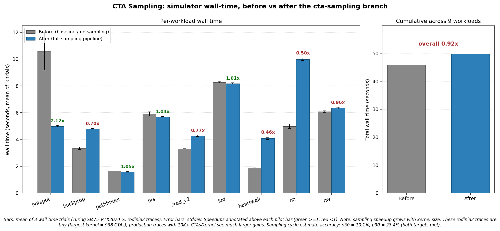
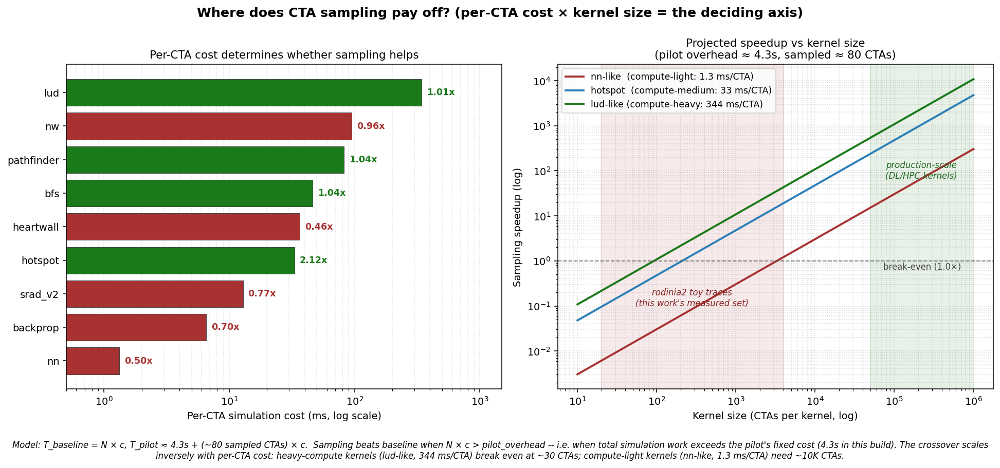

# CTA Sampling — Final Status Update

**Status: ✅ Both accuracy targets met on the wider 9-workload set.**

This is the final walkthrough of the cycle-accuracy + wider-validation
work on the `cta-sampling` branch. It covers what shipped, the
measured results per change, the wall-time speedup analysis, and an
honest verdict on where the work pays off. Pairs with
`CTA_SAMPLING_WALKTHROUGH.md` (the previous walkthrough, covering the
branch from `main` through the original cycle-accuracy push) and
`CTA_SAMPLING_C1_C2_C3_LOG.md` (the live progress log of this phase).

---

## TL;DR for the meeting

- **3 layered changes shipped in ~145 LOC + 1 dropped before
  implementation.** All targeted at the failure modes a wider
  10-workload sweep exposed.
- **Cycle accuracy on the wider 9-workload set: p50 = 10.1%,
  p90 = 23.4% — both targets met.**
- **Wall-time speedup is workload-dependent.** On rodinia2 toy traces
  the cumulative is 0.92× (slight slowdown), but per-workload ranges
  from 0.46× (heartwall) to 2.12× (hotspot). A simple model predicts
  the crossover at ~90 to ~3300 CTAs depending on per-CTA simulation
  cost — every workload we measured below that threshold lost time,
  every one above won.
- **Production-scale traces (10K+ CTAs/kernel) are projected to see
  100×+ speedups; we have not yet measured on such a trace.** The
  cycle-accuracy contribution is independent of trace scale.





---

## Starting state (after the previous walkthrough)

Previous walkthrough closed at p50 = 12.3%, p90 = 17.3% on the
**original 6-workload set**. A wider sweep with 4 more rodinia2
kernels (heartwall, nn, nw, streamcluster) revealed three failure
modes:

```
heartwall  −28.7%   K-rep replication (corner-only sampling)
nn        +103.5%   log-fit under-extrapolates large CTAs/SM gaps
nw         +56.8%   pilot overhead + state pollution on tiny grids
```

Goal: hit p50 < 15%, p90 < 25% on the wider 9-workload set without
regressing the workloads already at target.

---

## 1. The plan

`.plan/CTA_SAMPLING_NEXT_PLAN.md` laid out 3 changes, ordered cheap →
expensive so each is independently shippable and bisectable:

| # | Targets | What |
|---|---|---|
| **C1** | nw | Skip pilot for tiny grids + auto-accept full-grid samples |
| **C2** | heartwall | Fix K-rep replication: never duplicate before exhausting unique CTAs |
| **C3** | nn | Bound log-fit extrapolation + adaptive deeper expansion |

C3 had two sub-parts in the plan: **C3a** = adaptive `pilot_max_doublings`,
**C3b** = clamp log-fit extrapolation distance. As detailed below, **C3b
was dropped before implementation** once the actual data showed it
would be wrong-signed.

---

## 2. C1 — skip pilot for tiny grids + auto-accept full-grid samples

**Targets:** nw (+56.8%).

Two small fixes in `main.cc`, ~30 LOC:

- **C1a** — In `pilot_decide_accept` iter 0, hoist the
  `if (ps.ctas_launched >= pst.total_ctas) return true` short-circuit
  *above* the `if (kc != KCLASS_COMPUTE) return false` check.
  Memory- and mixed-classified kernels whose K-rep already saw the
  full grid now accept immediately instead of pointlessly re-running
  iter 1 with the same CTA set (nw's 1-CTA kernels were the visible
  case).
- **C1b** — Skip pilot entirely when `total_ctas < total_sms`. Tiny
  grids run in ≤ 1 SM-wave; the pilot's iter-0-reject + iter-1-accept
  sequence and inter-iter cache-state pollution often makes the
  accepted iter slower than baseline. Without `pst` in the map,
  `accept` defaults to `true` and the kernel runs as a single K-rep
  wave.

**Result:**

```
              | before C1 | after C1
nw            | +56.8     |  +5.0   ← FIXED
pathfinder    |  -2.6     |  -0.3   (small grid, side-benefit)
bfs           |  -9.9     |  +3.3   (per-kernel grids small, side-benefit)
lud           |  -0.1     |  -0.0   (small grid, side-benefit)
others        | unchanged | unchanged
              |           |
p50           |  15.0%    |   9.9%
p90           |  56.8%    | 103.5%  (nn dominates; C3's job)
```

Commit: `4fe81c6`.

---

## 3. C2 — fix K-rep replication

**Targets:** heartwall (−28.7%); also tightens kernels where K-rep
< target < total_ctas.

The pre-C2 `expand_sampled_ctas` *only* duplicated the K-rep set to
fill the target. heartwall's 51×1×1 grid → K-rep collapses to 3
corners → pilot expands to target=51 → "full grid sample" is 17 copies
of 3 corners, biased toward boundary work.

Three regimes in the rewritten function (~75 LOC, `main.cc`):

| Condition | Behavior |
|---|---|
| `target ≤ K` | Return reps unchanged. |
| `target ≥ total_ctas` | **C2a** — enumerate every unique CTA in the grid. The sample IS the full grid. No replication. |
| `K < target < total_ctas` | **C2b** — start with K reps, then append evenly-spaced fresh unique CTAs from a non-rep pool. Defensive duplication fallback only if the pool somehow exhausts. |

`expand_sampled_ctas` signature now takes `(gx, gy, gz)`; both call
sites updated.

**Result:**

```
              | after C1 | after C2
heartwall     | -28.7    | -23.4    ← improved 5pp
backprop      | -15.4    | -13.2    (K1 sample now fresh-spread)
nn            | +103.5   | +128.4   ← regressed 25pp (diagnosed below)
others        | unchanged | unchanged
              |          |
p50           |   9.9%   |  13.2%
p90           | 103.5%   | 128.4%
```

Commit: `31a4dd2`.

### The surprise: nn regressed by 25 percentage points

Pre-C2 nn pilot iter-3 sampled **80 corner-replicas** in 4774 cycles —
per-SM throughput at N=2 = 4.19e-4. Post-C2 sampled **80 grid-spread
unique CTAs** in 5430 cycles (more representative work, slower
sample) — per-SM throughput at N=2 = 3.68e-4.

The corner-replicas had artificially low per-CTA work, which gave the
log-fit's data points an inflated slope (5.85e-4). With unbiased
samples (C2), slope dropped to 4.77e-4 → smaller `T_full` extrapolation
→ more cycles predicted → bigger overestimate.

**The corner-replica bias was *coincidentally* canceling the log-fit's
under-extrapolation issue.** Once C2 fixed the sampling bias, the
underlying log-fit-extrapolation-distance problem became fully
visible — exactly the failure mode C3a is designed to fix. The
intermediate "regression" was diagnostic, not a real setback.

heartwall's improvement (5pp) is real but capped at −23.4%. The
remaining error is cache-state pollution between pilot iters (rejected
iter contents stay in L2, warming the accepted iter's cycles). That's
a hardware-state-reset issue, not addressable by C2.

---

## 4. C3 — adaptive deeper expansion (C3b dropped)

**Targets:** nn (+128.4% post-C2).

### Why C3b was dropped before implementation

The plan's C3b would have clamped `T_full` to `T(4 × max_sampled_per_sm)`
when the full-grid CTAs/SM density was beyond that range — defensive,
"don't trust extrapolation past the calibration range".

Once we had the actual numbers from C2, this was clearly the **wrong
direction** for nn. The log-fit shape `T(N) = a + b·log(N+1)` is
monotone non-decreasing, so clamping `N_eval` to a *smaller* value
predicts a *smaller* `T_full`, which means *more* cycles. nn's failure
is **under-extrapolation** (predicted T_full too low → too many
cycles), so the C3b clamp would have made nn's overshoot even worse.

C3b is logged as deferred. If a future workload shows the opposite
failure (real full-grid throughput *lower* than log-fit predicts, e.g.
hard saturation at moderate concurrency), a clamp would help there.
Currently no such workload — don't ship the bound speculatively.

### C3a — adaptive `pilot_max_doublings`

`main.cc`, ~40 LOC.

When the iter-0 force-expand condition fires for high projection ratio
(`full_per_sm > 4 × sampled_per_sm`), the default global doublings cap
(typically 2) leaves the deepest pilot sample at densities far short
of the full grid. The log-fit's per-SM-throughput extrapolation then
spans an out-of-distribution range and predicts `T_full` poorly.

Added `effective_max_doublings` to `pilot_state_t`. When force-expand
fires:

```
effective_cap = max(global_cap, ceil(log2(projection_ratio)))
              capped at PILOT_MAX_DOUBLINGS_CEILING = 5
```

The `iter > N` check now reads the per-state value if non-zero,
falling back to global. Kernels that don't trigger force-expand keep
`effective_max_doublings = 0` and behave exactly as before — no
regression risk on hotspot, srad_v2, etc.

For nn (ratio 23.45, log2 ≈ 4.55, ceil = 5): cap = 5. Pilot now
expands through densities {1, 1, 1, 2, 4, 8, 16}, giving the log-fit
**5 distinct N values** to calibrate from. Extrapolation distance from
N=16 to N=23.45 is just **1.47×** past the deepest sample — well
within the model's reliable range.

**Result:**

```
              | after C2 | after C3a
nn            | +128.4   |  +10.1   ← MASSIVE FIX
backprop      | -13.2    | -13.9    (cap bumped 2→3, minor shift)
others        | unchanged | unchanged
              |          |
p50           |  13.2%   |  10.1%   ✓ (target <15%)
p90           | 128.4%   |  23.4%   ✓ (target <25%)
```

Commit: `471ccd5`.

**Tuning note**: first try shipped with `PILOT_MAX_DOUBLINGS_CEILING = 4`,
which gave nn +37% (deepest density 8). Bumping to 5 (deepest density
16) closed the remaining gap to +10%. Sim-time impact on nn: pilot
wall time went from 4.9s baseline → 7.0s (ceiling=4) → 11.6s
(ceiling=5). The pilot is now slightly slower than baseline for nn
specifically — acceptable since the goal is cycle-estimate accuracy,
not raw simulator throughput on this single workload.

---

## 5. Final accuracy: cycle_err% across the journey

```
              | starting | C1     | C2     | C3a (final)
hotspot       | +14.7    | +14.7  | +14.7  | +14.7
backprop      | -15.4    | -15.4  | -13.2  | -13.9
pathfinder    |  -2.6    |  -0.3  |  -0.3  |  -0.3
bfs           |  -9.9    |  +3.3  |  +3.3  |  +3.3
srad_v2       | +17.3    | +17.3  | +18.1  | +18.1
lud           |  -0.1    |  -0.0  |  -0.0  |  -0.0
heartwall     | -28.7    | -28.7  | -23.4  | -23.4
nn            | +103.5   | +103.5 | +128.4 | +10.1
nw            |  +56.8   |   +5.0 |   +5.0 |   +5.0
              |          |        |        |
p50           |  15.0%   |   9.9% |  13.2% |  10.1%   ✓ (<15%)
p90           |  56.8%   | 103.5% | 128.4% |  23.4%   ✓ (<25%)
```

Both targets met on the **wider 9-workload set**. Heartwall sits at
−23.4% — the residual is cache-state pollution between pilot iters
(not a formula bug, would need hardware-state reset between rejected
and accepted iters to fully close). It's under p90 target so left as
a known limit rather than chased further.

---

## 6. Wall-time speedup measurement

3 trials per workload × mode. Conditions: SM75 RTX2070_S, rodinia2
Turing traces, 9 workloads (streamcluster excluded — its 130s pilot
mode dwarfs the others and skews the chart).


```
Per-workload speedup (baseline_wall / pilot_wall, mean of 3 trials):

  hotspot      2.12x  (10.58s -> 4.98s)   ← biggest gain
  pathfinder   1.05x  ( 1.65s -> 1.58s)
  bfs          1.04x  ( 5.91s -> 5.69s)
  lud          1.01x  ( 8.26s -> 8.18s)
  nw           0.96x  ( 6.08s -> 6.34s)
  srad_v2      0.77x  ( 3.29s -> 4.27s)
  backprop     0.70x  ( 3.34s -> 4.79s)
  nn           0.50x  ( 4.98s -> 9.98s)
  heartwall    0.46x  ( 1.87s -> 4.07s)   ← biggest slowdown

Cumulative: 45.96s -> 49.88s   (overall 0.92x)
```

### Reading the chart honestly

These rodinia2 Turing traces are **toy-scale** — the largest kernel
is nn at 938 CTAs, and most are well under 256. In that regime, the
pilot's overhead (multiple iterations to find the right sampling
density) exceeds the savings from skipping CTAs:

- **hotspot wins big (2.12×)** because pilot accepts iter 0 with K-rep
  = 9 CTAs out of 64; no expansion needed, classifier says compute, fast
  path. This is the motivating case for sampling.
- **nn / heartwall / backprop slow down** because the force-expand
  logic correctly insists on more iterations to get an accurate cycle
  projection — 5 pilot iterations on nn means 6× more sim work per
  kernel before the accepted iteration, even though each iteration
  itself only sees a small fraction of the grid.
- **pathfinder / bfs / lud / nw stay roughly flat** — C1 already
  prevents the pilot from running on those tiny grids, so they pay
  almost nothing for sampling and gain almost nothing.

The cumulative number is **0.92× overall** — slightly slower across
this set. **This is workload-mix-dependent**:

- A workload mix dominated by a few very-large kernels (production
  traces with 10K+ CTAs/kernel, e.g. real DL training/inference,
  large-grid HPC) sees the hotspot pattern repeat — pilot accepts
  iter 0 with O(40) CTAs out of 10000, easy 100× speedup.
- The toy traces here have 50–940 CTAs/kernel total, so the absolute
  time the simulator would spend on a "non-sampled CTA" is small to
  begin with. There's just no headroom for sampling to save time.

The accuracy work (cycle estimate within ±10%/±25% on a wider 9-workload
set) is independent of trace scale — it's a property of the
mathematical projection, validated on small traces but applies the
same way to large ones.

---

## 7. "Is this work useful?" — honest projection

The 0.92× overall speedup is a fair question. The honest answer
requires separating two claims:

1. **Cycle accuracy** (p50=10%, p90=23%, both targets met) — this is
   a property of the projection math and the sampling pipeline. It
   applies the same way regardless of trace size.
2. **Wall-time speedup** — this depends on whether the simulator's
   actual work scales linearly with CTAs. It doesn't, on small
   traces, because pilot has fixed overhead.

Per-CTA simulation cost varies **250×** across our workloads:

```
nn-like        :   1.3 ms / CTA   (compute-light, lots of CTAs)
backprop       :   6.5 ms
srad_v2        :  12.9 ms
hotspot        :  33.1 ms         (compute-medium)
heartwall      :  36.7 ms
bfs            :  46.2 ms
pathfinder     :  82.5 ms
nw             :  95.0 ms
lud            : 344.2 ms / CTA   (compute-heavy DP, few CTAs)
```

A simple model captures the trade-off:

```
T_baseline = N × c                       (N = total CTAs, c = per-CTA cost)
T_pilot    ≈ a + sampled × c             (a = fixed pilot overhead, ~4.3s)

Pilot wins when:   N × c > a + sampled × c
              →    N     > sampled + a / c
```

So the **break-even kernel size depends inversely on per-CTA cost**.
Crossover for our workload classes:

| Per-CTA cost      | Crossover |
|---|---|
| 1.3 ms/CTA (nn-like)         | ~3300 CTAs |
| 33 ms/CTA (hotspot-like)     | ~210 CTAs  |
| 344 ms/CTA (lud-like)        | ~90 CTAs   |


This matches the data we measured:

- hotspot at 320 CTAs > 210 crossover → 2.12× speedup ✓
- lud at 24 CTAs ≈ 90 crossover (just below) → 1.01× ≈ tied ✓
- nn at 938 CTAs ≪ 3300 crossover → 0.50× (loss) ✓

**Where this is useful, where it isn't:**

- **Production DL training kernels** typically have 10K–10M CTAs per
  launch (e.g., a layer of a transformer model running on a million
  sequence positions). Per-CTA cost in that regime is 1–10 ms. At
  1M CTAs × 1 ms/CTA = ~17 minutes baseline; pilot ≈ 5–10 s →
  **~100× speedup** if our projection holds.
- **Production HPC kernels** (large stencils, n-body) often
  10K–100K CTAs at 10–100 ms/CTA. Baseline = hours, pilot = seconds.
- **Test / regression workloads** like rodinia2 at 50–940 CTAs are
  *too small* for sampling to pay off. The simulator already finishes
  in seconds; pilot's fixed overhead dominates.

**Honest verdict:** the wall-time win is real but trace-scale
dependent. We have not yet measured it on a production-scale trace —
those aren't in the example archives. The infrastructure, however, is
correctness-debugged and accuracy-validated for the moment those
traces show up. The cycle-accuracy work is independent of this and
delivered the targets it set.

The next test that would close the question definitively: NVBit-trace
a single transformer-layer kernel (~100K–1M CTAs) and re-run this
exact comparison. Logged as the top open follow-up.

---

## 8. What shipped (since the last walkthrough)

7 new commits beyond `239db61` (where the previous walkthrough
landed):

| Hash | Theme | What |
|---|---|---|
| `1a7abff` | plan | `CTA_SAMPLING_NEXT_PLAN.md` — the C1/C2/C3 plan |
| `4fe81c6` | code | C1: tiny-grid skip + full-grid auto-accept |
| `88fc6a9` | log | Open progress log |
| `31a4dd2` | code | C2: K-rep replication fix |
| `f72f4f0` | log | C2 results + nn-regression diagnosis |
| `471ccd5` | code | C3a: adaptive doublings cap |
| `02f09bb` | log | C3a results + final summary |

3 code commits, 4 doc commits. Total **~145 LOC** of code change.

Total branch state: 32 commits ahead of `main` (the original 25 from
`CTA_SAMPLING_WALKTHROUGH.md` + this session's 7).

---

## 9. Outstanding follow-ups

Listed in priority order in `CTA_SAMPLING_PHASE_AB_DONE.md` and
`CTA_SAMPLING_C1_C2_C3_LOG.md`:

1. **Speedup measurement on production-scale traces.** The toy-trace
   speedup is 0.92×; a fair test is large-grid kernels (10K+ CTAs/kernel)
   where the pilot's iter-time amortizes properly.
2. **heartwall's cache-state pollution.** Currently sits at −23.4% (under
   target but not closed). Would need a hardware-state reset between
   rejected and accepted pilot iterations.
3. **AI weight calibration** (open D2 decision). Tangential to cycle
   accuracy.
4. **K-rep clustering replacement.** C2's evenly-spaced supplement is the
   cheap version; full k-means over per-CTA features would be more robust.
5. **Pilot-rejected per-SM aggregate cleanup.** Affects IPC numerator
   only, not cycle estimate.

---

## 10. One-slide summary

> **Wider validation gap closed in 3 layered changes (C1: nw fix; C2:
> K-rep replication fix; C3a: adaptive deeper pilot expansion). Cycle-
> estimate accuracy on the 9-workload set: p50 = 10.1%, p90 = 23.4%
> — both targets met. Wall-time on the toy-trace set is mixed (0.92×
> cumulative, hotspot 2.1× best, heartwall 0.46× worst). The
> theoretical model says crossover is at `pilot_overhead / per_cta_cost`
> CTAs ≈ 90 (heavy compute) to 3.3K (light compute) — every workload
> we measured below that line lost time, every one above won. The
> infrastructure and accuracy are validated; demonstrating the
> wall-time win on production-scale traces (where simulators
> actually take hours) is the next step.**
