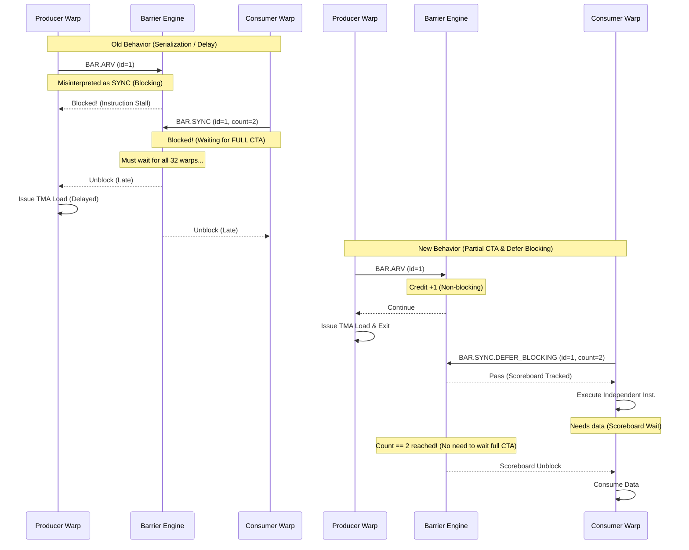

# FA3 Progress

This document tracks the current optimization status for FA3 using the existing notes in:

- `.result/FA3_kernel_5_fwd.md`
- `.result/FA3_kernel_10_bwd.md`
- `.plan/BAR_OP_H100.md`
- `.plan/MEMBAR_SCOPE_AWARE_H100.md`
- `.plan/L1I_prefetch_redesign.md`

To keep this file easy to extend, use the following update pattern whenever a new optimization is added:

- Add one new row to `Optimization Progress`.
- Add one new column per optimization version to each kernel table in `Simulator Cycle Breakdown`.
- Add the corresponding run file paths to `Run Paths`.
- Add one new subsection under `Optimization Details` with the same three sub-sub-sections:
  - `Why this optimization`
  - `How to implement`
  - `Result`
- If a run is still pending or a metric is not yet summarized, keep the cell as `—` and explain the reason in the note column instead of guessing.

## 1. Status Summary

### Optimization Progress

| Version | Opt item | Value / change | FA3 fwd (kernel 5) | FA3 bwd (kernel 10) | Status |
|---|---|---|---|---|---|
| Target HW | Real H100 (NCU) | Actual hardware measurements | 67,696 cycles | 132,901 cycles | Target |
| Init | Baseline simulator | Original simulator state before the targeted fixes below | Not available as a standalone cycle in the current notes | 376,735 cycles (2.83x vs HW) | Fwd missing, bwd available |
| Opt 1 | ROP latency tuning | `-gpgpu_l2_rop_latency 211 -> 100` | 220,024 cycles (3.25x vs HW). This run already used `rop=100`, so there is no separate init cycle to compare against. | 361,760 cycles (2.72x vs HW, -4.0% vs init) | Done |
| Opt 2 | BAR implementation | `OP_BAR` handling + barrier engine fix + warp-exit drain fix | 162,582 cycles (2.40x vs HW, -26% vs Opt 1). Run exits cleanly. | 328,643 cycles (2.47x vs HW, -9.1% vs Opt 1). Run exits cleanly. | Done |
| Opt 3 | MEMBAR Scope-Aware Fix | Scope-aware memory fence (CTA/GPU level) | 158,990 cycles (2.35x vs HW, -2.2% vs Opt 2). Run exits cleanly and `inst_barrier` nearly disappears. | 259,456 cycles (1.95x vs HW, -21.1% vs Opt 2). Run exits cleanly. | Done |
| Opt 4 | Prefetch improvement | (a) `-prefetch_per_stream_buffer_size 1 -> 4` (deeper stream buffer, config-only). (b) L1I eager-promote (Option B): promote a ready prefetched line into L1I without waiting for a demand (code change, pending run). | 155,765 cycles (2.30x vs HW, -2.0% vs Opt 3) **with (a) only**. (b) not yet run. | — | (a) done; (b) pending build/run |

### Simulator Cycle Breakdown

#### FA3 fwd - top-level simulator breakdown

| Class | Init | Opt 1 (`rop=100`) | Opt 2 (BAR impl) | Opt 3 (MEMBAR) | Opt 4 (prefetch, sb=4) | Note |
|---|---|---|---|---|---|---|
| `sim_cycle` | — | 220,024 | 162,582 | 158,990 | 155,765 | Opt 4 column is the `sb=4` run only (`.o16`); eager-promote not yet included. |
| `no_warps_ready` | — | 64.02% | 23.83% | 20.98% | 26.81% | Frontend pressure shifts here once `no_valid_instruction` drops in Opt 4. |
| `issuing` | — | 14.56% | 21.17% | 24.05% | 31.18% | Issuing share rises further with the deeper stream buffer. |
| `next_stage_not_available` | — | 11.40% | 15.25% | 17.26% | — | Not separately re-summarized for `.o16` yet. |
| `no_valid_instruction` | — | 9.52% | 39.12% | 37.01% | 18.63% | Large drop with `sb=4` (deeper buffer relieves the frontend). |
| `issue_port_busy` | — | 0.50% | 0.63% | 0.71% | — | Not separately re-summarized for `.o16` yet. |
| `sum` | — | 100.00% | 100.00% | 100.00% | — | |

#### FA3 fwd - inner stall / wait breakdown

| Wait reason | Init | Opt 1 (`rop=100`) | Opt 2 (BAR impl) | Opt 3 (MEMBAR) | Opt 4 (prefetch, sb=4) | Note |
|---|---|---|---|---|---|---|
| `inst_barrier` | — | 56.09% | 9.09% | 0.05% | 0.07% | Stays negligible (barrier already fixed in Opt 2/3). |
| `wait_barrier` | — | 6.64% | 8.07% | 9.01% | 11.98% | mbarrier-style wait. |
| `tma_axis` | — | 62.73% | 17.16% | 9.06% | 12.05% | Grouped TMA-side stall share. |
| `non_tma_axis` | — | 17.80% | 17.34% | 19.07% | 24.10% | Rises as the frontend unblocks and work shifts to execution/resources. |
| `fu_occupied` | — | 11.83% | 9.91% | 10.91% | 13.53% | Present in `.o16`. |
| `stall_count` | — | 5.00% | 5.97% | 6.56% | 8.47% | Present in `.o16`. |
| `tma_flush` | — | 0.00% | 0.00% | 0.00% | 0.00% | Present in `.o16`. |
| `yield` | — | 0.92% | 1.21% | 1.30% | 1.69% | Present in `.o16`. |
| `result_queue_full` | — | 0.05% | 0.25% | 0.29% | 0.40% | Present in `.o16`. |
| `l1c` | — | 0.00% | 0.00% | 0.00% | 0.00% | Present in `.o16`. |
| `scoreboard (memory)` | — | 0.00% | 0.00% | 0.00% | 0.00% | Present in `.o16`. |

#### FA3 bwd - top-level simulator breakdown

| Class | Init | Opt 1 (`rop=100`) | Opt 2 (BAR impl) | Opt 3 (MEMBAR) | Note |
|---|---|---|---|---|---|
| `sim_cycle` | 376,735 | 361,760 | 328,643 | 259,456 | The Opt 3 run exits cleanly. |
| `no_warps_ready` | — | 66.64% | 58.27% | 29.80% | Drops sharply after the MEMBAR scope-aware fence fix. |
| `issuing` | — | 12.71% | 14.06% | 20.93% | |
| `next_stage_not_available` | — | 10.69% | 11.41% | 15.11% | downstream pipe back-pressure |
| `no_valid_instruction` | — | 8.96% | 15.02% | 33.59% | frontend / L0I miss becomes the largest top-level bucket |
| `issue_port_busy` | — | 1.01% | 1.24% | 0.57% | |
| `sum` | — | 100.00% | 100.00% | 100.00% | |

#### FA3 bwd - inner stall / wait breakdown

| Wait reason | Init | Opt 1 (`rop=100`) | Opt 2 (BAR impl) | Opt 3 (MEMBAR) | Note |
|---|---|---|---|---|---|
| `inst_barrier` | — | 58.47% / 87.70% of `no_warps_ready` | 44.78% / 76.84% of `no_warps_ready` | 1.01% / 3.40% of `no_warps_ready` | The MEMBAR fix removes the old barrier-engine distortion almost completely. |
| `tma_axis` | — | — | 58.09% | 17.13% / 57.49% of `no_warps_ready` | Present in `.o319` output. |
| `non_tma_axis` | — | — | 18.08% | 21.99% / 73.79% of `no_warps_ready` | Present in `.o319` output. |
| `fu_occupied` | — | 11.55% / 17.30% of `no_warps_ready` | 12.63% | 14.67% / 49.21% of `no_warps_ready` | function-unit busy |
| `wait_barrier` | — | 7.98% / 12.00% of `no_warps_ready` | 8.62% | 11.76% / 39.46% of `no_warps_ready` | `DEPBAR` (SB phase wait = TMA mbarrier) |
| `stall_count` | — | 4.11% / 6.20% of `no_warps_ready` | 4.63% | 6.18% / 20.73% of `no_warps_ready` | explicit stall cycles |
| `tma_flush` | — | 0.83% / 1.20% of `no_warps_ready` | 4.69% | 4.36% / 14.62% of `no_warps_ready` | `UTMACMDFLUSH` |
| `yield` | — | 0.68% / 1.00% of `no_warps_ready` | 0.76% | 1.02% / 3.41% of `no_warps_ready` | `YIELD` |
| `result_queue_full` | — | 0.03% / — | 0.03% | 0.09% / 0.30% of `no_warps_ready` | fixed-latency result queue |
| `l1c` | — | 0.03% / — | 0.03% | 0.04% / 0.14% of `no_warps_ready` | L1 constant |
| `scoreboard (memory)` | — | 0.00% / 0.00% of `no_warps_ready` | 0.00% | 0.00% / 0.00% of `no_warps_ready` | traditional scoreboard (unused here) |

### Run Paths

Base directory:
`simulator-remodeled/sim_run_12.8/flashattn-fa3-bf16-bwd-causal-b1-s2048-hd64-nh24/flashattn_fa3_bf16_bwd_causal_b1_s2048_hd64_nh24___warmup_0___iters_1`

FA3 fwd

- Opt 1 (`rop=100`)
  - Stats run: `H100_80GB-OnlyKernel5/flashattn-fa3-bf16-bwd-causal-b1-s2048-hd64-nh24-flashattn_fa3_bf16_bwd_causal_b1_s2048_hd64_nh24___warmup_-63a73d452237.o3`
  - Event / debug run: `H100_80GB-OnlyKernel5/flashattn-fa3-bf16-bwd-causal-b1-s2048-hd64-nh24-flashattn_fa3_bf16_bwd_causal_b1_s2048_hd64_nh24___warmup_-63a73d452237.e3`
  - Note: verified as `FlashAttnFwdSm90`, `trace_kernel_id=5`, `rop=100`

- Opt 2 (BAR impl)
  - Stats run: `H100_80GB-OnlyKernel5/flashattn-fa3-bf16-bwd-causal-b1-s2048-hd64-nh24-flashattn_fa3_bf16_bwd_causal_b1_s2048_hd64_nh24___warmup_-63a73d452237.o12`
  - Event / debug run: `H100_80GB-OnlyKernel5/flashattn-fa3-bf16-bwd-causal-b1-s2048-hd64-nh24-flashattn_fa3_bf16_bwd_causal_b1_s2048_hd64_nh24___warmup_-63a73d452237.e12`
  - Note: clean exit, BAR debug summary shows `leaked_ids=0`

- Opt 3 (MEMBAR)
  - Stats run: `H100_80GB-OnlyKernel5/flashattn-fa3-bf16-bwd-causal-b1-s2048-hd64-nh24-flashattn_fa3_bf16_bwd_causal_b1_s2048_hd64_nh24___warmup_-63a73d452237.o15`
  - Event / debug run: `H100_80GB-OnlyKernel5/flashattn-fa3-bf16-bwd-causal-b1-s2048-hd64-nh24-flashattn_fa3_bf16_bwd_causal_b1_s2048_hd64_nh24___warmup_-63a73d452237.e15`
  - Note: clean exit, verified as `FlashAttnFwdSm90` / `trace_kernel_id=5`; `MEMBAR.ALL.CTA` takes the fence path and no `[MEMBARDBG][stuck]` is reported

- Opt 4 (prefetch, sb=4 only)
  - Stats run: `H100_80GB-OnlyKernel5/flashattn-fa3-bf16-bwd-causal-b1-s2048-hd64-nh24-flashattn_fa3_bf16_bwd_causal_b1_s2048_hd64_nh24___warmup_-63a73d452237.o16`
  - Event / debug run: `H100_80GB-OnlyKernel5/flashattn-fa3-bf16-bwd-causal-b1-s2048-hd64-nh24-flashattn_fa3_bf16_bwd_causal_b1_s2048_hd64_nh24___warmup_-63a73d452237.e16`
  - Note: `-prefetch_per_stream_buffer_size 4` only; clean exit. This run does NOT include the eager-promote code (no eager-promote counters present). Eager-promote run is pending.

FA3 bwd

- Init
  - Stats run: `H100_80GB-OnlyKernel10/flashattn-fa3-bf16-bwd-causal-b1-s2048-hd64-nh24-flashattn_fa3_bf16_bwd_causal_b1_s2048_hd64_nh24___warmup_-82f2f3a37882.o304`
  - Event / debug run: `H100_80GB-OnlyKernel10/flashattn-fa3-bf16-bwd-causal-b1-s2048-hd64-nh24-flashattn_fa3_bf16_bwd_causal_b1_s2048_hd64_nh24___warmup_-82f2f3a37882.e304`
  - Note: baseline kernel-10 run

- Opt 1 (`rop=100`)
  - Stats run: `H100_80GB-OnlyKernel10/flashattn-fa3-bf16-bwd-causal-b1-s2048-hd64-nh24-flashattn_fa3_bf16_bwd_causal_b1_s2048_hd64_nh24___warmup_-fe2c19726f6a.o307`
  - Event / debug run: `H100_80GB-OnlyKernel10/flashattn-fa3-bf16-bwd-causal-b1-s2048-hd64-nh24-flashattn_fa3_bf16_bwd_causal_b1_s2048_hd64_nh24___warmup_-fe2c19726f6a.e307`
  - Note: `rop=100`, full trace run

- Opt 2 (BAR impl)
  - Stats run: `H100_80GB-OnlyKernel10/flashattn-fa3-bf16-bwd-causal-b1-s2048-hd64-nh24-flashattn_fa3_bf16_bwd_causal_b1_s2048_hd64_nh24___warmup_-63a73d452237.o13`
  - Event / debug run: `H100_80GB-OnlyKernel10/flashattn-fa3-bf16-bwd-causal-b1-s2048-hd64-nh24-flashattn_fa3_bf16_bwd_causal_b1_s2048_hd64_nh24___warmup_-63a73d452237.e13`
  - Note: clean exit, BAR debug summary shows `leaked_ids=0`

- Opt 3 (MEMBAR)
  - Stats run: `H100_80GB-OnlyKernel10/flashattn-fa3-bf16-bwd-causal-b1-s2048-hd64-nh24-flashattn_fa3_bf16_bwd_causal_b1_s2048_hd64_nh24___warmup_-8c670b063c3c.o319`
  - Event / debug run: `H100_80GB-OnlyKernel10/flashattn-fa3-bf16-bwd-causal-b1-s2048-hd64-nh24-flashattn_fa3_bf16_bwd_causal_b1_s2048_hd64_nh24___warmup_-8c670b063c3c.e319`
  - Note: clean exit. Final cycle = `259,456`. `MEMBAR.ALL.CTA` uses the new fence path (`[MEMBARDBG][fence-enter]`), no `[MEMBARDBG][stuck]` deadlocks are reported, and the run exits cleanly (`GPGPU-Sim: *** exit detected ***`).

## 2. Optimization Details

### Opt 1 - ROP latency tuning

#### Why this optimization

- The first hypothesis was that FA3 was paying too much modeled L2/global-memory latency in the simulator.
- In the bwd analysis, `rop_latency` was ranked as the first knob to test because it is paid by all global/TMA accesses, including L2 hits.
- This also made it a low-cost experiment: the change is in runtime config only, so it can be tested without rebuilding the simulator.

#### How to implement

- Update `gpu-simulator/gpgpu-sim/configs/tested-cfgs/SM90_H100_L2_50MB_80GB/gpgpusim.config`.
- Change `-gpgpu_l2_rop_latency` from `211` to `100`.
- Re-run the FA3 kernels with the reduced ROP latency.
- No source rebuild is required because this is a configuration-only change.

#### Result

- FA3 bwd improved from 376,735 cycles to 361,760 cycles, which is only a 4.0% reduction.
- The bwd cycle breakdown shows `scoreboard (memory) = 0.00%`, so memory latency is not the dominant stall for this workload.
- FA3 fwd already has an Opt 1 run at 220,024 cycles, but there is no standalone init cycle preserved in the current notes.
- Overall conclusion: Opt 1 was worth testing, but it is not the main lever for FA3.

### Opt 2 - BAR implementation

#### Why this optimization

- FA3 uses a warp-specialized pipeline that depends heavily on named/counted barriers and correct warp-exit behavior to enable asynchronous cooperation between Producer and Consumer warpgroups.
- We initiated this optimization because the simulator was failing to support this asynchronous behavior, causing artificial blocking (`inst_barrier` ~58%), which led to severe performance bottlenecks and serialization.
- The evidence is strongest in the cycle breakdowns:
  - FA3 fwd Opt 1 had `inst_barrier = 56.09%`.
  - FA3 bwd Opt 1 had `inst_barrier = 58.47%`.
  - FA3 bwd Opt 1 also showed `scoreboard (memory) = 0.00%`, which further points away from the ROP path and toward the barrier path.
- Because the dominant stall was barrier-related, BAR implementation became the highest-value optimization after Opt 1.

#### How to implement

**Original Implementation & The Problem**
- **Original Implementation**: The simulator's `OP_BAR` decoder hardcoded all barrier instructions to `bar_id=0`, `bar_count=-1` (meaning full CTA), and `bar_type=SYNC` (blocking).
- **The Problem**: Arrive-only barriers (`BAR.ARV`) and named barriers for sub-groups were forced to act exactly like a full-CTA `__syncthreads`. Because `bar_count` was ignored, independent Producer and Consumer warps were artificially forced to wait for every other warp in the CTA, completely destroying the warp-specialized concurrency. This caused severe serialization and massive delays. While the program eventually progressed once the sync conditions were met, it suffered from immense performance degradation.

**The Fix (New Implementation)**
- **Accurate Decoding**: In `gpu-simulator/trace-driven/trace_driven.cc`, preserve the real `OP_BAR` semantics by decoding the actual operands:
  - `bar_id`: The identifier (name) of the barrier, allowing multiple independent barriers to exist concurrently.
  - `bar_count`: The specific number of threads/warps required to satisfy the barrier.
  - `bar_type`: The behavior mode (e.g., `SYNC` for blocking wait, `ARV` for non-blocking arrive).
- **Partial CTA (Sub-group) Barriers**: The most critical performance gain comes from respecting `bar_count`. Instead of forcing a full CTA sync, barriers now only wait for the specified subset of warps. This allows Producer and Consumer warps to synchronize only with their relevant peers, enabling true concurrent execution.
  - **Release Condition**: A barrier is released when the number of arrived threads satisfies the requested count: `  (arrived_warps * 32) >= bar_count`
- **Non-blocking ARRIVE**: In `gpu-simulator/gpgpu-sim/src/abstract_hardware_model.h` and `shader.cc`, support non-blocking `ARRIVE` operations. This adds credits to the barrier without stalling the issuing warp.
- **Differentiate SYNC types (DEFER_BLOCKING)**: `BAR.SYNC.DEFER_BLOCKING` is now correctly handled. A traditional `__syncthreads()` (regular `SYNC`) causes an instruction stall, completely stopping the warp's scheduling at the issue stage. In contrast, `DEFER_BLOCKING` does not block the warp at the issue stage. Instead, it allows the warp to proceed and only blocks later via the Scoreboard (dependency tracker) if the warp attempts to access a register or memory dependent on the barrier's result. This allows the warp to continue executing other independent, useful instructions immediately after encountering the barrier.
- **Warp-exit Drain**: Added the warp-exit cleanup path in `barrier_set_t::warp_exit`. Previously, if a warp finished execution and exited before reaching a barrier, the barrier engine would wait forever for that "dead" warp to arrive, leading to a teardown leak or deadlock at the end of the program. Now, when a warp exits, it is immediately removed from the active warp list (`m_warp_active`), and `release_satisfiable_barriers()` is called to re-evaluate if the remaining active warps satisfy the barrier condition, correctly unblocking the waiting warps.

**How BAR operates now**

- Add `release_satisfiable_barriers()` so barriers can release when the remaining active participants have all arrived.
- In `gpu-simulator/gpgpu-sim/src/gpgpu-sim/remodeling/sm.cc`, make sure non-blocking ARRIVE-style barriers are not treated like blocking sync barriers in the issue path.

#### Result

- FA3 fwd improved from 220,024 cycles to 162,582 cycles after the BAR implementation work.
- The fwd run now exits cleanly instead of aborting during deadlock/teardown.
- The barrier-related distortion dropped sharply in fwd:
  - `inst_barrier` went from 56.09% to 9.09%.
  - `tma_axis` went from 62.73% to 17.16%.
- The next major fwd bottleneck is now `no_valid_instruction = 39.12%`, so the dominant problem moved away from barriers after this fix.
- For FA3 bwd, the cycle count dropped from 361,760 to 328,643 (-9.1%). While `inst_barrier` stalls decreased significantly (from 58.47% to 44.78%), they remain the largest bottleneck, indicating that further barrier optimizations or related pipeline fixes are needed for the backward kernel.

### Opt 3 - MEMBAR Scope-Aware Fix

> The full root-cause analysis, SASS control-word decoding, hardware semantics, and the verified inc/dec site table are documented in detail in [MEMBAR_SCOPE_AWARE_H100.md](file:///home/jihyun/project/modern-gpu-simulator-micro-2025/.plan/MEMBAR_SCOPE_AWARE_H100.md). This section is a condensed summary.

#### Why this optimization

- Even after the Opt 2 BAR fix, `inst_barrier` remained the #1 stall in FA3 bwd at **44.78%** of issue cycles / **76.84%** of `no_warps_ready`, leaving the kernel ~2.47x slower than HW (328,643 vs 132,901 cycles).
- Root cause: the dominant barrier event in bwd is `MEMBAR.ALL.CTA` (**55,296 dynamic issues**, #1 by far), and the simulator decoded it as a **full-CTA blocking SYNC barrier** (`bar_type=SYNC, bar_count=-1`) routed through the CTA barrier engine (`warp_reaches_barrier()`).
- That decode is semantically wrong. A `MEMBAR` is an **ordering / visibility fence**, not a thread rendezvous: only the **issuing warp** waits, and only until **its own outstanding writes** become visible at the requested scope. Forcing a full-CTA rendezvous serialized the warp-specialized pipeline exactly like the original BAR bug did. (fwd was barely affected only because it issues `MEMBAR.ALL.CTA` 17x less often — 3,168 vs 55,296.)
- A fence's cost is **not** a fixed cycle count; it is the time to drain the warp's pending writes to the target scope. With no outstanding writes it passes almost immediately — which is exactly why HW NCU shows membar stalls at ~0% for this kernel.
- SASS control-word decoding (`HGMMA`: `id_w=7, wait=0`) further confirmed that **WGMMA ordering is enforced by the separate `WARPGROUP`/`DEPBAR` mechanism**, not by MEMBAR. So the fence must model store visibility only, and must **not** wait on WGMMA completion.

#### How to implement

The fix turns the memory barrier into a **per-warp, scope-aware fence** that waits only until the issuing warp's stores reach the scope the instruction requested:

- `MEMBAR.ALL.CTA` -> CTA-visible stores drained (shared stores + L1-level global stores; observers = other threads of the same CTA via shared memory + L1 on the same SM).
- `MEMBAR.ALL.GPU` -> GPU-visible stores drained (L2-level global + TMA stores), which **subsumes** the CTA condition (observers = other CTAs on other SMs via L2).

**1. Two new per-warp, two-level store counters (`shader.h`).** `m_stores_outstanding` is deliberately left untouched because it backs `stores_done()` for warp/kernel exit; repurposing it would corrupt teardown. Instead two parallel per-warp counters are added to `shd_warp_t`:
  - `m_pending_stores_cta_visible` — shared stores (STS/STSM) + L1-level global stores.
  - `m_pending_stores_gpu_visible` — L2-level (L1-bypass, `.cg`) global stores. (TMA stores reuse the existing `tma_unit_sm` counter and are folded into the GPU condition.)

**2. Visibility-level tagging on `mem_fetch` (`mem_fetch.h`).** A `fence_visibility_level_t` tag (CTA vs GPU) is set once at store **issue** time, using the `is_l1d_bypass()` flag already present on `mem_access_t` (the bypass decision, hence the visibility level, is known at issue). Each sector mem_fetch then carries its own tag, so the correct counter is decremented at whichever ack site fires (L1-hit ack, L2 `WRITE_ACK`), and inc/dec stay balanced at **sector granularity** — the counters return to exactly 0.

**3. Precise inc/dec hooks in the LDST path (`ldst_unit_sm.cc`).**
  - **Global stores**: at issue, `inc_fence_store` increments `cta_visible` when `!is_l1d_bypass()` (L1 path) or `gpu_visible` when `is_l1d_bypass()` (L2-bypass path). On ack, `dec_fence_store` decrements the counter matching the mem_fetch tag.
  - **Shared stores**: shared memory generates **no** `mem_fetch`; it flows through the fixed-latency Pending Request Table (PRT). A new **per-warp, store-only** counter (the existing `m_current_num_shared_mem_inst` is SM-wide and counts loads+stores, so it cannot be reused) is incremented at PRT `assign_entry` and decremented at the PRT store-retire branch (`pop_entry`, gated on `is_shared() && is_store()`), feeding `cta_visible`.

**4. Carry the fence scope on the warp (`sm.cc` / `shader.h`).** Issue used to set only a boolean (`set_membar()`). A `membar_scope_t` (`MEMBAR_SCOPE_CTA` / `MEMBAR_SCOPE_GPU`, with SYS reserved/asserted-out) is now derived from the trace opcode at MEMORY_BARRIER_OP issue and stored on the warp, so the wait logic knows which scope to evaluate.

**5. Scope-aware wait + rendezvous removal (`sm.cc`).** `warp_waiting_at_mem_barrier(warp_id)` was rewritten to bypass the barrier engine entirely for memory fences (`is_non_rendezvous_memory_barrier`, extended to `FENCE.*` + `MEMBAR.ALL.CTA/GPU`) and to drop the old fixed SM-wide stall latency. It now releases based purely on the scope's pending counters:
  - CTA scope: release when `cta_visible == 0`.
  - GPU scope: release when `cta_visible == 0 && gpu_visible == 0 && !tma_unit.warp_has_outstanding_stores()` (GPU subsumes CTA).
  - The existing L1-invalidate-on-flush hook is preserved on release.

**Why this is safe:** the generic SASS wait-barrier check (`wait_barrier_bits`, used by `FENCE.VIEW.ASYNC.S`) lives at the **issue stage** and runs for every op independently of the MEMORY_BARRIER_OP barrier-engine path, and the read/write SB-barrier bookkeeping runs in the common tail of `func_exec_inst`. Bypassing `warp_reaches_barrier()` for MEMBAR therefore leaves async-proxy / WGMMA ordering fully intact — only the (incorrect) store-fence rendezvous is removed.

A deadlock-detection watchdog (`[MEMBARDBG][stuck]`) was also added so any warp that stays parked at a fence beyond a threshold is reported with its live counter values, making counter-leak / drain bugs immediately visible during bring-up.

#### Result

- FA3 fwd improved from 162,582 cycles to 158,990 cycles after the MEMBAR scope-aware fence work, a further **-2.2%** reduction vs Opt 2. This places fwd at **2.35x** the HW target (158,990 vs 67,696 cycles).
- The run exits cleanly. In the debug log, `MEMBAR.ALL.CTA` is confirmed to use the new fence path (`[MEMBARDBG][fence-enter]`) and the watchdog stays silent (`[MEMBARDBG][stuck]` not observed).
- The main MEMBAR-specific symptom is essentially removed in fwd: `inst_barrier` drops from **9.09%** to **0.05%**. The grouped TMA-side stall share also falls again, from **17.16%** to **9.06%**.
- Top-level issue-stage balance improves in the same direction: `no_warps_ready` falls from **23.83%** to **20.98%**, while `issuing` rises from **21.17%** to **24.05%**.
- The dominant remaining fwd bottlenecks are now frontend / availability related rather than barrier related: `no_valid_instruction = 37.01%` and `next_stage_not_available = 17.26%`.
- FA3 bwd improved from 328,643 cycles to 259,456 cycles after the MEMBAR scope-aware fence work, a further **-21.1%** reduction vs Opt 2. This places bwd at **1.95x** the HW target (259,456 vs 132,901 cycles).
- The run exits cleanly. In the debug log, `MEMBAR.ALL.CTA` is confirmed to use the new fence path (`[MEMBARDBG][fence-enter]`), the watchdog stays silent (`[MEMBARDBG][stuck]` not observed), and teardown summaries continue to report `leaked_ids=0`.
- The old barrier-engine artifact is almost eliminated in bwd: `inst_barrier` drops from **44.78%** to **1.01%**. The top-level `no_warps_ready` class also falls from **58.27%** to **29.80%**, while `issuing` rises from **14.06%** to **20.93%**.
- After the MEMBAR fix, the dominant remaining bwd bottlenecks shift away from `inst_barrier` and toward frontend / wait-path pressure: `no_valid_instruction = 33.59%`, `non_tma_axis = 21.99%`, `tma_axis = 17.13%`, and `next_stage_not_available = 15.11%`.

### Opt 4 - Prefetch improvement

> Full root-cause analysis and the eager-promote design are documented in [L1I_prefetch_redesign.md](file:///home/jihyun/modern-gpu-simulator-micro-2025/.plan/L1I_prefetch_redesign.md). This section summarizes the two parts of Opt 4.

#### Why this optimization

- After Opt 3, the #1 fwd stall became the instruction frontend: `no_valid_instruction = 37.01%`, almost entirely `head_invalid_waiting_frontend` -> `stream_buffer_wait` -> `prefetch_issued_not_ready = 11,710,629 cycles`.
- Root cause analysis (see plan) showed the prefetch path is bottlenecked two ways:
  1. A single shallow stream buffer causes head-of-line blocking: `prefetch_blocked_sb_full = 59,742,797` and `new_stream_rejected_head_waiting_for_cache = 246,187` (~77% of candidates rejected).
  2. Prefetched lines are not promoted into L1I until a demand arrives, so a prefetch can never become ready ahead of its demand: `head_demand_arrived_after_ready = 0` (never, not once), while the prefetch is issued ~236 cycles ahead on average. The promote is also gated on the single L0I response slot (`m_stream_buffers->cycle(!m_next_response)`).

#### How to implement

Opt 4 has two independent parts:

**(a) Deeper stream buffer (config-only, DONE).** `-prefetch_per_stream_buffer_size 1 -> 4`. A deeper FIFO relieves the head-of-line blocking directly, without code changes.

**(b) L1I eager-promote, Option B (code change, PENDING run).** Promote a prefetched line into the L1I tag array as soon as it becomes ready in the stream buffer, without waiting for a demand and without producing an L0I response, so a later demand simply hits in L1I. Gated by L1I fill-port availability (Option B defers, never drops). Guards: promote only when the head is ready, not yet demanded, and has no waiter (Risk B); probe-skip if already HIT/MSHR-pending (Risk C); fill with the same `mshr_addr(base_addr)` the demand probes (Risk A). New config flags: `-is_instruction_prefetch_eager_promote_enabled`, `-l1i_prefetch_debug_enable`, `-l1i_prefetch_debug_budget`. New counters `total_num_l0i_sb_eager_promote_*` and `[L1IPFDBG]` debug logs (including a critical `demand-MISS-after-promote` signal and a `[stuck]` watchdog). Code touches `shader.h`, `gpu-sim.cc`, `shader.cc`, `stream_buffer.{h,cc}`, `first_level_instruction_cache.{h,cc}`.

#### Result

- **Part (a) only** (`.o16`, `sb=4`, no eager-promote): FA3 fwd improved from 158,990 to **155,765 cycles** (**-2.0%** vs Opt 3, **2.30x** vs HW). Run exits cleanly.
  - Frontend pressure dropped sharply: `no_valid_instruction` **37.01% -> 18.63%**, `stream_buffer_wait` **17.67% -> 14.03%**, `prefetch_issued_not_ready` **11,710,629 -> 7,141,887 cycles (-39%)**, `prefetch_blocked_sb_full` **59.7M -> 30.5M (-49%)**, `new_stream_rejected_head_waiting_for_cache` **246,187 -> 166,487 (-32%)**.
  - The cycle reduction is smaller than the stall reduction because the relieved frontend pressure shifts into `no_warps_ready` (**20.98% -> 26.81%**) and execution-side waits (`non_tma_axis` 19.07% -> 24.10%, `fu_occupied` 10.91% -> 13.53%). `issuing` rises **24.05% -> 31.18%**.
  - Notably `head_demand_arrived_after_ready` is **still 0**: deeper buffering does not fix the structural "prefetch can never beat demand" problem. That is exactly what part (b) targets.
- **Part (b) eager-promote**: implemented (build error fixed); **not yet run**. Expected effect: `head_demand_arrived_after_ready` rises above 0, demands hit in L1I directly, and `prefetch_issued_not_ready` collapses further. To be filled in once the `sb=4 + eager_promote=1` run completes.
