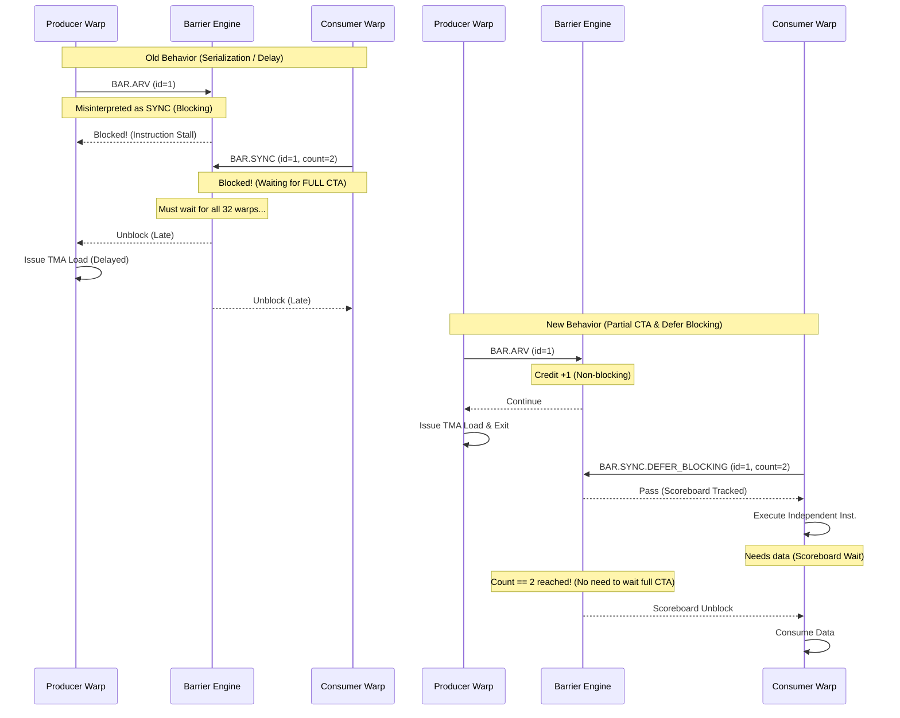

# FA3 Progress

This document tracks the current optimization status for FA3 using the existing notes in:

- `.result/FA3_kernel_5_fwd.md`
- `.result/FA3_kernel_10_bwd.md`
- `.plan/BAR_OP_H100.md`
- `.plan/MEMBAR_SCOPE_AWARE_H100.md`
- `.plan/L1I_prefetch_redesign.md`

To keep this file easy to extend, use the following update pattern whenever a new optimization is added:

- Add one new row to `Optimization Progress`.
- Add one new column per optimization version to each kernel table in `Simulator Cycle Breakdown`.
- Add the corresponding run file paths to `Run Paths`.
- Add one new subsection under `Optimization Details` with the same three sub-sub-sections:
  - `Why this optimization`
  - `How to implement`
  - `Result`
- If a run is still pending or a metric is not yet summarized, keep the cell as `—` and explain the reason in the note column instead of guessing.

## 1. Status Summary

### Optimization Progress

| Version | Opt item | Value / change | FA3 fwd (kernel 5) | FA3 bwd (kernel 10) | Status |
|---|---|---|---|---|---|
| Target HW | Real H100 (NCU) | Actual hardware measurements | 67,696 cycles | 132,901 cycles | Target |
| Init | Baseline simulator | Original simulator state before the targeted fixes below | Not available as a standalone cycle in the current notes | 376,735 cycles (2.83x vs HW) | Fwd missing, bwd available |
| Opt 1 | ROP latency tuning | `-gpgpu_l2_rop_latency 211 -> 100` | 220,024 cycles (3.25x vs HW). This run already used `rop=100`, so there is no separate init cycle to compare against. | 361,760 cycles (2.72x vs HW, -4.0% vs init) | Done |
| Opt 2 | BAR implementation | `OP_BAR` handling + barrier engine fix + warp-exit drain fix | 162,582 cycles (2.40x vs HW, -26% vs Opt 1). Run exits cleanly. | 328,643 cycles (2.47x vs HW, -9.1% vs Opt 1). Run exits cleanly. | Done |
| Opt 3 | MEMBAR Scope-Aware Fix | Scope-aware memory fence (CTA/GPU level) | 158,990 cycles (2.35x vs HW, -2.2% vs Opt 2). Run exits cleanly and `inst_barrier` nearly disappears. | 259,456 cycles (1.95x vs HW, -21.1% vs Opt 2). Run exits cleanly. | Done |
| Opt 4 | Prefetch (deeper stream buffer) | `-prefetch_per_stream_buffer_size 1 -> 4` (deeper stream buffer, config-only) | 155,765 cycles (2.30x vs HW, -2.0% vs Opt 3) | 241,528 cycles (1.82x vs HW, -6.9% vs Opt 3) | Done |
| Opt 5 | L1I eager-promote | Promote a ready prefetched line into L1I as soon as it is filled in the stream buffer, without waiting for a demand and without an L0I response (code change, on top of Opt 4 sb=4) | 150,755 cycles (2.23x vs HW, -3.2% vs Opt 4, -5.2% vs Opt 3) | 242,270 cycles (1.82x vs HW, +0.3% vs Opt 4). SIGSEGV at teardown only (after all stats dumped), so the cycle is trustworthy; a fix + re-run is in progress. | Fwd done; bwd numbers preliminary (re-running) |

### Simulator Cycle Breakdown

#### FA3 fwd - top-level simulator breakdown

| Class | Init | Opt 1 (`rop=100`) | Opt 2 (BAR impl) | Opt 3 (MEMBAR) | Opt 4 (prefetch, sb=4) | Opt 5 (eager-promote) | Note |
|---|---|---|---|---|---|---|---|
| `sim_cycle` | — | 220,024 | 162,582 | 158,990 | 155,765 | 150,755 | Opt 4 = `.o16` (sb=4 only); Opt 5 = `.o18` (sb=4 + eager-promote). |
| `no_warps_ready` | — | 64.02% | 23.83% | 20.98% | 26.81% | 27.82% | Now the dominant class; frontend is no longer #1. |
| `issuing` | — | 14.56% | 21.17% | 24.05% | 31.18% | 31.36% | Roughly flat vs Opt 4. |
| `next_stage_not_available` | — | 11.40% | 15.25% | 17.26% | 22.45% | 22.58% | Downstream pipes; roughly flat vs Opt 4. |
| `no_valid_instruction` | — | 9.52% | 39.12% | 37.01% | 18.63% | 17.32% | Frontend drops a bit further with eager-promote. |
| `issue_port_busy` | — | 0.50% | 0.63% | 0.71% | 0.92% | 0.92% | Present in `.o18`. |
| `sum` | — | 100.00% | 100.00% | 100.00% | 100.00% | 100.00% | |

#### FA3 fwd - inner stall / wait breakdown

| Wait reason | Init | Opt 1 (`rop=100`) | Opt 2 (BAR impl) | Opt 3 (MEMBAR) | Opt 4 (prefetch, sb=4) | Opt 5 (eager-promote) | Note |
|---|---|---|---|---|---|---|---|
| `inst_barrier` | — | 56.09% | 9.09% | 0.05% | 0.07% | 0.07% | Negligible. |
| `wait_barrier` | — | 6.64% | 8.07% | 9.01% | 11.98% | 12.97% | mbarrier-style wait. |
| `tma_axis` | — | 62.73% | 17.16% | 9.06% | 12.05% | 13.04% | Grouped TMA-side stall share. See note [1] below. |
| `non_tma_axis` | — | 17.80% | 17.34% | 19.07% | 24.10% | 24.25% | Execution/resource-side waits. |
| `fu_occupied` | — | 11.83% | 9.91% | 10.91% | 13.53% | 13.60% | Present in `.o18`. |
| `stall_count` | — | 5.00% | 5.97% | 6.56% | 8.47% | 8.53% | Present in `.o18`. |
| `tma_flush` | — | 0.00% | 0.00% | 0.00% | 0.00% | 0.00% | Present in `.o18`. |
| `yield` | — | 0.92% | 1.21% | 1.30% | 1.69% | 1.71% | Present in `.o18`. |
| `result_queue_full` | — | 0.05% | 0.25% | 0.29% | 0.40% | 0.41% | Present in `.o18`. |
| `l1c` | — | 0.00% | 0.00% | 0.00% | 0.00% | 0.00% | Present in `.o18`. |
| `scoreboard (memory)` | — | 0.00% | 0.00% | 0.00% | 0.00% | 0.00% | Present in `.o18`. |

> **[1] On the Opt 1 `tma_axis = 62.73%`.** This is a correctly-recorded value, not an input error. `tma_axis` is the grouped sum `wait_barrier + inst_barrier + tma_flush`, and the **same formula is applied in every column** (e.g. Opt 1: 6.64+56.09+0.00=62.73; Opt 2: 8.07+9.09+0.00=17.16) — it is not split differently between columns. Opt 1 only looks large because the pre-BAR-fix `inst_barrier` (56.09%) is folded in; that is not a real TMA cost. It collapses to 17.16% in Opt 2 purely because `inst_barrier` itself drops (56.09% -> 9.09%) after the BAR implementation. The HW TMA axis is ~23.8%, so the Opt 1 value is an over-attribution driven by the unfixed barrier model.

#### FA3 bwd - top-level simulator breakdown

| Class | Init | Opt 1 (`rop=100`) | Opt 2 (BAR impl) | Opt 3 (MEMBAR) | Opt 4 (prefetch, sb=4) | Opt 5 (eager-promote) | Note |
|---|---|---|---|---|---|---|---|
| `sim_cycle` | 376,735 | 361,760 | 328,643 | 259,456 | 241,528 | 242,270 | Opt 4 = `.o1` (sb=4 only); Opt 5 = `.o320` (sb=4 + eager-promote). Opt 5 SIGSEGV at teardown only (stats already dumped); see note [4]. |
| `no_warps_ready` | 66.40% | 66.64% | 58.27% | 29.80% | 36.56% | 36.30% | Init from `.o304` (rop=211); frontend pressure drops in Opt 4, but more cycles shift into wait/resource buckets. |
| `issuing` | 12.12% | 12.71% | 14.06% | 20.93% | 26.18% | 25.65% | Init from `.o304`. |
| `next_stage_not_available` | 10.17% | 10.69% | 11.41% | 15.11% | 18.96% | 18.53% | downstream pipe back-pressure |
| `no_valid_instruction` | 10.37% | 8.96% | 15.02% | 33.59% | 17.59% | 18.83% | Frontend / L0I miss pressure drops sharply with the deeper stream buffer. |
| `issue_port_busy` | 0.95% | 1.01% | 1.24% | 0.57% | 0.71% | 0.69% | |
| `sum` | 100.00% | 100.00% | 100.00% | 100.00% | 100.00% | 100.00% | Init columns sum to ~100% after rounding. |

#### FA3 bwd - inner stall / wait breakdown

| Wait reason | Init | Opt 1 (`rop=100`) | Opt 2 (BAR impl) | Opt 3 (MEMBAR) | Opt 4 (prefetch, sb=4) | Opt 5 (eager-promote) | Note |
|---|---|---|---|---|---|---|---|
| `inst_barrier` | — | 58.47% / 87.70% of `no_warps_ready` | 44.78% / 76.84% of `no_warps_ready` | 1.01% / 3.40% of `no_warps_ready` | 1.30% / 3.57% of `no_warps_ready` | 1.28% | Remains low after the MEMBAR fix; Opt 4 does not reintroduce the old barrier artifact. |
| `tma_axis` | — | 67.28% / 90.90% of `no_warps_ready` | 58.09% | 17.13% / 57.49% of `no_warps_ready` | 21.96% / 60.06% of `no_warps_ready` | 22.07% | Opt 1 computed, not emitted; see note [2]. |
| `non_tma_axis` | — | 16.40% / 24.50% of `no_warps_ready` | 18.08% | 21.99% / 73.79% of `no_warps_ready` | 27.15% / 74.25% of `no_warps_ready` | 26.64% | Opt 1 computed, not emitted; see note [2]. |
| `fu_occupied` | — | 11.55% / 17.30% of `no_warps_ready` | 12.63% | 14.67% / 49.21% of `no_warps_ready` | 18.09% / 49.47% of `no_warps_ready` | 17.75% | function-unit busy |
| `wait_barrier` | — | 7.98% / 12.00% of `no_warps_ready` | 8.62% | 11.76% / 39.46% of `no_warps_ready` | 14.66% / 40.12% of `no_warps_ready` | 14.80% | `DEPBAR` (SB phase wait = TMA mbarrier) |
| `stall_count` | — | 4.11% / 6.20% of `no_warps_ready` | 4.63% | 6.18% / 20.73% of `no_warps_ready` | 7.55% / 20.65% of `no_warps_ready` | 7.39% | explicit stall cycles |
| `tma_flush` | — | 0.83% / 1.20% of `no_warps_ready` | 4.69% | 4.36% / 14.62% of `no_warps_ready` | 5.99% / 16.38% of `no_warps_ready` | 5.99% | `UTMACMDFLUSH` |
| `yield` | — | 0.68% / 1.00% of `no_warps_ready` | 0.76% | 1.02% / 3.41% of `no_warps_ready` | 1.26% / 3.45% of `no_warps_ready` | 1.23% | `YIELD` |
| `result_queue_full` | — | 0.03% / — | 0.03% | 0.09% / 0.30% of `no_warps_ready` | 0.12% / 0.33% of `no_warps_ready` | 0.12% | fixed-latency result queue |
| `l1c` | — | 0.03% / — | 0.03% | 0.04% / 0.14% of `no_warps_ready` | 0.13% / 0.36% of `no_warps_ready` | 0.15% | L1 constant |
| `scoreboard (memory)` | — | 0.00% / 0.00% of `no_warps_ready` | 0.00% | 0.00% / 0.00% of `no_warps_ready` | 0.00% / 0.00% of `no_warps_ready` | 0.00% | traditional scoreboard (unused here) |

> **[2] On the bwd Opt 1 `tma_axis` / `non_tma_axis`.** These were not emitted as single grouped counters in the Opt 1 run (`.o307`), so the cells are **computed** from the per-reason rows in the same column (the later runs emit them directly):
> - `tma_axis` = `wait_barrier + inst_barrier + tma_flush` = 7.98+58.47+0.83 = **67.28%** (of `no_warps_ready`: 12.00+87.70+1.20 = 90.90%).
> - `non_tma_axis` = `fu_occupied + stall_count + l1c + scoreboard + result_queue_full + yield` = 11.55+4.11+0.03+0.00+0.03+0.68 = **16.40%** (of `no_warps_ready`: 17.30+6.20+1.00 = 24.50%; the `result_queue_full`/`l1c` sub-shares are `—` in this run).
>
> **[3] On the bwd `Init` column.** `sim_cycle` and the top-level breakdown are from the baseline `.o304` run (rop=211). The inner stall/wait per-reason counters were not yet implemented at the `Init` stage, so those cells remain `—` (no source value to report).
>
> **[4] On the bwd Opt 5 column (`.o320`).** The run is sb=4 + eager-promote. It does **not** end with `*** exit detected ***`; instead it raises `SIGSEGV` in the destructor chain (`gpgpu_sim::~gpgpu_sim()` -> `simt_core_cluster::~simt_core_cluster()` -> `SM::~SM()` -> `free()`) **after all simulation statistics were already printed** (the crash is the last line of the file). The simulation body therefore completed and the cycle/breakdown numbers above are trustworthy, but the clean-exit guarantee does not hold. eager-promote counters: `eager_promote_to_cache=985,114`, `demand_hit_later=365,853`, `skipped_fill_port_busy=32,540`, `skipped_has_waiter=0`, `demand_miss_after_promote=2,224`; L1I miss rate 0.1972. A fix for the teardown heap corruption (eager-promote stream-buffer ownership) plus added diagnostics is in place and a re-run is in progress; these numbers are preliminary until the clean re-run confirms them.

### Deferred Opts

Optimizations that were investigated and consciously **parked** because, although they fix a real
modeling inaccuracy, the measured cycle leverage is too small to matter for the 1.8–2.2x sim-vs-HW
gap. Kept here so they are not re-attempted blindly.

| Candidate | What it was | Why deferred | Status |
|---|---|---|---|
| Shared-mem bank-conflict model | Swizzle/vector-width-aware shared bank-conflict + counter-semantics fix (sim over-counts `gpgpu_n_shmem_bkconflict`: fwd 38,016 vs HW 281, bwd 1,327,104 vs HW 35,493). See [SHMEM_BANK_CONFLICT_H100.md](file:///home/jihyun/modern-gpu-simulator-micro-2025/.plan/SHMEM_BANK_CONFLICT_H100.md). | NCU raw shows the per-instruction over-charge is only ~3 cyc and HW shared stores are 98.5–99.5% conflict-free; HW's real store serialization is width-based, which the sim under-states. Fixing the counter improves a metric, not the cycle gap. | Deferred (parked) |
| WGMMA / tensor-pipe issue-serialization (`fu_occupied`) | Stop serializing back-to-back WGMMA issue at the per-WGMMA `initiation_interval` (~32 cyc) so consecutive HGMMAs pipeline like real async WGMMA. Step-0 instrumentation behind `-wgmma_step0_instrument_enable` (default off). See [WGMMA_FU_OCCUPIED_H100.md](file:///home/jihyun/modern-gpu-simulator-micro-2025/.plan/WGMMA_FU_OCCUPIED_H100.md). | Step-0 run (fwd `.o19` / bwd `.o2`): the TRUE recoverable ceiling (`sm_idle_all_blocked_by_tensor`) is only **0.65% (fwd) / 1.59% (bwd)**; the per-subcore `fu_occupied` (13.4% / 18.1%) overcounted the SM-level loss ~7x because another subcore is almost always issuing. Too small for the gap. | Deferred (parked) |

> Open follow-up from the WGMMA Step-0 run: `sm_all_subcores_idle ≈ 18%` on both kernels, of which
> only ~0.65–1.59% is tensor-only. The remaining ~16–17% of true SM-idle is the real target —
> decompose it by the dominant per-subcore blocking reason next.

### Run Paths

Base directory:
`simulator-remodeled/sim_run_12.8/flashattn-fa3-bf16-bwd-causal-b1-s2048-hd64-nh24/flashattn_fa3_bf16_bwd_causal_b1_s2048_hd64_nh24___warmup_0___iters_1`

FA3 fwd

- Opt 1 (`rop=100`)
  - Stats run: `H100_80GB-OnlyKernel5/flashattn-fa3-bf16-bwd-causal-b1-s2048-hd64-nh24-flashattn_fa3_bf16_bwd_causal_b1_s2048_hd64_nh24___warmup_-63a73d452237.o3`
  - Event / debug run: `H100_80GB-OnlyKernel5/flashattn-fa3-bf16-bwd-causal-b1-s2048-hd64-nh24-flashattn_fa3_bf16_bwd_causal_b1_s2048_hd64_nh24___warmup_-63a73d452237.e3`
  - Note: verified as `FlashAttnFwdSm90`, `trace_kernel_id=5`, `rop=100`

- Opt 2 (BAR impl)
  - Stats run: `H100_80GB-OnlyKernel5/flashattn-fa3-bf16-bwd-causal-b1-s2048-hd64-nh24-flashattn_fa3_bf16_bwd_causal_b1_s2048_hd64_nh24___warmup_-63a73d452237.o12`
  - Event / debug run: `H100_80GB-OnlyKernel5/flashattn-fa3-bf16-bwd-causal-b1-s2048-hd64-nh24-flashattn_fa3_bf16_bwd_causal_b1_s2048_hd64_nh24___warmup_-63a73d452237.e12`
  - Note: clean exit, BAR debug summary shows `leaked_ids=0`

- Opt 3 (MEMBAR)
  - Stats run: `H100_80GB-OnlyKernel5/flashattn-fa3-bf16-bwd-causal-b1-s2048-hd64-nh24-flashattn_fa3_bf16_bwd_causal_b1_s2048_hd64_nh24___warmup_-63a73d452237.o15`
  - Event / debug run: `H100_80GB-OnlyKernel5/flashattn-fa3-bf16-bwd-causal-b1-s2048-hd64-nh24-flashattn_fa3_bf16_bwd_causal_b1_s2048_hd64_nh24___warmup_-63a73d452237.e15`
  - Note: clean exit, verified as `FlashAttnFwdSm90` / `trace_kernel_id=5`; `MEMBAR.ALL.CTA` takes the fence path and no `[MEMBARDBG][stuck]` is reported

- Opt 4 (prefetch, sb=4)
  - Stats run: `H100_80GB-OnlyKernel5/flashattn-fa3-bf16-bwd-causal-b1-s2048-hd64-nh24-flashattn_fa3_bf16_bwd_causal_b1_s2048_hd64_nh24___warmup_-63a73d452237.o16`
  - Event / debug run: `H100_80GB-OnlyKernel5/flashattn-fa3-bf16-bwd-causal-b1-s2048-hd64-nh24-flashattn_fa3_bf16_bwd_causal_b1_s2048_hd64_nh24___warmup_-63a73d452237.e16`
  - Note: `-prefetch_per_stream_buffer_size 4` only; clean exit. No eager-promote code in this run.

- Opt 5 (L1I eager-promote, on top of sb=4)
  - Stats run: `H100_80GB-OnlyKernel5/flashattn-fa3-bf16-bwd-causal-b1-s2048-hd64-nh24-flashattn_fa3_bf16_bwd_causal_b1_s2048_hd64_nh24___warmup_-63a73d452237.o18`
  - Event / debug run: `H100_80GB-OnlyKernel5/flashattn-fa3-bf16-bwd-causal-b1-s2048-hd64-nh24-flashattn_fa3_bf16_bwd_causal_b1_s2048_hd64_nh24___warmup_-63a73d452237.e18`
  - Note: `sb=4` + `-is_instruction_prefetch_eager_promote_enabled 1`; clean exit. `eager_promote_to_cache=663,598`, `demand_hit_later=266,752`, `demand_miss_after_promote=498` (all capacity eviction, gap>1k cycles; no immediate-miss = no real Risk A). L1I miss rate 0.6715 -> 0.3387.

FA3 bwd

- Init
  - Stats run: `H100_80GB-OnlyKernel10/flashattn-fa3-bf16-bwd-causal-b1-s2048-hd64-nh24-flashattn_fa3_bf16_bwd_causal_b1_s2048_hd64_nh24___warmup_-82f2f3a37882.o304`
  - Event / debug run: `H100_80GB-OnlyKernel10/flashattn-fa3-bf16-bwd-causal-b1-s2048-hd64-nh24-flashattn_fa3_bf16_bwd_causal_b1_s2048_hd64_nh24___warmup_-82f2f3a37882.e304`
  - Note: baseline kernel-10 run

- Opt 1 (`rop=100`)
  - Stats run: `H100_80GB-OnlyKernel10/flashattn-fa3-bf16-bwd-causal-b1-s2048-hd64-nh24-flashattn_fa3_bf16_bwd_causal_b1_s2048_hd64_nh24___warmup_-fe2c19726f6a.o307`
  - Event / debug run: `H100_80GB-OnlyKernel10/flashattn-fa3-bf16-bwd-causal-b1-s2048-hd64-nh24-flashattn_fa3_bf16_bwd_causal_b1_s2048_hd64_nh24___warmup_-fe2c19726f6a.e307`
  - Note: `rop=100`, full trace run

- Opt 2 (BAR impl)
  - Stats run: `H100_80GB-OnlyKernel10/flashattn-fa3-bf16-bwd-causal-b1-s2048-hd64-nh24-flashattn_fa3_bf16_bwd_causal_b1_s2048_hd64_nh24___warmup_-63a73d452237.o13`
  - Event / debug run: `H100_80GB-OnlyKernel10/flashattn-fa3-bf16-bwd-causal-b1-s2048-hd64-nh24-flashattn_fa3_bf16_bwd_causal_b1_s2048_hd64_nh24___warmup_-63a73d452237.e13`
  - Note: clean exit, BAR debug summary shows `leaked_ids=0`

- Opt 3 (MEMBAR)
  - Stats run: `H100_80GB-OnlyKernel10/flashattn-fa3-bf16-bwd-causal-b1-s2048-hd64-nh24-flashattn_fa3_bf16_bwd_causal_b1_s2048_hd64_nh24___warmup_-8c670b063c3c.o319`
  - Event / debug run: `H100_80GB-OnlyKernel10/flashattn-fa3-bf16-bwd-causal-b1-s2048-hd64-nh24-flashattn_fa3_bf16_bwd_causal_b1_s2048_hd64_nh24___warmup_-8c670b063c3c.e319`
  - Note: clean exit. Final cycle = `259,456`. `MEMBAR.ALL.CTA` uses the new fence path (`[MEMBARDBG][fence-enter]`), no `[MEMBARDBG][stuck]` deadlocks are reported, and the run exits cleanly (`GPGPU-Sim: *** exit detected ***`).

- Opt 4 (prefetch, sb=4 only)
  - Stats run: `H100_80GB-OnlyKernel10/flashattn-fa3-bf16-bwd-causal-b1-s2048-hd64-nh24-flashattn_fa3_bf16_bwd_causal_b1_s2048_hd64_nh24___warmup_-63a73d452237.o1`
  - Event / debug run: `H100_80GB-OnlyKernel10/flashattn-fa3-bf16-bwd-causal-b1-s2048-hd64-nh24-flashattn_fa3_bf16_bwd_causal_b1_s2048_hd64_nh24___warmup_-63a73d452237.e1`
  - Note: `-prefetch_per_stream_buffer_size 4` only; clean exit. Final cycle = `241,528`. No eager-promote counters or `[L1IPFDBG]` logs are present, so this run does NOT include the eager-promote path. `head_demand_arrived_after_ready` remains `0`.

- Opt 5 (L1I eager-promote, on top of sb=4) — preliminary, re-running
  - Stats run: `H100_80GB-OnlyKernel10/flashattn-fa3-bf16-bwd-causal-b1-s2048-hd64-nh24-flashattn_fa3_bf16_bwd_causal_b1_s2048_hd64_nh24___warmup_-8911b3eea0c2.o320`
  - Event / debug run: `H100_80GB-OnlyKernel10/flashattn-fa3-bf16-bwd-causal-b1-s2048-hd64-nh24-flashattn_fa3_bf16_bwd_causal_b1_s2048_hd64_nh24___warmup_-8911b3eea0c2.e320`
  - Note: `sb=4` + `-is_instruction_prefetch_eager_promote_enabled 1`. Final cycle = `242,270` (+0.3% vs Opt 4 `.o1`). **NOT a clean exit**: `SIGSEGV` in the teardown destructor chain after all stats were dumped (see note [4]), so the cycle is trustworthy but the run did not exit cleanly. `eager_promote_to_cache=985,114`, `demand_hit_later=365,853`, `skipped_fill_port_busy=32,540`, `skipped_has_waiter=0`, `demand_miss_after_promote=2,224`; L1I miss rate 0.1972. Teardown-heap-corruption fix + diagnostics applied; re-run in progress.

## 2. Optimization Details

### Opt 1 - ROP latency tuning

#### Why this optimization

- The first hypothesis was that FA3 was paying too much modeled L2/global-memory latency in the simulator.
- In the bwd analysis, `rop_latency` was ranked as the first knob to test because it is paid by all global/TMA accesses, including L2 hits.
- This also made it a low-cost experiment: the change is in runtime config only, so it can be tested without rebuilding the simulator.

#### How to implement

- Update `gpu-simulator/gpgpu-sim/configs/tested-cfgs/SM90_H100_L2_50MB_80GB/gpgpusim.config`.
- Change `-gpgpu_l2_rop_latency` from `211` to `100`.
- Re-run the FA3 kernels with the reduced ROP latency.
- No source rebuild is required because this is a configuration-only change.

#### Result

- FA3 bwd improved from 376,735 cycles to 361,760 cycles, which is only a 4.0% reduction.
- The bwd cycle breakdown shows `scoreboard (memory) = 0.00%`, so memory latency is not the dominant stall for this workload.
- FA3 fwd already has an Opt 1 run at 220,024 cycles, but there is no standalone init cycle preserved in the current notes.
- Overall conclusion: Opt 1 was worth testing, but it is not the main lever for FA3.

### Opt 2 - BAR implementation

#### Why this optimization

- FA3 uses a warp-specialized pipeline that depends heavily on named/counted barriers and correct warp-exit behavior to enable asynchronous cooperation between Producer and Consumer warpgroups.
- We initiated this optimization because the simulator was failing to support this asynchronous behavior, causing artificial blocking (`inst_barrier` ~58%), which led to severe performance bottlenecks and serialization.
- The evidence is strongest in the cycle breakdowns:
  - FA3 fwd Opt 1 had `inst_barrier = 56.09%`.
  - FA3 bwd Opt 1 had `inst_barrier = 58.47%`.
  - FA3 bwd Opt 1 also showed `scoreboard (memory) = 0.00%`, which further points away from the ROP path and toward the barrier path.
- Because the dominant stall was barrier-related, BAR implementation became the highest-value optimization after Opt 1.

#### How to implement

**Original Implementation & The Problem**
- **Original Implementation**: The simulator's `OP_BAR` decoder hardcoded all barrier instructions to `bar_id=0`, `bar_count=-1` (meaning full CTA), and `bar_type=SYNC` (blocking).
- **The Problem**: Arrive-only barriers (`BAR.ARV`) and named barriers for sub-groups were forced to act exactly like a full-CTA `__syncthreads`. Because `bar_count` was ignored, independent Producer and Consumer warps were artificially forced to wait for every other warp in the CTA, completely destroying the warp-specialized concurrency. This caused severe serialization and massive delays. While the program eventually progressed once the sync conditions were met, it suffered from immense performance degradation.

**The Fix (New Implementation)**
- **Accurate Decoding**: In `gpu-simulator/trace-driven/trace_driven.cc`, preserve the real `OP_BAR` semantics by decoding the actual operands:
  - `bar_id`: The identifier (name) of the barrier, allowing multiple independent barriers to exist concurrently.
  - `bar_count`: The specific number of threads/warps required to satisfy the barrier.
  - `bar_type`: The behavior mode (e.g., `SYNC` for blocking wait, `ARV` for non-blocking arrive).
- **Partial CTA (Sub-group) Barriers**: The most critical performance gain comes from respecting `bar_count`. Instead of forcing a full CTA sync, barriers now only wait for the specified subset of warps. This allows Producer and Consumer warps to synchronize only with their relevant peers, enabling true concurrent execution.
  - **Release Condition**: A barrier is released when the number of arrived threads satisfies the requested count: `  (arrived_warps * 32) >= bar_count`
- **Non-blocking ARRIVE**: In `gpu-simulator/gpgpu-sim/src/abstract_hardware_model.h` and `shader.cc`, support non-blocking `ARRIVE` operations. This adds credits to the barrier without stalling the issuing warp.
- **Differentiate SYNC types (DEFER_BLOCKING)**: `BAR.SYNC.DEFER_BLOCKING` is now correctly handled. A traditional `__syncthreads()` (regular `SYNC`) causes an instruction stall, completely stopping the warp's scheduling at the issue stage. In contrast, `DEFER_BLOCKING` does not block the warp at the issue stage. Instead, it allows the warp to proceed and only blocks later via the Scoreboard (dependency tracker) if the warp attempts to access a register or memory dependent on the barrier's result. This allows the warp to continue executing other independent, useful instructions immediately after encountering the barrier.
- **Warp-exit Drain**: Added the warp-exit cleanup path in `barrier_set_t::warp_exit`. Previously, if a warp finished execution and exited before reaching a barrier, the barrier engine would wait forever for that "dead" warp to arrive, leading to a teardown leak or deadlock at the end of the program. Now, when a warp exits, it is immediately removed from the active warp list (`m_warp_active`), and `release_satisfiable_barriers()` is called to re-evaluate if the remaining active warps satisfy the barrier condition, correctly unblocking the waiting warps.

**How BAR operates now**

- Add `release_satisfiable_barriers()` so barriers can release when the remaining active participants have all arrived.
- In `gpu-simulator/gpgpu-sim/src/gpgpu-sim/remodeling/sm.cc`, make sure non-blocking ARRIVE-style barriers are not treated like blocking sync barriers in the issue path.

#### Result

- FA3 fwd improved from 220,024 cycles to 162,582 cycles after the BAR implementation work.
- The fwd run now exits cleanly instead of aborting during deadlock/teardown.
- The barrier-related distortion dropped sharply in fwd:
  - `inst_barrier` went from 56.09% to 9.09%.
  - `tma_axis` went from 62.73% to 17.16%.
- The next major fwd bottleneck is now `no_valid_instruction = 39.12%`, so the dominant problem moved away from barriers after this fix.
- For FA3 bwd, the cycle count dropped from 361,760 to 328,643 (-9.1%). While `inst_barrier` stalls decreased significantly (from 58.47% to 44.78%), they remain the largest bottleneck, indicating that further barrier optimizations or related pipeline fixes are needed for the backward kernel.

### Opt 3 - MEMBAR Scope-Aware Fix

> The full root-cause analysis, SASS control-word decoding, hardware semantics, and the verified inc/dec site table are documented in detail in [MEMBAR_SCOPE_AWARE_H100.md](file:///home/jihyun/project/modern-gpu-simulator-micro-2025/.plan/MEMBAR_SCOPE_AWARE_H100.md). This section is a condensed summary.

#### Why this optimization

- Even after the Opt 2 BAR fix, `inst_barrier` remained the #1 stall in FA3 bwd at **44.78%** of issue cycles / **76.84%** of `no_warps_ready`, leaving the kernel ~2.47x slower than HW (328,643 vs 132,901 cycles).
- Root cause: the dominant barrier event in bwd is `MEMBAR.ALL.CTA` (**55,296 dynamic issues**, #1 by far), and the simulator decoded it as a **full-CTA blocking SYNC barrier** (`bar_type=SYNC, bar_count=-1`) routed through the CTA barrier engine (`warp_reaches_barrier()`).
- That decode is semantically wrong. A `MEMBAR` is an **ordering / visibility fence**, not a thread rendezvous: only the **issuing warp** waits, and only until **its own outstanding writes** become visible at the requested scope. Forcing a full-CTA rendezvous serialized the warp-specialized pipeline exactly like the original BAR bug did. (fwd was barely affected only because it issues `MEMBAR.ALL.CTA` 17x less often — 3,168 vs 55,296.)
- A fence's cost is **not** a fixed cycle count; it is the time to drain the warp's pending writes to the target scope. With no outstanding writes it passes almost immediately — which is exactly why HW NCU shows membar stalls at ~0% for this kernel.
- SASS control-word decoding (`HGMMA`: `id_w=7, wait=0`) further confirmed that **WGMMA ordering is enforced by the separate `WARPGROUP`/`DEPBAR` mechanism**, not by MEMBAR. So the fence must model store visibility only, and must **not** wait on WGMMA completion.

#### How to implement

The fix turns the memory barrier into a **per-warp, scope-aware fence** that waits only until the issuing warp's stores reach the scope the instruction requested:

- `MEMBAR.ALL.CTA` -> CTA-visible stores drained (shared stores + L1-level global stores; observers = other threads of the same CTA via shared memory + L1 on the same SM).
- `MEMBAR.ALL.GPU` -> GPU-visible stores drained (L2-level global + TMA stores), which **subsumes** the CTA condition (observers = other CTAs on other SMs via L2).

**1. Two new per-warp, two-level store counters (`shader.h`).** `m_stores_outstanding` is deliberately left untouched because it backs `stores_done()` for warp/kernel exit; repurposing it would corrupt teardown. Instead two parallel per-warp counters are added to `shd_warp_t`:
  - `m_pending_stores_cta_visible` — shared stores (STS/STSM) + L1-level global stores.
  - `m_pending_stores_gpu_visible` — L2-level (L1-bypass, `.cg`) global stores. (TMA stores reuse the existing `tma_unit_sm` counter and are folded into the GPU condition.)

**2. Visibility-level tagging on `mem_fetch` (`mem_fetch.h`).** A `fence_visibility_level_t` tag (CTA vs GPU) is set once at store **issue** time, using the `is_l1d_bypass()` flag already present on `mem_access_t` (the bypass decision, hence the visibility level, is known at issue). Each sector mem_fetch then carries its own tag, so the correct counter is decremented at whichever ack site fires (L1-hit ack, L2 `WRITE_ACK`), and inc/dec stay balanced at **sector granularity** — the counters return to exactly 0.

**3. Precise inc/dec hooks in the LDST path (`ldst_unit_sm.cc`).**
  - **Global stores**: at issue, `inc_fence_store` increments `cta_visible` when `!is_l1d_bypass()` (L1 path) or `gpu_visible` when `is_l1d_bypass()` (L2-bypass path). On ack, `dec_fence_store` decrements the counter matching the mem_fetch tag.
  - **Shared stores**: shared memory generates **no** `mem_fetch`; it flows through the fixed-latency Pending Request Table (PRT). A new **per-warp, store-only** counter (the existing `m_current_num_shared_mem_inst` is SM-wide and counts loads+stores, so it cannot be reused) is incremented at PRT `assign_entry` and decremented at the PRT store-retire branch (`pop_entry`, gated on `is_shared() && is_store()`), feeding `cta_visible`.

**4. Carry the fence scope on the warp (`sm.cc` / `shader.h`).** Issue used to set only a boolean (`set_membar()`). A `membar_scope_t` (`MEMBAR_SCOPE_CTA` / `MEMBAR_SCOPE_GPU`, with SYS reserved/asserted-out) is now derived from the trace opcode at MEMORY_BARRIER_OP issue and stored on the warp, so the wait logic knows which scope to evaluate.

**5. Scope-aware wait + rendezvous removal (`sm.cc`).** `warp_waiting_at_mem_barrier(warp_id)` was rewritten to bypass the barrier engine entirely for memory fences (`is_non_rendezvous_memory_barrier`, extended to `FENCE.*` + `MEMBAR.ALL.CTA/GPU`) and to drop the old fixed SM-wide stall latency. It now releases based purely on the scope's pending counters:
  - CTA scope: release when `cta_visible == 0`.
  - GPU scope: release when `cta_visible == 0 && gpu_visible == 0 && !tma_unit.warp_has_outstanding_stores()` (GPU subsumes CTA).
  - The existing L1-invalidate-on-flush hook is preserved on release.

**Why this is safe:** the generic SASS wait-barrier check (`wait_barrier_bits`, used by `FENCE.VIEW.ASYNC.S`) lives at the **issue stage** and runs for every op independently of the MEMORY_BARRIER_OP barrier-engine path, and the read/write SB-barrier bookkeeping runs in the common tail of `func_exec_inst`. Bypassing `warp_reaches_barrier()` for MEMBAR therefore leaves async-proxy / WGMMA ordering fully intact — only the (incorrect) store-fence rendezvous is removed.

A deadlock-detection watchdog (`[MEMBARDBG][stuck]`) was also added so any warp that stays parked at a fence beyond a threshold is reported with its live counter values, making counter-leak / drain bugs immediately visible during bring-up.

#### Result

- FA3 fwd improved from 162,582 cycles to 158,990 cycles after the MEMBAR scope-aware fence work, a further **-2.2%** reduction vs Opt 2. This places fwd at **2.35x** the HW target (158,990 vs 67,696 cycles).
- The run exits cleanly. In the debug log, `MEMBAR.ALL.CTA` is confirmed to use the new fence path (`[MEMBARDBG][fence-enter]`) and the watchdog stays silent (`[MEMBARDBG][stuck]` not observed).
- The main MEMBAR-specific symptom is essentially removed in fwd: `inst_barrier` drops from **9.09%** to **0.05%**. The grouped TMA-side stall share also falls again, from **17.16%** to **9.06%**.
- Top-level issue-stage balance improves in the same direction: `no_warps_ready` falls from **23.83%** to **20.98%**, while `issuing` rises from **21.17%** to **24.05%**.
- The dominant remaining fwd bottlenecks are now frontend / availability related rather than barrier related: `no_valid_instruction = 37.01%` and `next_stage_not_available = 17.26%`.
- FA3 bwd improved from 328,643 cycles to 259,456 cycles after the MEMBAR scope-aware fence work, a further **-21.1%** reduction vs Opt 2. This places bwd at **1.95x** the HW target (259,456 vs 132,901 cycles).
- The run exits cleanly. In the debug log, `MEMBAR.ALL.CTA` is confirmed to use the new fence path (`[MEMBARDBG][fence-enter]`), the watchdog stays silent (`[MEMBARDBG][stuck]` not observed), and teardown summaries continue to report `leaked_ids=0`.
- The old barrier-engine artifact is almost eliminated in bwd: `inst_barrier` drops from **44.78%** to **1.01%**. The top-level `no_warps_ready` class also falls from **58.27%** to **29.80%**, while `issuing` rises from **14.06%** to **20.93%**.
- After the MEMBAR fix, the dominant remaining bwd bottlenecks shift away from `inst_barrier` and toward frontend / wait-path pressure: `no_valid_instruction = 33.59%`, `non_tma_axis = 21.99%`, `tma_axis = 17.13%`, and `next_stage_not_available = 15.11%`.

### Opt 4 - Prefetch (deeper stream buffer)

#### Why this optimization

- After Opt 3, the #1 fwd stall became the instruction frontend: `no_valid_instruction = 37.01%`, almost entirely `head_invalid_waiting_frontend` -> `stream_buffer_wait` -> `prefetch_issued_not_ready = 11,710,629 cycles`.
- Root-cause analysis (see [L1I_prefetch_redesign.md](file:///home/jihyun/modern-gpu-simulator-micro-2025/.plan/L1I_prefetch_redesign.md)) found a single shallow stream buffer causing head-of-line blocking: `prefetch_blocked_sb_full = 59,742,797` and `new_stream_rejected_head_waiting_for_cache = 246,187` (~77% of candidates rejected).

#### How to implement

- Config-only: `-prefetch_per_stream_buffer_size 1 -> 4`. A deeper FIFO relieves the head-of-line blocking directly, no code changes.

#### Result

- FA3 fwd (`.o16`): 158,990 -> **155,765 cycles** (**-2.0%** vs Opt 3, **2.30x** vs HW). Clean exit.
  - Frontend pressure dropped sharply: `no_valid_instruction` **37.01% -> 18.63%**, `stream_buffer_wait` **17.67% -> 14.03%**, `prefetch_issued_not_ready` **11,710,629 -> 7,141,887 (-39%)**, `prefetch_blocked_sb_full` **59.7M -> 30.5M (-49%)**, `new_stream_rejected_head_waiting_for_cache` **246,187 -> 166,487 (-32%)**.
  - The cycle reduction is smaller than the stall reduction because relieved frontend pressure shifts into `no_warps_ready` (**20.98% -> 26.81%**) and execution-side waits (`non_tma_axis` 19.07% -> 24.10%, `fu_occupied` 10.91% -> 13.53%). `issuing` rises **24.05% -> 31.18%**.
  - Notably `head_demand_arrived_after_ready` is **still 0**: deeper buffering does not fix the structural "prefetch can never beat demand" problem. That is what Opt 5 targets.
- FA3 bwd (`.o1`): 259,456 -> **241,528 cycles** (**-6.9%** vs Opt 3, **1.82x** vs HW). Clean exit.
  - Top-level balance shifts as expected: `no_valid_instruction` **33.59% -> 17.59%**, `issuing` **20.93% -> 26.18%**, while `no_warps_ready` rises **29.80% -> 36.56%**.
  - `head_demand_arrived_after_ready` is **still 0** here too.

### Opt 5 - L1I eager-promote

> Full root-cause analysis and design are documented in [L1I_prefetch_redesign.md](file:///home/jihyun/modern-gpu-simulator-micro-2025/.plan/L1I_prefetch_redesign.md). Opt 5 is a code change applied on top of Opt 4 (sb=4).

#### Why this optimization

- Even with the deeper buffer (Opt 4), `head_demand_arrived_after_ready` stayed at 0: a prefetch could never be cached before its demand. The cause is structural - a prefetched line sits in the stream buffer and is only copied into the L1I tag array when a demand arrives (promote and L0I response were fused, and the promote was gated on the single L0I response slot).

#### How to implement

*Core idea.* Split the promote from the L0I response. As soon as a prefetched
line is filled in the stream buffer (becomes `is_ready`), promote it straight into
the L1I tag array with **no L0I response generated**. A later demand then simply
HITs in L1I.

*Trigger / scheduling.*
- Runs once per cache cycle, after the demand path has had its turn at the fill
  port that cycle.
- Port gating: the promote consumes the L1I fill port via `use_fill_port()`. If
  the port is already busy this cycle, the promote is **deferred to a later cycle,
  never dropped** (the line stays safely in the stream buffer). This keeps the L1I
  `fill_port_util` metric honest and gives demand fills priority.

*Safety guards (each maps to a failure mode in the plan):*
- **Risk A (silent miss):** fill with the exact key the demand probes -
  `mshr_addr(base_addr)`, asserting `prefetch_addr == base_addr`.
- **Risk B (stranded waiter / deadlock):** promote only when the head is ready,
  not yet demanded, and has **no waiting warp** attached.
- **Risk C (duplicate fill):** probe first; skip if the line is already HIT or has
  an in-flight MSHR entry.

*Observability.*
- Config flags: `-is_instruction_prefetch_eager_promote_enabled` (default off, for
  clean A/B), `-l1i_prefetch_debug_enable`, `-l1i_prefetch_debug_budget`.
- Counters: `total_num_l0i_sb_eager_promote_{to_cache, demand_hit_later,
  demand_miss_after_promote, skipped_already_cached, skipped_fill_port_busy,
  skipped_has_waiter}`.
- `[L1IPFDBG]` logs: success signal `demand-hit-promoted`, critical signal
  `demand-MISS-after-promote`, and a `[stuck]` deadlock watchdog (critical signals
  print regardless of budget).

*Files touched:* `shader.h`, `gpu-sim.cc`, `shader.cc`, `stream_buffer.{h,cc}`,
`first_level_instruction_cache.{h,cc}`.

#### Result

- FA3 fwd (`.o18`, sb=4 + eager-promote): 155,765 -> **150,755 cycles** (**-3.2%** vs Opt 4, **-5.2%** vs Opt 3, **2.23x** vs HW). Clean exit, no deadlock.
- The mechanism works as designed: `eager_promote_to_cache = 663,598`, `demand_hit_later = 266,752` (the success path that was impossible before), `skipped_fill_port_busy = 19,678` (port gating active), `skipped_has_waiter = 0`. **L1I miss rate halved: 0.6715 -> 0.3387.**
- Frontend stall fell only modestly further: `no_valid_instruction` **18.63% -> 17.32%**, `prefetch_issued_not_ready` **7,141,887 -> 6,795,212 (-4.9%)**. The remaining bottleneck is no longer the frontend but `no_warps_ready = 27.82%` and execution-side waits (`non_tma_axis = 24.25%`, `fu_occupied = 13.60%`).
- `demand_miss_after_promote = 498`. Investigation (promote->miss gap distribution: 86% over 1,000 cycles, 0 under 100 cycles; hot lines re-promoted up to 16x per SM) shows these are **capacity evictions**, not a correctness bug: the promoted line is evicted from L1I long before its next demand. **No real Risk A** (immediate miss = mshr mismatch) occurred. Note: the metric currently conflates "evicted before demand" with true immediate miss; see the metric-accuracy follow-up below.
- The gain is smaller than expected. A dedicated re-analysis of why eager-promote yields only -3.2% (despite halving L1I miss rate) is tracked separately.
- FA3 bwd (`.o320`, sb=4 + eager-promote): 241,528 -> **242,270 cycles** (**+0.3%** vs Opt 4, **1.82x** vs HW) — **preliminary**. Unlike fwd, eager-promote gives essentially no bwd cycle benefit here even though L1I miss rate drops. `eager_promote_to_cache = 985,114`, `demand_hit_later = 365,853`, `skipped_has_waiter = 0`, `demand_miss_after_promote = 2,224`.
- The bwd run did **not** exit cleanly: it `SIGSEGV`ed in the teardown destructor chain (`gpgpu_sim::~gpgpu_sim()` -> `simt_core_cluster::~simt_core_cluster()` -> `SM::~SM()` -> `free()`) **after** all statistics were already printed, so the cycle is trustworthy but the clean-exit guarantee fails (fwd `.o18` was clean). Root cause was localized to the eager-promote stream-buffer ownership path: when `try_eager_promote_head()` removed a tracking entry while a prefetch response was still in flight, the later fill fell into the generic orphan path / `assert`, leaving the memory-fetch accounting inconsistent and corrupting the heap (only triggered by the bwd configuration's higher concurrent-prefetch pressure).
- Fix applied (code, on top of Opt 5): `try_eager_promote_head()` now records dropped addresses in `m_eager_promoted_dropped_addrs`; `fill()` treats a later fill for such an address as a benign `[L1IPFDBG][sb-promoted-orphan-fill]` (new counter `total_num_l0i_stream_buffer_fill_eager_promoted_orphaned`) instead of re-driving the cache; and `send_to_cache()` / `has_ready_requested_head()` no longer `assert` on a missing head entry (new counter `total_num_l0i_stream_buffer_send_to_cache_head_missing_entry`, plus `[L1IPFDBG][sb-eager-drop]` logging). A clean re-run is in progress to confirm the bwd numbers.

##### Metric accuracy follow-up (planned)

- `m_eager_promoted_base_addr_cycle` records a promoted base addr but is only
  cleared when a demand observes it. If the line is evicted before any demand, the
  entry lingers; a much later demand then MISSes and is counted as
  `demand_miss_after_promote`, even though the promote was correct.
- Fix direction: classify by promote->miss gap (or check eviction explicitly), so
  a small-gap immediate miss is the only true Risk-A signal and large-gap evictions
  go to a separate `eager_promote_evicted_before_demand` bucket.

## 3. Arch TODO

Known modeling gaps that are **out of scope** for the current optimization pass but should be
implemented later for higher fidelity. These are architectural model limitations, not tuning
knobs.

### TODO-1: TMA shared-memory swizzle is not modeled

- **Status**: not implemented. The `swizzle` field exists in the TMA descriptor model only
  ([tma_types.h:60](file:///home/jihyun/modern-gpu-simulator-micro-2025/simulator-remodeled/gpu-simulator/gpgpu-sim/src/gpgpu-sim/remodeling/tma_types.h#L60), `:257`;
  carried at [tma_unit_sm.cc:380](file:///home/jihyun/modern-gpu-simulator-micro-2025/simulator-remodeled/gpu-simulator/gpgpu-sim/src/gpgpu-sim/remodeling/tma_unit_sm.cc#L380);
  parsed at [gpu-sim.cc:375-377](file:///home/jihyun/modern-gpu-simulator-micro-2025/simulator-remodeled/gpu-simulator/gpgpu-sim/src/gpgpu-sim/gpu-sim.cc#L375-L377))
  but the value is **carried, not used**: the TMA unit does not apply any swizzle when it writes
  a tile into shared memory, and there is no shared-memory bank model on the TMA store path.
- **Why it matters**: On Hopper, TMA writes (GMEM->SMEM) and the subsequent `LDSM`/`LDS`
  consumers rely on the descriptor swizzle to be bank-conflict-free in shared memory. Because the
  sim does not model the swizzle, the SMEM-side write/read bank behavior of TMA tiles is not
  represented at all.
- **TODO**: implement TMA-side shared-memory swizzle (apply the descriptor `swizzle` mode when
  computing the SMEM destination layout) so the TMA store path and the downstream LDSM/LDS
  consumers see the correct (swizzled) shared addresses.

### TODO-2: TMA does not receive a real start (base) address from the trace

- **Status**: TMA fabricates a synthetic GMEM base address per transfer. See
  [tma_unit_sm.cc:629-635](file:///home/jihyun/modern-gpu-simulator-micro-2025/simulator-remodeled/gpu-simulator/gpgpu-sim/src/gpgpu-sim/remodeling/tma_unit_sm.cc#L629-L635):
  the comment states *"The trace does not carry the descriptor base, so we fabricate a
  per-transfer address range purely to exercise memory-hierarchy timing"*, computing
  `agu_base = (transfer_uid << 20) + agu_index * MAX_MEMORY_ACCESS_SIZE`.
- **Why it matters**: because every transfer gets a deterministic fabricated base keyed on
  `transfer_uid`, the model **cannot observe real address behavior** — bank conflicts, address
  coalescing/overlap across transfers, L2 set/line reuse, and any real same-base collisions are
  invisible. Distinct logical transfers that in reality hit the same/adjacent base look like
  unrelated disjoint ranges (or, within a uid, always the same synthetic base), so TMA-side
  memory effects are modeled only as generic timing, not as real address-dependent behavior.
- **TODO**: capture and feed the real TMA descriptor base address (and per-transfer GMEM/SMEM
  offsets) from the trace into the TMA unit, then drive the AGU requests from the real addresses
  instead of the synthetic `agu_base`. This is a prerequisite for modeling TMA bank conflicts /
  address coalescing correctly, and is also required before TODO-1 can be validated against real
  addresses.
