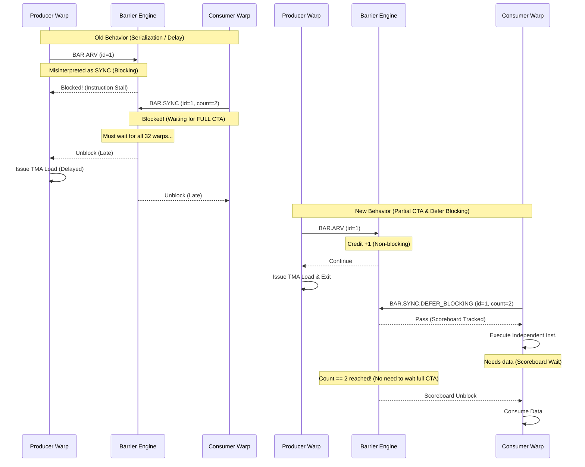

# FA3 Progress

This document tracks the current optimization status for FA3 using the existing notes in:

- `.result/FA3_kernel_5_fwd.md`
- `.result/FA3_kernel_10_bwd.md`
- `.plan/BAR_OP_H100.md`
- `.plan/MEMBAR_SCOPE_AWARE_H100.md`
- `.plan/L1I_prefetch_redesign.md`

To keep this file easy to extend, use the following update pattern whenever a new optimization is added:

- Add one new row to `Optimization Progress`.
- Add one new column per optimization version to each kernel table in `Simulator Cycle Breakdown`.
- Add the corresponding run file paths to `Run Paths`.
- Add one new subsection under `Optimization Details` with the same three sub-sub-sections:
  - `Why this optimization`
  - `How to implement`
  - `Result`
- If a run is still pending or a metric is not yet summarized, keep the cell as `—` and explain the reason in the note column instead of guessing.

## 1. Status Summary

### Optimization Progress

| Version | Opt item | Value / change | FA3 fwd (kernel 5) | FA3 bwd (kernel 10) | Status |
|---|---|---|---|---|---|
| Target HW | Real H100 (NCU) | Actual hardware measurements | 67,696 cycles | 132,901 cycles | Target |
| Init | Baseline simulator | Original simulator state before the targeted fixes below | Not available as a standalone cycle in the current notes | 376,735 cycles (2.83x vs HW) | Fwd missing, bwd available |
| Opt 1 | ROP latency tuning | `-gpgpu_l2_rop_latency 211 -> 100` | 220,024 cycles (3.25x vs HW). This run already used `rop=100`, so there is no separate init cycle to compare against. | 361,760 cycles (2.72x vs HW, -4.0% vs init) | Done |
| Opt 2 | BAR implementation | `OP_BAR` handling + barrier engine fix + warp-exit drain fix | 162,582 cycles (2.40x vs HW, -26% vs Opt 1). Run exits cleanly. | 328,643 cycles (2.47x vs HW, -9.1% vs Opt 1). Run exits cleanly. | Done |
| Opt 3 | MEMBAR Scope-Aware Fix | Scope-aware memory fence (CTA/GPU level) | 158,990 cycles (2.35x vs HW, -2.2% vs Opt 2). Run exits cleanly and `inst_barrier` nearly disappears. | 259,456 cycles (1.95x vs HW, -21.1% vs Opt 2). Run exits cleanly. | Done |
| Opt 4 | Prefetch (deeper stream buffer) | `-prefetch_per_stream_buffer_size 1 -> 4` (deeper stream buffer, config-only) | 155,765 cycles (2.30x vs HW, -2.0% vs Opt 3) | 241,528 cycles (1.82x vs HW, -6.9% vs Opt 3) | Done |
| Opt 5 | L1I eager-promote | Promote a ready prefetched line into L1I as soon as it is filled in the stream buffer, without waiting for a demand and without an L0I response (code change, on top of Opt 4 sb=4) | 149,727 cycles (2.21x vs HW, -3.4% vs Opt 4). From the clean-exit Step-0 instrumentation run (fwd `.o20`); Step-0 counters are timing-neutral. | 241,425 cycles (1.82x vs HW, -0.04% vs Opt 4). From the clean-exit Step-0 run (bwd `.o3`); supersedes the earlier 242,270 figure that hit a teardown SIGSEGV. | Done (cycles from clean-exit `.o20`/`.o3`) |
| Opt 6 | TMA real base + CTA-indexed tile spread (M2/M2.5) | Replace synthetic `(transfer_uid<<20)` address with the real per-site GMEM base + per-CTA tile offset, so L2 locality matches HW | 145,855 cycles (2.15x vs HW, **-2.6% vs Opt 5**). `L2_TMA_true_hit_rate` 0.9854 → **0.9461** (HW 0.6958). fwd `.o31`. This is an **accuracy baseline** (no-fake-wins tradeoff), not a targeted cycle opt — it is the trustworthy baseline that Opt 7 builds on | 290,572 cycles (2.19x vs HW, **+20.4% vs Opt 5** — accuracy tradeoff). `L2_TMA_true_hit_rate` 0.9785 → **0.8718** (HW 0.8226, on target). bwd `.o14` | Done (accuracy prerequisite; enabled Opt 7) |
| Opt 7 | TMA queue/interconnect calibration (inject + reply) | HW-calibrated per-SM 4 sector/clk drain on both inject and reply paths: `-icnt_grant_passes_per_cycle 4` + `-gpgpu_icnt_to_l2_pop_per_cycle 4` (inject) + `-gpgpu_l2_reply_drain_per_cycle 4` + `-gpgpu_cluster_reply_eject_per_cycle 4` (reply), paired so no 1/tick choke remains. Timing-only (work invariant). | 138,021 cycles (2.04x vs HW, **-5.4% vs Opt 6**). fwd `.o35`. `L2_TMA_true_hit_rate` 0.9456 (unchanged → work invariant). | 250,026 cycles (1.88x vs HW, **-13.9% vs Opt 6**). bwd `.o18`. `L2_TMA_true_hit_rate` 0.8688 (unchanged). `gpu_stall_icnt2sh` 1.82M→5.8K, `L2_TMA_output_full` 1.39M→441. | Done. TMA queue tuning now **exhausted** — every queue stage at noise floor; next wall is `ROP_DELAY` (fixed-latency), see Ongoing. |

### Simulator Cycle Breakdown

#### FA3 fwd - top-level simulator breakdown

| Class | Init | Opt 1 (`rop=100`) | Opt 2 (BAR impl) | Opt 3 (MEMBAR) | Opt 4 (prefetch, sb=4) | Opt 5 (eager-promote) | Opt 6 (TMA real base) | Opt 7 (queue calib) | Note |
|---|---|---|---|---|---|---|---|---|---|
| `sim_cycle` | — | 220,024 | 162,582 | 158,990 | 155,765 | 149,727 | 145,855 | 138,021 | Opt 6 = `.o31` (realistic-address baseline). Opt 7 = `.o35` (all queue levers; -5.4% vs Opt 6, work invariant). |
| `no_warps_ready` | — | 64.02% | 23.83% | 20.98% | 26.81% | 27.32% | 27.93% | 29.51% | Now the dominant class; frontend is no longer #1. |
| `issuing` | — | 14.56% | 21.17% | 24.05% | 31.18% | 31.19% | 32.30% | 34.75% | Rises: fewer stalls, more issue slots used. |
| `next_stage_not_available` | — | 11.40% | 15.25% | 17.26% | 22.45% | 22.46% | 23.23% | 24.90% | Downstream pipes; per-subcore (SM-level tensor-block only 0.67%, see Deferred). |
| `no_valid_instruction` | — | 9.52% | 39.12% | 37.01% | 18.63% | 18.11% | 15.59% | 9.81% | Frontend drops further. |
| `issue_port_busy` | — | 0.50% | 0.63% | 0.71% | 0.92% | 0.92% | 0.95% | 1.02% | Present in `.o35`. |
| `sum` | — | 100.00% | 100.00% | 100.00% | 100.00% | 100.00% | 100.00% | 100.00% | |

#### FA3 fwd - inner stall / wait breakdown

| Wait reason | Init | Opt 1 (`rop=100`) | Opt 2 (BAR impl) | Opt 3 (MEMBAR) | Opt 4 (prefetch, sb=4) | Opt 5 (eager-promote) | Opt 6 (TMA real base) | Opt 7 (queue calib) | Note |
|---|---|---|---|---|---|---|---|---|---|
| `inst_barrier` | — | 56.09% | 9.09% | 0.05% | 0.07% | 0.07% | 0.07% | 0.08% | Negligible. |
| `wait_barrier` | — | 6.64% | 8.07% | 9.01% | 11.98% | 12.58% | 12.66% | 13.18% | mbarrier-style wait. |
| `tma_axis` | — | 62.73% | 17.16% | 9.06% | 12.05% | 12.65% | 12.73% | 13.25% | Grouped TMA-side stall share. See note [1] below. |
| `non_tma_axis` | — | 17.80% | 17.34% | 19.07% | 24.10% | 24.07% | 24.90% | 26.59% | Execution/resource-side waits. |
| `fu_occupied` | — | 11.83% | 9.91% | 10.91% | 13.53% | 13.50% | 13.99% | 14.98% | Present in `.o35`. |
| `stall_count` | — | 5.00% | 5.97% | 6.56% | 8.47% | 8.48% | 8.75% | 9.31% | Present in `.o35`. |
| `tma_flush` | — | 0.00% | 0.00% | 0.00% | 0.00% | 0.00% | 0.00% | 0.00% | fwd is load-only. |
| `yield` | — | 0.92% | 1.21% | 1.30% | 1.69% | 1.69% | 1.74% | 1.83% | Present in `.o35`. |
| `result_queue_full` | — | 0.05% | 0.25% | 0.29% | 0.40% | 0.40% | 0.41% | 0.45% | Present in `.o35`. |
| `l1c` | — | 0.00% | 0.00% | 0.00% | 0.00% | 0.00% | 0.00% | 0.03% | Present in `.o35`. |
| `scoreboard (memory)` | — | 0.00% | 0.00% | 0.00% | 0.00% | 0.00% | 0.00% | 0.00% | Present in `.o35`. |

> **[1] On the Opt 1 `tma_axis = 62.73%`.** This is a correctly-recorded value, not an input error. `tma_axis` is the grouped sum `wait_barrier + inst_barrier + tma_flush`, and the **same formula is applied in every column** (e.g. Opt 1: 6.64+56.09+0.00=62.73; Opt 2: 8.07+9.09+0.00=17.16) — it is not split differently between columns. Opt 1 only looks large because the pre-BAR-fix `inst_barrier` (56.09%) is folded in; that is not a real TMA cost. It collapses to 17.16% in Opt 2 purely because `inst_barrier` itself drops (56.09% -> 9.09%) after the BAR implementation. The HW TMA axis is ~23.8%, so the Opt 1 value is an over-attribution driven by the unfixed barrier model.

#### FA3 bwd - top-level simulator breakdown

| Class | Init | Opt 1 (`rop=100`) | Opt 2 (BAR impl) | Opt 3 (MEMBAR) | Opt 4 (prefetch, sb=4) | Opt 5 (eager-promote) | Opt 6 (TMA real base) | Opt 7 (queue calib) | Note |
|---|---|---|---|---|---|---|---|---|---|
| `sim_cycle` | 376,735 | 361,760 | 328,643 | 259,456 | 241,528 | 241,425 | 290,572 | 250,026 | Opt 6 = `.o14` (realistic-address baseline; hit rate 0.8718 ≈ HW 0.8226). Opt 7 = `.o18` (all queue levers; -13.9% vs Opt 6, work invariant). |
| `no_warps_ready` | 66.40% | 66.64% | 58.27% | 29.80% | 36.56% | 36.45% | 41.51% | 34.00% | Falls back as the TMA-completion stall drains. |
| `issuing` | 12.12% | 12.71% | 14.06% | 20.93% | 26.18% | 25.70% | 17.76% | 21.94% | Rises: warps wait less on TMA completion. |
| `next_stage_not_available` | 10.17% | 10.69% | 11.41% | 15.11% | 18.96% | 18.52% | 12.88% | 15.83% | per-subcore (SM-level tensor-block only 1.13%, see Deferred). |
| `no_valid_instruction` | 10.37% | 8.96% | 15.02% | 33.59% | 17.59% | 18.63% | 27.37% | 27.63% | Frontend tail (`nv_ibuffer_empty`) now co-dominant with the TMA axis. |
| `issue_port_busy` | 0.95% | 1.01% | 1.24% | 0.57% | 0.71% | 0.70% | 0.48% | 0.59% | |
| `sum` | 100.00% | 100.00% | 100.00% | 100.00% | 100.00% | 100.00% | 100.00% | 100.00% | Init columns sum to ~100% after rounding. |

#### FA3 bwd - inner stall / wait breakdown

| Wait reason | Init | Opt 1 (`rop=100`) | Opt 2 (BAR impl) | Opt 3 (MEMBAR) | Opt 4 (prefetch, sb=4) | Opt 5 (eager-promote) | Opt 6 (TMA real base) | Opt 7 (queue calib) | Note |
|---|---|---|---|---|---|---|---|---|---|
| `inst_barrier` | — | 58.47% / 87.70% of `no_warps_ready` | 44.78% / 76.84% of `no_warps_ready` | 1.01% / 3.40% of `no_warps_ready` | 1.30% / 3.57% of `no_warps_ready` | 1.26% | 0.89% | 1.09% | Remains low after the MEMBAR fix. |
| `tma_axis` | — | 67.28% / 90.90% of `no_warps_ready` | 58.09% | 17.13% / 57.49% of `no_warps_ready` | 21.96% / 60.06% of `no_warps_ready` | 22.17% | 31.91% | 21.60% | Falls back sharply as the queue levers drain TMA completion latency. |
| `non_tma_axis` | — | 16.40% / 24.50% of `no_warps_ready` | 18.08% | 21.99% / 73.79% of `no_warps_ready` | 27.15% / 74.25% of `no_warps_ready` | 26.66% | 18.94% | 22.79% | |
| `fu_occupied` | — | 11.55% / 17.30% of `no_warps_ready` | 12.63% | 14.67% / 49.21% of `no_warps_ready` | 18.09% / 49.47% of `no_warps_ready` | 17.75% | 12.58% | 15.18% | function-unit busy |
| `wait_barrier` | — | 7.98% / 12.00% of `no_warps_ready` | 8.62% | 11.76% / 39.46% of `no_warps_ready` | 14.66% / 40.12% of `no_warps_ready` | 14.71% | 11.80% | 12.09% | `DEPBAR` (SB phase wait = TMA mbarrier) |
| `stall_count` | — | 4.11% / 6.20% of `no_warps_ready` | 4.63% | 6.18% / 20.73% of `no_warps_ready` | 7.55% / 20.65% of `no_warps_ready` | 7.40% | 5.30% | 6.33% | explicit stall cycles |
| `tma_flush` | — | 0.83% / 1.20% of `no_warps_ready` | 4.69% | 4.36% / 14.62% of `no_warps_ready` | 5.99% / 16.38% of `no_warps_ready` | 6.20% | 19.22% | 8.42% | `UTMACMDFLUSH` store-drain; drops sharply after the reply-path levers (`.o18` SM-idle `tma_flush` 14.66%→6.84%). |
| `yield` | — | 0.68% / 1.00% of `no_warps_ready` | 0.76% | 1.02% / 3.41% of `no_warps_ready` | 1.26% / 3.45% of `no_warps_ready` | 1.23% | 0.87% | 1.06% | `YIELD` |
| `result_queue_full` | — | 0.03% / — | 0.03% | 0.09% / 0.30% of `no_warps_ready` | 0.12% / 0.33% of `no_warps_ready` | 0.12% | 0.08% | 0.10% | fixed-latency result queue |
| `l1c` | — | 0.03% / — | 0.03% | 0.04% / 0.14% of `no_warps_ready` | 0.13% / 0.36% of `no_warps_ready` | 0.16% | 0.11% | 0.13% | L1 constant |
| `scoreboard (memory)` | — | 0.00% / 0.00% of `no_warps_ready` | 0.00% | 0.00% / 0.00% of `no_warps_ready` | 0.00% / 0.00% of `no_warps_ready` | 0.00% | 0.00% | 0.00% | traditional scoreboard (unused here) |

> **[2] On the bwd Opt 1 `tma_axis` / `non_tma_axis`.** These were not emitted as single grouped counters in the Opt 1 run (`.o307`), so the cells are **computed** from the per-reason rows in the same column (the later runs emit them directly):
> - `tma_axis` = `wait_barrier + inst_barrier + tma_flush` = 7.98+58.47+0.83 = **67.28%** (of `no_warps_ready`: 12.00+87.70+1.20 = 90.90%).
> - `non_tma_axis` = `fu_occupied + stall_count + l1c + scoreboard + result_queue_full + yield` = 11.55+4.11+0.03+0.00+0.03+0.68 = **16.40%** (of `no_warps_ready`: 17.30+6.20+1.00 = 24.50%; the `result_queue_full`/`l1c` sub-shares are `—` in this run).
>
> **[3] On the bwd `Init` column.** `sim_cycle` and the top-level breakdown are from the baseline `.o304` run (rop=211). The inner stall/wait per-reason counters were not yet implemented at the `Init` stage, so those cells remain `—` (no source value to report).
>
> **[4] On the bwd Opt 5 column (`.o3`, clean-exit Step-0 run).** The run is sb=4 + eager-promote. It **exits cleanly** (`exit code 0`, no teardown SIGSEGV — the earlier `.o320` run's destructor heap-corruption crash is gone), so the cycle (241,425) and breakdown are fully trustworthy and this supersedes the preliminary 242,270. eager-promote counters: `eager_promote_to_cache=994,032`, `demand_hit_later=366,329`, `skipped_fill_port_busy=31,254`, `skipped_has_waiter=0`, `demand_miss_after_promote=0` (the prior `.o320` showed 2,224 here — the teardown fix also cleared the promote-then-miss artifact); L1I miss rate 0.1977. Step-0 instrumentation counters are timing-neutral, so this is a valid Opt-5 baseline.

### Ongoing (next cycle-reduction levers — after Opt 7)

Opt 6 (address realism) and Opt 7 (TMA queue/interconnect calibration) are **Done**. With Opt 7 the
TMA queue/interconnect axis is **exhausted** — every REQ/reply queue and interconnect stage is at the
noise floor (`Req_Network_in_buffer_full` 355→7, `L2_TMA_output_full_cycles` 1.39M→441,
`gpu_stall_icnt2sh` 1.82M→5.8K, `Reply_Network_in_buffer_full` 6.3→0.02 on bwd `.o18`). Further
depth/drain/eject/width knobs move local `*_full` counters but **not `gpu_sim_cycle`**. The remaining
sim-vs-HW gap (fwd 2.04x / bwd 1.88x) is owned by the two items below. No cycle claim is made until an
item lands a verified improvement.

#### Ongoing item 1 — Opt 8: L2 admission-rate under-modeling (the primary remaining cycle lever)

> Dedicated plan: [L2_ADMISSION_WIDTH_H100.md](file:///home/jihyun/modern-gpu-simulator-micro-2025/.plan/L2_ADMISSION_WIDTH_H100.md) (HW anchor, 2-probe/cycle safety trace, impl + verification). Upstream diagnosis: [TMA_LATENCY_INJECTION_H100.md](file:///home/jihyun/modern-gpu-simulator-micro-2025/.plan/TMA_LATENCY_INJECTION_H100.md) §4.11.7.

- **Evidence (bwd `.o18`).** After Opt 7, **90.0% of a TMA request's round-trip is `IN_PARTITION_ROP_DELAY`** (avg **1,483** cyc), while inject is 7.1%, reply flight 1.5%, and the DRAM device itself is idle (`bw_util ≈ 0.033`, `avg_mrq_latency = 10`, `IN_PARTITION_DRAM = 0.57`). The configured ROP fixed part is only `-gpgpu_l2_rop_latency 100`, so ~1,383 cyc (93% of ROP) is **queue-wait to leave ROP**, not modeled latency.
- **Root cause.** One 24KB TMA transfer = 768×32B sectors, tiled onto a few sub-partitions, each draining at the L2-admission cap of **1 sector (32B)/cycle** (`gpu_stall_dramfull=137,131` = L2-input queue full). HW pipelines it as a bulk line stream.
- **HW-anchored fix (verified 2026-07-13).** A real H100 L2 slice returns **64B/cycle = 2×32B sectors** (32B is the access granularity; 100-class HBM doubled per-slice width from V100's 32B to 64B — Cornell CVW GPU-memory + NVIDIA dev-forum L2-throughput thread). So the sim under-models L2 admission by **2x**. Fix = admit **2 sectors/cycle/sub-partition** (each still through the real `access()`+MSHR+`data_port`, so work stays invariant), mirroring the Opt-7 inject/reply calibration. Target is **2** (L2-slice quantum), NOT 4 (SM→L2 injection quantum). **`m_data_port_width` is NOT this knob** (proven null — only meters occupancy of an already-admitted sector, `ceil(32/32)=1`).
- **Safety traced (before implementing):** `access()` is re-entrant within a cycle; MSHR (192 entries) and miss-queue are capacity- not rate-bounded; the only real relocation risk is the 1/tick miss-queue→DRAM drain, but with ~87% L2 hits and DRAM idle it should be minor. Full trace in the dedicated plan §4.
- **Measure before/after (next run):** the coarse `partiton_level_parallism` counter (already printed) shows only **~44 of 80** sub-partitions active/cycle chip-wide on bwd `.o18`, but that is inject-side and kernel-averaged — it hides temporal burst concentration. A new **per-sub-partition L2-admission histogram** (§8 of the plan) is to be added so the next run directly confirms whether the ROP wall is a few hot slices (spread problem) vs a genuine per-slice throughput limit (Opt 8 lever), and later proves the 1→2 budget is actually used.
- **Alternative (more invasive, deferred):** model a per-transfer ~170-cyc TMA fixed overhead instead of 768 serialized sector round-trips — attacks the same wall from the fixed-latency side but risks deleting the per-sector L2/DRAM traffic whose hit-rate realism Opt 6 earned. Do Opt 8 (admission width) first.

#### Ongoing item 2 — frontend tail / fwd L2-hit over-model (accuracy-side, largely unrecoverable)

- **Frontend tail.** With the TMA axis drained, `no_valid_instruction` / `nv_ibuffer_empty` (~6–9%) is now co-dominant on bwd, but it is HW's own **straggler-tail imbalance** (Waves-Per-SM cross-validated: fwd 1.00 wave, bwd 2.91 non-integer waves; HW SM-idle 9.7% / 11.1% ≈ sim `nv_ibuffer_empty` 12.2% / 10.1%). It is **not** recoverable by a frontend-fetch fix — see the detailed evidence in **Deferred Opts → L1I frontend `stream_buffer_wait`**.
- **fwd L2-hit over-model.** fwd `L2_TMA_true_hit_rate` is still **0.9456 vs HW 0.6958**, due to the **CTA-count cap** (132 CTAs < 384 tiles → ≤132 distinct tiles/tensor). Closing it needs real tile `coords` (Opt-6 approach B) — an **addressing** fix, not a timing one; parked because bwd hit rate is already on target (0.8688 vs HW 0.8226). This is why fwd's DRAM-work ratio is the most off (§4.12: fwd 0.26x vs bwd 0.56x).
- Both are **fidelity items**, not the primary cycle lever; tracked here so they are not mistaken for queue work.

### Deferred Opts

Optimizations that were investigated and consciously **parked** because, although they fix a real
modeling inaccuracy, the measured cycle leverage is too small to matter for the 1.8–2.2x sim-vs-HW
gap. Kept here so they are not re-attempted blindly.

**Shared-mem bank-conflict model.** This was a swizzle / vector-width-aware shared bank-conflict model plus a counter-semantics fix, motivated by the sim over-counting `gpgpu_n_shmem_bkconflict` (fwd 38,016 vs HW 281, bwd 1,327,104 vs HW 35,493). See [SHMEM_BANK_CONFLICT_H100.md](file:///home/jihyun/modern-gpu-simulator-micro-2025/.plan/SHMEM_BANK_CONFLICT_H100.md). It was deferred because the NCU raw data shows the per-instruction over-charge is only ~3 cyc and HW shared stores are 98.5–99.5% conflict-free; HW's real store serialization is width-based, which the sim under-states. Fixing the counter therefore improves a metric, not the cycle gap.

**WGMMA / tensor-pipe issue-serialization (`fu_occupied`).** The idea was to stop serializing back-to-back WGMMA issue at the per-WGMMA `initiation_interval` (~32 cyc) so consecutive HGMMAs pipeline like real async WGMMA, with Step-0 instrumentation behind `-wgmma_step0_instrument_enable` (default off). See [WGMMA_FU_OCCUPIED_H100.md](file:///home/jihyun/modern-gpu-simulator-micro-2025/.plan/WGMMA_FU_OCCUPIED_H100.md). It was deferred because the Step-0 run (fwd `.o19` / bwd `.o2`) showed the TRUE recoverable ceiling (`sm_idle_all_blocked_by_tensor`) is only **0.65% (fwd) / 1.59% (bwd)**; the per-subcore `fu_occupied` (13.4% / 18.1%) overcounted the SM-level loss ~7x because another subcore is almost always issuing. Too small for the gap.

**ISSUE_CONTROL latch depth (`next_stage_not_available`).** A non-TMA candidate: raise the depth-1 `m_ISSUE_CONTROL_latch` so WGMMA II lockout does not back-pressure issue. See [ISSUE_CONTROL_LATCH_DEPTH_H100.md](file:///home/jihyun/modern-gpu-simulator-micro-2025/.plan/ISSUE_CONTROL_LATCH_DEPTH_H100.md). Gate failed on the M2/M2.5 baseline (fwd `.o31` / bwd `.o14`): the per-subcore `next_stage_not_available` is 23.23% / 12.88% but the true `sm_idle_all_blocked_by_tensor` is only **0.67% / 1.13%** — the identical per-subcore over-count mirage as WGMMA `fu_occupied`. Raising the latch depth would move the per-subcore counter but not `gpu_sim_cycle`. Parked without implementing.

**L1I frontend `stream_buffer_wait` / prefetch send-bandwidth.** The original hypothesis was that the L0→L1 prefetch send port (`m_memport` = a single per-SM `L0_icnt` with `max_request_allowed_to_L1I 1`, shared by 4 subcores' demand+prefetch+const) was the #1 remaining frontend bottleneck, supported by `prefetch_blocked_memport_full 1.9M > prefetch_issued 1.1M` and `head_demand_arrived_after_ready = 0` despite a 521-cyc prefetch lead. (An earlier "lookahead=1" diagnosis was wrong — `do_prefetch` already fills ~4 lines.) See [L1I_PREFETCH_LOOKAHEAD_H100.md](file:///home/jihyun/modern-gpu-simulator-micro-2025/.plan/L1I_PREFETCH_LOOKAHEAD_H100.md). It is deferred because three independent lines of evidence show the apparent frontend bucket is actually **tail-drain (winding-down warp/SM imbalance)**, which is not recoverable by any frontend-fetch fix:

- **GATE + sub-bucket decomposition.** The SM-idle decomposition (fwd `.o20` / bwd `.o3`) shows `sm_idle_blocked_by_frontend_sbwait` is only **3.99% / 5.31%** of cycles. The follow-up split run (fwd `.o23`, `gpu_sim_cycle=151,350`, clean exit / bwd `.o5`, `gpu_sim_cycle=241,238`, clean exit) shows the largest coarse bucket `no_valid_other` is almost entirely `nv_ibuffer_empty` = **12.21% / 10.08%**, while `nv_ibuf_fetch_inflight = 0` and `nv_ibuf_fetch_not_issued ≈ 0.005%`. Since the fetch-related sub-buckets are ~0, the empty-ibuffer warps are **drained (trace exhausted)**, not fetch-starved — confirmed in source: `Subcore::cycle()` deliberately leaves a trace-done warp's empty ibuffer unclassified for the inflight/not-issued sub-buckets ([subcore.cc:461-487](file:///home/jihyun/modern-gpu-simulator-micro-2025/simulator-remodeled/gpu-simulator/gpgpu-sim/src/gpgpu-sim/remodeling/subcore.cc#L461-L487)), and the SM-idle counters only increment on cycles where **no** subcore issued ([sm.cc:564-602](file:///home/jihyun/modern-gpu-simulator-micro-2025/simulator-remodeled/gpu-simulator/gpgpu-sim/src/gpgpu-sim/remodeling/sm.cc#L564-L602)). The other major live bucket is `wait_barrier` (~10–11%).

- **Time distribution (per-SM drain).** The `[L1IPFDBG][eager-promote] sm=N ... cycle=C` logs in the split runs (`.e23` / `.e5`) give each SM's last frontend-fetch cycle. Binned into deciles of kernel duration, the idle is **concentrated at the kernel tail, not spread through the middle**: in fwd, **0 SMs** stop before 50% of the kernel, and **103 / 132 SMs (78%)** keep fetching into the final 10% (90–100%) window; the earliest finisher stops at cycle 79,378 (52%), giving a per-SM finish spread of 71,872 cyc (47% of the kernel). In bwd, again **0 SMs** stop before 50%, and **125 / 132 SMs (95%)** finish in the last 20%; earliest finisher at cycle 154,959 (64%), spread 83,741 cyc (35%). A scheduling/throughput bottleneck would spread idle across the whole timeline; this straggler-tail shape rules that out.

- **HW NCU cross-validation.** The H100 NCU report (`nv_reports/h100/...full_rpt.csv`) tracks the same imbalance directly. For fwd: `Waves Per SM = 1.00`, `Block Limit (Registers / Shared Mem) = 1` → exactly **1 CTA per SM, 1 wave**, so an early-finishing SM has no other CTA to switch to; `Elapsed Cycles 67,696` vs `SM Active Cycles 61,147` → **9.67% SM-idle**, and `SMSP Active 60,209` → **11.06% SMSP-idle**, matching the sim's `nv_ibuffer_empty = 12.21%`. For bwd: `Waves Per SM = 2.91` (non-integer = classic tail effect), `Elapsed 132,901` vs `SM Active 118,089` → **11.1% SM-idle**, `SMSP Active 115,328` → **13.2% SMSP-idle**, matching the sim's `nv_ibuffer_empty = 10.08%`. HW achieved occupancy is also below theoretical (fwd 20.14% / 25.0%, bwd 15.02% / 18.75%). In other words the sim's ~10–12% idle is a faithful reproduction of HW's own tail imbalance, not a simulator artifact, so this is unrecoverable and correctly parked.

### Run Paths

Base directory:
`simulator-remodeled/sim_run_12.8/flashattn-fa3-bf16-bwd-causal-b1-s2048-hd64-nh24/flashattn_fa3_bf16_bwd_causal_b1_s2048_hd64_nh24___warmup_0___iters_1`

FA3 fwd

- Opt 1 (`rop=100`)
  - Stats run: `H100_80GB-OnlyKernel5/flashattn-fa3-bf16-bwd-causal-b1-s2048-hd64-nh24-flashattn_fa3_bf16_bwd_causal_b1_s2048_hd64_nh24___warmup_-63a73d452237.o3`
  - Event / debug run: `H100_80GB-OnlyKernel5/flashattn-fa3-bf16-bwd-causal-b1-s2048-hd64-nh24-flashattn_fa3_bf16_bwd_causal_b1_s2048_hd64_nh24___warmup_-63a73d452237.e3`
  - Note: verified as `FlashAttnFwdSm90`, `trace_kernel_id=5`, `rop=100`

- Opt 2 (BAR impl)
  - Stats run: `H100_80GB-OnlyKernel5/flashattn-fa3-bf16-bwd-causal-b1-s2048-hd64-nh24-flashattn_fa3_bf16_bwd_causal_b1_s2048_hd64_nh24___warmup_-63a73d452237.o12`
  - Event / debug run: `H100_80GB-OnlyKernel5/flashattn-fa3-bf16-bwd-causal-b1-s2048-hd64-nh24-flashattn_fa3_bf16_bwd_causal_b1_s2048_hd64_nh24___warmup_-63a73d452237.e12`
  - Note: clean exit, BAR debug summary shows `leaked_ids=0`

- Opt 3 (MEMBAR)
  - Stats run: `H100_80GB-OnlyKernel5/flashattn-fa3-bf16-bwd-causal-b1-s2048-hd64-nh24-flashattn_fa3_bf16_bwd_causal_b1_s2048_hd64_nh24___warmup_-63a73d452237.o15`
  - Event / debug run: `H100_80GB-OnlyKernel5/flashattn-fa3-bf16-bwd-causal-b1-s2048-hd64-nh24-flashattn_fa3_bf16_bwd_causal_b1_s2048_hd64_nh24___warmup_-63a73d452237.e15`
  - Note: clean exit, verified as `FlashAttnFwdSm90` / `trace_kernel_id=5`; `MEMBAR.ALL.CTA` takes the fence path and no `[MEMBARDBG][stuck]` is reported

- Opt 4 (prefetch, sb=4)
  - Stats run: `H100_80GB-OnlyKernel5/flashattn-fa3-bf16-bwd-causal-b1-s2048-hd64-nh24-flashattn_fa3_bf16_bwd_causal_b1_s2048_hd64_nh24___warmup_-63a73d452237.o16`
  - Event / debug run: `H100_80GB-OnlyKernel5/flashattn-fa3-bf16-bwd-causal-b1-s2048-hd64-nh24-flashattn_fa3_bf16_bwd_causal_b1_s2048_hd64_nh24___warmup_-63a73d452237.e16`
  - Note: `-prefetch_per_stream_buffer_size 4` only; clean exit. No eager-promote code in this run.

- Opt 5 (L1I eager-promote, on top of sb=4)
  - Stats run: `H100_80GB-OnlyKernel5/flashattn-fa3-bf16-bwd-causal-b1-s2048-hd64-nh24-flashattn_fa3_bf16_bwd_causal_b1_s2048_hd64_nh24___warmup_-63a73d452237.o20`
  - Event / debug run: `H100_80GB-OnlyKernel5/flashattn-fa3-bf16-bwd-causal-b1-s2048-hd64-nh24-flashattn_fa3_bf16_bwd_causal_b1_s2048_hd64_nh24___warmup_-63a73d452237.e20`
  - Note: `sb=4` + `-is_instruction_prefetch_eager_promote_enabled 1`; clean-exit Step-0 instrumentation run (Step-0 counters are timing-neutral). `eager_promote_to_cache=662,658`, `demand_hit_later=252,212`, `demand_miss_after_promote=0` (no Risk A). L1I miss rate 0.3574. Supersedes the earlier `.o18` (150,755).

- Opt 6 (TMA real base + CTA-indexed tile spread)
  - Stats run: `H100_80GB-OnlyKernel5/flashattn-fa3-bf16-bwd-causal-b1-s2048-hd64-nh24-flashattn_fa3_bf16_bwd_causal_b1_s2048_hd64_nh24___warmup_-63a73d452237.o31`
  - Event / debug run: `H100_80GB-OnlyKernel5/flashattn-fa3-bf16-bwd-causal-b1-s2048-hd64-nh24-flashattn_fa3_bf16_bwd_causal_b1_s2048_hd64_nh24___warmup_-63a73d452237.e31`
  - Note: real-base + CTA-indexed tile spread (M2/M2.5); clean exit. Final cycle = `145,855`. `L2_TMA_true_hit_rate=0.9461` (accuracy baseline, not a cycle win).

- Opt 7 (TMA queue/interconnect calibration)
  - Stats run: `H100_80GB-OnlyKernel5/flashattn-fa3-bf16-bwd-causal-b1-s2048-hd64-nh24-flashattn_fa3_bf16_bwd_causal_b1_s2048_hd64_nh24___warmup_-63a73d452237.o35`
  - Event / debug run: `H100_80GB-OnlyKernel5/flashattn-fa3-bf16-bwd-causal-b1-s2048-hd64-nh24-flashattn_fa3_bf16_bwd_causal_b1_s2048_hd64_nh24___warmup_-63a73d452237.e35`
  - Note: `grant_passes=4` + `icnt_to_l2_pop=4` + `reply_drain=4` + `cluster_reply_eject=4` (all boot logs confirmed live). Final cycle = `138,021` (-5.4% vs Opt 6). `L2_TMA_true_hit_rate=0.9456` (unchanged → work invariant). ROP_DELAY dominates residual round-trip (61% / avg 135; req_side 95.3%).

FA3 bwd

- Init
  - Stats run: `H100_80GB-OnlyKernel10/flashattn-fa3-bf16-bwd-causal-b1-s2048-hd64-nh24-flashattn_fa3_bf16_bwd_causal_b1_s2048_hd64_nh24___warmup_-82f2f3a37882.o304`
  - Event / debug run: `H100_80GB-OnlyKernel10/flashattn-fa3-bf16-bwd-causal-b1-s2048-hd64-nh24-flashattn_fa3_bf16_bwd_causal_b1_s2048_hd64_nh24___warmup_-82f2f3a37882.e304`
  - Note: baseline kernel-10 run

- Opt 1 (`rop=100`)
  - Stats run: `H100_80GB-OnlyKernel10/flashattn-fa3-bf16-bwd-causal-b1-s2048-hd64-nh24-flashattn_fa3_bf16_bwd_causal_b1_s2048_hd64_nh24___warmup_-fe2c19726f6a.o307`
  - Event / debug run: `H100_80GB-OnlyKernel10/flashattn-fa3-bf16-bwd-causal-b1-s2048-hd64-nh24-flashattn_fa3_bf16_bwd_causal_b1_s2048_hd64_nh24___warmup_-fe2c19726f6a.e307`
  - Note: `rop=100`, full trace run

- Opt 2 (BAR impl)
  - Stats run: `H100_80GB-OnlyKernel10/flashattn-fa3-bf16-bwd-causal-b1-s2048-hd64-nh24-flashattn_fa3_bf16_bwd_causal_b1_s2048_hd64_nh24___warmup_-63a73d452237.o13`
  - Event / debug run: `H100_80GB-OnlyKernel10/flashattn-fa3-bf16-bwd-causal-b1-s2048-hd64-nh24-flashattn_fa3_bf16_bwd_causal_b1_s2048_hd64_nh24___warmup_-63a73d452237.e13`
  - Note: clean exit, BAR debug summary shows `leaked_ids=0`

- Opt 3 (MEMBAR)
  - Stats run: `H100_80GB-OnlyKernel10/flashattn-fa3-bf16-bwd-causal-b1-s2048-hd64-nh24-flashattn_fa3_bf16_bwd_causal_b1_s2048_hd64_nh24___warmup_-8c670b063c3c.o319`
  - Event / debug run: `H100_80GB-OnlyKernel10/flashattn-fa3-bf16-bwd-causal-b1-s2048-hd64-nh24-flashattn_fa3_bf16_bwd_causal_b1_s2048_hd64_nh24___warmup_-8c670b063c3c.e319`
  - Note: clean exit. Final cycle = `259,456`. `MEMBAR.ALL.CTA` uses the new fence path (`[MEMBARDBG][fence-enter]`), no `[MEMBARDBG][stuck]` deadlocks are reported, and the run exits cleanly (`GPGPU-Sim: *** exit detected ***`).

- Opt 4 (prefetch, sb=4 only)
  - Stats run: `H100_80GB-OnlyKernel10/flashattn-fa3-bf16-bwd-causal-b1-s2048-hd64-nh24-flashattn_fa3_bf16_bwd_causal_b1_s2048_hd64_nh24___warmup_-63a73d452237.o1`
  - Event / debug run: `H100_80GB-OnlyKernel10/flashattn-fa3-bf16-bwd-causal-b1-s2048-hd64-nh24-flashattn_fa3_bf16_bwd_causal_b1_s2048_hd64_nh24___warmup_-63a73d452237.e1`
  - Note: `-prefetch_per_stream_buffer_size 4` only; clean exit. Final cycle = `241,528`. No eager-promote counters or `[L1IPFDBG]` logs are present, so this run does NOT include the eager-promote path. `head_demand_arrived_after_ready` remains `0`.

- Opt 5 (L1I eager-promote, on top of sb=4)
  - Stats run: `H100_80GB-OnlyKernel10/flashattn-fa3-bf16-bwd-causal-b1-s2048-hd64-nh24-flashattn_fa3_bf16_bwd_causal_b1_s2048_hd64_nh24___warmup_-63a73d452237.o3`
  - Event / debug run: `H100_80GB-OnlyKernel10/flashattn-fa3-bf16-bwd-causal-b1-s2048-hd64-nh24-flashattn_fa3_bf16_bwd_causal_b1_s2048_hd64_nh24___warmup_-63a73d452237.e3`
  - Note: `sb=4` + `-is_instruction_prefetch_eager_promote_enabled 1`; **clean-exit** Step-0 instrumentation run (`exit 0`, the teardown SIGSEGV is fixed; Step-0 counters are timing-neutral). Final cycle = `241,425` (-0.04% vs Opt 4 `.o1`). `eager_promote_to_cache=994,032`, `demand_hit_later=366,329`, `skipped_fill_port_busy=31,254`, `skipped_has_waiter=0`, `demand_miss_after_promote=0`; L1I miss rate 0.1977. Supersedes the earlier `.o320` (242,270, teardown SIGSEGV).

- Opt 6 (TMA real base + CTA-indexed tile spread)
  - Stats run: `H100_80GB-OnlyKernel10/flashattn-fa3-bf16-bwd-causal-b1-s2048-hd64-nh24-flashattn_fa3_bf16_bwd_causal_b1_s2048_hd64_nh24___warmup_-63a73d452237.o14`
  - Event / debug run: `H100_80GB-OnlyKernel10/flashattn-fa3-bf16-bwd-causal-b1-s2048-hd64-nh24-flashattn_fa3_bf16_bwd_causal_b1_s2048_hd64_nh24___warmup_-63a73d452237.e14`
  - Note: real-base + CTA-indexed tile spread (M2/M2.5); clean exit. Final cycle = `290,572`. `L2_TMA_true_hit_rate=0.8718` (≈ HW 0.8226, on target). Cycle rise vs Opt 5 is the "no fake wins" accuracy tradeoff, not a regression.

- Opt 7 (TMA queue/interconnect calibration)
  - Stats run: `H100_80GB-OnlyKernel10/flashattn-fa3-bf16-bwd-causal-b1-s2048-hd64-nh24-flashattn_fa3_bf16_bwd_causal_b1_s2048_hd64_nh24___warmup_-63a73d452237.o18`
  - Event / debug run: `H100_80GB-OnlyKernel10/flashattn-fa3-bf16-bwd-causal-b1-s2048-hd64-nh24-flashattn_fa3_bf16_bwd_causal_b1_s2048_hd64_nh24___warmup_-63a73d452237.e18`
  - Note: `grant_passes=4` + `icnt_to_l2_pop=4` + `reply_drain=4` + `cluster_reply_eject=4` (all boot logs confirmed live). Final cycle = `250,026` (-13.9% vs Opt 6). `L2_TMA_true_hit_rate=0.8688` (unchanged → work invariant). `gpu_stall_icnt2sh` 1.82M→5,792, `L2_TMA_output_full_cycles` →441. Post-run: ROP_DELAY = 90% of TMA round-trip (avg 1,483), queue axis exhausted.

## 2. Optimization Details

### Opt 1 - ROP latency tuning

#### Why this optimization

- The first hypothesis was that FA3 was paying too much modeled L2/global-memory latency in the simulator.
- In the bwd analysis, `rop_latency` was ranked as the first knob to test because it is paid by all global/TMA accesses, including L2 hits.
- This also made it a low-cost experiment: the change is in runtime config only, so it can be tested without rebuilding the simulator.

#### How to implement

- Update `gpu-simulator/gpgpu-sim/configs/tested-cfgs/SM90_H100_L2_50MB_80GB/gpgpusim.config`.
- Change `-gpgpu_l2_rop_latency` from `211` to `100`.
- Re-run the FA3 kernels with the reduced ROP latency.
- No source rebuild is required because this is a configuration-only change.

#### Result

- FA3 bwd improved from 376,735 cycles to 361,760 cycles, which is only a 4.0% reduction.
- The bwd cycle breakdown shows `scoreboard (memory) = 0.00%`, so memory latency is not the dominant stall for this workload.
- FA3 fwd already has an Opt 1 run at 220,024 cycles, but there is no standalone init cycle preserved in the current notes.
- Overall conclusion: Opt 1 was worth testing, but it is not the main lever for FA3.

### Opt 2 - BAR implementation

#### Why this optimization

- FA3 uses a warp-specialized pipeline that depends heavily on named/counted barriers and correct warp-exit behavior to enable asynchronous cooperation between Producer and Consumer warpgroups.
- We initiated this optimization because the simulator was failing to support this asynchronous behavior, causing artificial blocking (`inst_barrier` ~58%), which led to severe performance bottlenecks and serialization.
- The evidence is strongest in the cycle breakdowns:
  - FA3 fwd Opt 1 had `inst_barrier = 56.09%`.
  - FA3 bwd Opt 1 had `inst_barrier = 58.47%`.
  - FA3 bwd Opt 1 also showed `scoreboard (memory) = 0.00%`, which further points away from the ROP path and toward the barrier path.
- Because the dominant stall was barrier-related, BAR implementation became the highest-value optimization after Opt 1.

#### How to implement

**Original Implementation & The Problem**
- **Original Implementation**: The simulator's `OP_BAR` decoder hardcoded all barrier instructions to `bar_id=0`, `bar_count=-1` (meaning full CTA), and `bar_type=SYNC` (blocking).
- **The Problem**: Arrive-only barriers (`BAR.ARV`) and named barriers for sub-groups were forced to act exactly like a full-CTA `__syncthreads`. Because `bar_count` was ignored, independent Producer and Consumer warps were artificially forced to wait for every other warp in the CTA, completely destroying the warp-specialized concurrency. This caused severe serialization and massive delays. While the program eventually progressed once the sync conditions were met, it suffered from immense performance degradation.

**The Fix (New Implementation)**
- **Accurate Decoding**: In `gpu-simulator/trace-driven/trace_driven.cc`, preserve the real `OP_BAR` semantics by decoding the actual operands:
  - `bar_id`: The identifier (name) of the barrier, allowing multiple independent barriers to exist concurrently.
  - `bar_count`: The specific number of threads/warps required to satisfy the barrier.
  - `bar_type`: The behavior mode (e.g., `SYNC` for blocking wait, `ARV` for non-blocking arrive).
- **Partial CTA (Sub-group) Barriers**: The most critical performance gain comes from respecting `bar_count`. Instead of forcing a full CTA sync, barriers now only wait for the specified subset of warps. This allows Producer and Consumer warps to synchronize only with their relevant peers, enabling true concurrent execution.
  - **Release Condition**: A barrier is released when the number of arrived threads satisfies the requested count: `  (arrived_warps * 32) >= bar_count`
- **Non-blocking ARRIVE**: In `gpu-simulator/gpgpu-sim/src/abstract_hardware_model.h` and `shader.cc`, support non-blocking `ARRIVE` operations. This adds credits to the barrier without stalling the issuing warp.
- **Differentiate SYNC types (DEFER_BLOCKING)**: `BAR.SYNC.DEFER_BLOCKING` is now correctly handled. A traditional `__syncthreads()` (regular `SYNC`) causes an instruction stall, completely stopping the warp's scheduling at the issue stage. In contrast, `DEFER_BLOCKING` does not block the warp at the issue stage. Instead, it allows the warp to proceed and only blocks later via the Scoreboard (dependency tracker) if the warp attempts to access a register or memory dependent on the barrier's result. This allows the warp to continue executing other independent, useful instructions immediately after encountering the barrier.
- **Warp-exit Drain**: Added the warp-exit cleanup path in `barrier_set_t::warp_exit`. Previously, if a warp finished execution and exited before reaching a barrier, the barrier engine would wait forever for that "dead" warp to arrive, leading to a teardown leak or deadlock at the end of the program. Now, when a warp exits, it is immediately removed from the active warp list (`m_warp_active`), and `release_satisfiable_barriers()` is called to re-evaluate if the remaining active warps satisfy the barrier condition, correctly unblocking the waiting warps.

**How BAR operates now**

- Add `release_satisfiable_barriers()` so barriers can release when the remaining active participants have all arrived.
- In `gpu-simulator/gpgpu-sim/src/gpgpu-sim/remodeling/sm.cc`, make sure non-blocking ARRIVE-style barriers are not treated like blocking sync barriers in the issue path.

#### Result

- FA3 fwd improved from 220,024 cycles to 162,582 cycles after the BAR implementation work.
- The fwd run now exits cleanly instead of aborting during deadlock/teardown.
- The barrier-related distortion dropped sharply in fwd:
  - `inst_barrier` went from 56.09% to 9.09%.
  - `tma_axis` went from 62.73% to 17.16%.
- The next major fwd bottleneck is now `no_valid_instruction = 39.12%`, so the dominant problem moved away from barriers after this fix.
- For FA3 bwd, the cycle count dropped from 361,760 to 328,643 (-9.1%). While `inst_barrier` stalls decreased significantly (from 58.47% to 44.78%), they remain the largest bottleneck, indicating that further barrier optimizations or related pipeline fixes are needed for the backward kernel.

### Opt 3 - MEMBAR Scope-Aware Fix

> The full root-cause analysis, SASS control-word decoding, hardware semantics, and the verified inc/dec site table are documented in detail in [MEMBAR_SCOPE_AWARE_H100.md](file:///home/jihyun/project/modern-gpu-simulator-micro-2025/.plan/MEMBAR_SCOPE_AWARE_H100.md). This section is a condensed summary.

#### Why this optimization

- Even after the Opt 2 BAR fix, `inst_barrier` remained the #1 stall in FA3 bwd at **44.78%** of issue cycles / **76.84%** of `no_warps_ready`, leaving the kernel ~2.47x slower than HW (328,643 vs 132,901 cycles).
- Root cause: the dominant barrier event in bwd is `MEMBAR.ALL.CTA` (**55,296 dynamic issues**, #1 by far), and the simulator decoded it as a **full-CTA blocking SYNC barrier** (`bar_type=SYNC, bar_count=-1`) routed through the CTA barrier engine (`warp_reaches_barrier()`).
- That decode is semantically wrong. A `MEMBAR` is an **ordering / visibility fence**, not a thread rendezvous: only the **issuing warp** waits, and only until **its own outstanding writes** become visible at the requested scope. Forcing a full-CTA rendezvous serialized the warp-specialized pipeline exactly like the original BAR bug did. (fwd was barely affected only because it issues `MEMBAR.ALL.CTA` 17x less often — 3,168 vs 55,296.)
- A fence's cost is **not** a fixed cycle count; it is the time to drain the warp's pending writes to the target scope. With no outstanding writes it passes almost immediately — which is exactly why HW NCU shows membar stalls at ~0% for this kernel.
- SASS control-word decoding (`HGMMA`: `id_w=7, wait=0`) further confirmed that **WGMMA ordering is enforced by the separate `WARPGROUP`/`DEPBAR` mechanism**, not by MEMBAR. So the fence must model store visibility only, and must **not** wait on WGMMA completion.

#### How to implement

The fix turns the memory barrier into a **per-warp, scope-aware fence** that waits only until the issuing warp's stores reach the scope the instruction requested:

- `MEMBAR.ALL.CTA` -> CTA-visible stores drained (shared stores + L1-level global stores; observers = other threads of the same CTA via shared memory + L1 on the same SM).
- `MEMBAR.ALL.GPU` -> GPU-visible stores drained (L2-level global + TMA stores), which **subsumes** the CTA condition (observers = other CTAs on other SMs via L2).

**1. Two new per-warp, two-level store counters (`shader.h`).** `m_stores_outstanding` is deliberately left untouched because it backs `stores_done()` for warp/kernel exit; repurposing it would corrupt teardown. Instead two parallel per-warp counters are added to `shd_warp_t`:
  - `m_pending_stores_cta_visible` — shared stores (STS/STSM) + L1-level global stores.
  - `m_pending_stores_gpu_visible` — L2-level (L1-bypass, `.cg`) global stores. (TMA stores reuse the existing `tma_unit_sm` counter and are folded into the GPU condition.)

**2. Visibility-level tagging on `mem_fetch` (`mem_fetch.h`).** A `fence_visibility_level_t` tag (CTA vs GPU) is set once at store **issue** time, using the `is_l1d_bypass()` flag already present on `mem_access_t` (the bypass decision, hence the visibility level, is known at issue). Each sector mem_fetch then carries its own tag, so the correct counter is decremented at whichever ack site fires (L1-hit ack, L2 `WRITE_ACK`), and inc/dec stay balanced at **sector granularity** — the counters return to exactly 0.

**3. Precise inc/dec hooks in the LDST path (`ldst_unit_sm.cc`).**
  - **Global stores**: at issue, `inc_fence_store` increments `cta_visible` when `!is_l1d_bypass()` (L1 path) or `gpu_visible` when `is_l1d_bypass()` (L2-bypass path). On ack, `dec_fence_store` decrements the counter matching the mem_fetch tag.
  - **Shared stores**: shared memory generates **no** `mem_fetch`; it flows through the fixed-latency Pending Request Table (PRT). A new **per-warp, store-only** counter (the existing `m_current_num_shared_mem_inst` is SM-wide and counts loads+stores, so it cannot be reused) is incremented at PRT `assign_entry` and decremented at the PRT store-retire branch (`pop_entry`, gated on `is_shared() && is_store()`), feeding `cta_visible`.

**4. Carry the fence scope on the warp (`sm.cc` / `shader.h`).** Issue used to set only a boolean (`set_membar()`). A `membar_scope_t` (`MEMBAR_SCOPE_CTA` / `MEMBAR_SCOPE_GPU`, with SYS reserved/asserted-out) is now derived from the trace opcode at MEMORY_BARRIER_OP issue and stored on the warp, so the wait logic knows which scope to evaluate.

**5. Scope-aware wait + rendezvous removal (`sm.cc`).** `warp_waiting_at_mem_barrier(warp_id)` was rewritten to bypass the barrier engine entirely for memory fences (`is_non_rendezvous_memory_barrier`, extended to `FENCE.*` + `MEMBAR.ALL.CTA/GPU`) and to drop the old fixed SM-wide stall latency. It now releases based purely on the scope's pending counters:
  - CTA scope: release when `cta_visible == 0`.
  - GPU scope: release when `cta_visible == 0 && gpu_visible == 0 && !tma_unit.warp_has_outstanding_stores()` (GPU subsumes CTA).
  - The existing L1-invalidate-on-flush hook is preserved on release.

**Why this is safe:** the generic SASS wait-barrier check (`wait_barrier_bits`, used by `FENCE.VIEW.ASYNC.S`) lives at the **issue stage** and runs for every op independently of the MEMORY_BARRIER_OP barrier-engine path, and the read/write SB-barrier bookkeeping runs in the common tail of `func_exec_inst`. Bypassing `warp_reaches_barrier()` for MEMBAR therefore leaves async-proxy / WGMMA ordering fully intact — only the (incorrect) store-fence rendezvous is removed.

A deadlock-detection watchdog (`[MEMBARDBG][stuck]`) was also added so any warp that stays parked at a fence beyond a threshold is reported with its live counter values, making counter-leak / drain bugs immediately visible during bring-up.

#### Result

- FA3 fwd improved from 162,582 cycles to 158,990 cycles after the MEMBAR scope-aware fence work, a further **-2.2%** reduction vs Opt 2. This places fwd at **2.35x** the HW target (158,990 vs 67,696 cycles).
- The run exits cleanly. In the debug log, `MEMBAR.ALL.CTA` is confirmed to use the new fence path (`[MEMBARDBG][fence-enter]`) and the watchdog stays silent (`[MEMBARDBG][stuck]` not observed).
- The main MEMBAR-specific symptom is essentially removed in fwd: `inst_barrier` drops from **9.09%** to **0.05%**. The grouped TMA-side stall share also falls again, from **17.16%** to **9.06%**.
- Top-level issue-stage balance improves in the same direction: `no_warps_ready` falls from **23.83%** to **20.98%**, while `issuing` rises from **21.17%** to **24.05%**.
- The dominant remaining fwd bottlenecks are now frontend / availability related rather than barrier related: `no_valid_instruction = 37.01%` and `next_stage_not_available = 17.26%`.
- FA3 bwd improved from 328,643 cycles to 259,456 cycles after the MEMBAR scope-aware fence work, a further **-21.1%** reduction vs Opt 2. This places bwd at **1.95x** the HW target (259,456 vs 132,901 cycles).
- The run exits cleanly. In the debug log, `MEMBAR.ALL.CTA` is confirmed to use the new fence path (`[MEMBARDBG][fence-enter]`), the watchdog stays silent (`[MEMBARDBG][stuck]` not observed), and teardown summaries continue to report `leaked_ids=0`.
- The old barrier-engine artifact is almost eliminated in bwd: `inst_barrier` drops from **44.78%** to **1.01%**. The top-level `no_warps_ready` class also falls from **58.27%** to **29.80%**, while `issuing` rises from **14.06%** to **20.93%**.
- After the MEMBAR fix, the dominant remaining bwd bottlenecks shift away from `inst_barrier` and toward frontend / wait-path pressure: `no_valid_instruction = 33.59%`, `non_tma_axis = 21.99%`, `tma_axis = 17.13%`, and `next_stage_not_available = 15.11%`.

### Opt 4 - Prefetch (deeper stream buffer)

#### Why this optimization

- After Opt 3, the #1 fwd stall became the instruction frontend: `no_valid_instruction = 37.01%`, almost entirely `head_invalid_waiting_frontend` -> `stream_buffer_wait` -> `prefetch_issued_not_ready = 11,710,629 cycles`.
- Root-cause analysis (see [L1I_prefetch_redesign.md](file:///home/jihyun/modern-gpu-simulator-micro-2025/.plan/L1I_prefetch_redesign.md)) found a single shallow stream buffer causing head-of-line blocking: `prefetch_blocked_sb_full = 59,742,797` and `new_stream_rejected_head_waiting_for_cache = 246,187` (~77% of candidates rejected).

#### How to implement

- Config-only: `-prefetch_per_stream_buffer_size 1 -> 4`. A deeper FIFO relieves the head-of-line blocking directly, no code changes.

#### Result

- FA3 fwd (`.o16`): 158,990 -> **155,765 cycles** (**-2.0%** vs Opt 3, **2.30x** vs HW). Clean exit.
  - Frontend pressure dropped sharply: `no_valid_instruction` **37.01% -> 18.63%**, `stream_buffer_wait` **17.67% -> 14.03%**, `prefetch_issued_not_ready` **11,710,629 -> 7,141,887 (-39%)**, `prefetch_blocked_sb_full` **59.7M -> 30.5M (-49%)**, `new_stream_rejected_head_waiting_for_cache` **246,187 -> 166,487 (-32%)**.
  - The cycle reduction is smaller than the stall reduction because relieved frontend pressure shifts into `no_warps_ready` (**20.98% -> 26.81%**) and execution-side waits (`non_tma_axis` 19.07% -> 24.10%, `fu_occupied` 10.91% -> 13.53%). `issuing` rises **24.05% -> 31.18%**.
  - Notably `head_demand_arrived_after_ready` is **still 0**: deeper buffering does not fix the structural "prefetch can never beat demand" problem. That is what Opt 5 targets.
- FA3 bwd (`.o1`): 259,456 -> **241,528 cycles** (**-6.9%** vs Opt 3, **1.82x** vs HW). Clean exit.
  - Top-level balance shifts as expected: `no_valid_instruction` **33.59% -> 17.59%**, `issuing` **20.93% -> 26.18%**, while `no_warps_ready` rises **29.80% -> 36.56%**.
  - `head_demand_arrived_after_ready` is **still 0** here too.

### Opt 5 - L1I eager-promote

> Full root-cause analysis and design are documented in [L1I_prefetch_redesign.md](file:///home/jihyun/modern-gpu-simulator-micro-2025/.plan/L1I_prefetch_redesign.md). Opt 5 is a code change applied on top of Opt 4 (sb=4).

#### Why this optimization

- Even with the deeper buffer (Opt 4), `head_demand_arrived_after_ready` stayed at 0: a prefetch could never be cached before its demand. The cause is structural - a prefetched line sits in the stream buffer and is only copied into the L1I tag array when a demand arrives (promote and L0I response were fused, and the promote was gated on the single L0I response slot).

#### How to implement

*Core idea.* Split the promote from the L0I response. As soon as a prefetched
line is filled in the stream buffer (becomes `is_ready`), promote it straight into
the L1I tag array with **no L0I response generated**. A later demand then simply
HITs in L1I.

*Trigger / scheduling.*
- Runs once per cache cycle, after the demand path has had its turn at the fill
  port that cycle.
- Port gating: the promote consumes the L1I fill port via `use_fill_port()`. If
  the port is already busy this cycle, the promote is **deferred to a later cycle,
  never dropped** (the line stays safely in the stream buffer). This keeps the L1I
  `fill_port_util` metric honest and gives demand fills priority.

*Safety guards (each maps to a failure mode in the plan):*
- **Risk A (silent miss):** fill with the exact key the demand probes -
  `mshr_addr(base_addr)`, asserting `prefetch_addr == base_addr`.
- **Risk B (stranded waiter / deadlock):** promote only when the head is ready,
  not yet demanded, and has **no waiting warp** attached.
- **Risk C (duplicate fill):** probe first; skip if the line is already HIT or has
  an in-flight MSHR entry.

*Observability.*
- Config flags: `-is_instruction_prefetch_eager_promote_enabled` (default off, for
  clean A/B), `-l1i_prefetch_debug_enable`, `-l1i_prefetch_debug_budget`.
- Counters: `total_num_l0i_sb_eager_promote_{to_cache, demand_hit_later,
  demand_miss_after_promote, skipped_already_cached, skipped_fill_port_busy,
  skipped_has_waiter}`.
- `[L1IPFDBG]` logs: success signal `demand-hit-promoted`, critical signal
  `demand-MISS-after-promote`, and a `[stuck]` deadlock watchdog (critical signals
  print regardless of budget).

*Files touched:* `shader.h`, `gpu-sim.cc`, `shader.cc`, `stream_buffer.{h,cc}`,
`first_level_instruction_cache.{h,cc}`.

#### Result

- FA3 fwd (`.o20`, sb=4 + eager-promote, clean-exit Step-0 run): 155,765 -> **149,727 cycles** (**-3.4%** vs Opt 4, **2.21x** vs HW). Clean exit, no deadlock. (Supersedes the earlier `.o18` 150,755; Step-0 instrumentation counters are timing-neutral.)
- The mechanism works as designed: `eager_promote_to_cache = 662,658`, `demand_hit_later = 252,212` (the success path that was impossible before), `demand_miss_after_promote = 0`. **L1I miss rate 0.3574.**
- Frontend stall fell only modestly further: `no_valid_instruction` **18.63% -> 18.11%**. The remaining bottleneck is no longer the frontend but `no_warps_ready = 27.32%` and execution-side waits (`non_tma_axis = 24.07%`, `fu_occupied = 13.50%`).
- `demand_miss_after_promote = 0` in the clean-exit `.o20` run (the earlier `.o18` showed 498, all capacity evictions with gap>1k cycles — no real Risk A; the teardown fix also cleared that artifact). Note: the metric previously conflated "evicted before demand" with true immediate miss; see the metric-accuracy follow-up below.
- The gain is smaller than expected. A dedicated re-analysis of why eager-promote yields only -3.4% (despite the L1I miss-rate drop) is tracked separately — and the subsequent Step-0 SM-idle decomposition showed the frontend is only ~4–5% of true SM-idle (see Deferred Opts), so further frontend work is not the lever.
- FA3 bwd (`.o3`, sb=4 + eager-promote, clean-exit Step-0 run): 241,528 -> **241,425 cycles** (**-0.04%** vs Opt 4, **1.82x** vs HW). Unlike fwd, eager-promote gives essentially no bwd cycle benefit even though L1I miss rate drops. `eager_promote_to_cache = 994,032`, `demand_hit_later = 366,329`, `skipped_has_waiter = 0`, `demand_miss_after_promote = 0`; L1I miss rate 0.1977.
- The bwd run now **exits cleanly** (`exit 0`). The earlier `.o320` run `SIGSEGV`ed in the teardown destructor chain (`gpgpu_sim::~gpgpu_sim()` -> `simt_core_cluster::~simt_core_cluster()` -> `SM::~SM()` -> `free()`) **after** all statistics were printed; root cause was the eager-promote stream-buffer ownership path: when `try_eager_promote_head()` removed a tracking entry while a prefetch response was still in flight, the later fill fell into the generic orphan path / `assert`, corrupting the heap (only triggered by the bwd configuration's higher concurrent-prefetch pressure).
- Fix applied (code, on top of Opt 5): `try_eager_promote_head()` now records dropped addresses in `m_eager_promoted_dropped_addrs`; `fill()` treats a later fill for such an address as a benign `[L1IPFDBG][sb-promoted-orphan-fill]` (new counter `total_num_l0i_stream_buffer_fill_eager_promoted_orphaned`) instead of re-driving the cache; and `send_to_cache()` / `has_ready_requested_head()` no longer `assert` on a missing head entry (new counter `total_num_l0i_stream_buffer_send_to_cache_head_missing_entry`, plus `[L1IPFDBG][sb-eager-drop]` logging). The clean-exit `.o3` run confirms the fix.

##### Metric accuracy follow-up (planned)

- `m_eager_promoted_base_addr_cycle` records a promoted base addr but is only
  cleared when a demand observes it. If the line is evicted before any demand, the
  entry lingers; a much later demand then MISSes and is counted as
  `demand_miss_after_promote`, even though the promote was correct.
- Fix direction: classify by promote->miss gap (or check eviction explicitly), so
  a small-gap immediate miss is the only true Risk-A signal and large-gap evictions
  go to a separate `eager_promote_evicted_before_demand` bucket.

### Opt 6 - TMA real base address + CTA-indexed tile spread (M2/M2.5)

> Detailed design & spike history: [TMA_exact_base_mapping_integration.md](file:///home/jihyun/modern-gpu-simulator-micro-2025/.plan/TMA_exact_base_mapping_integration.md) (milestones M0-M4, per-opcode handling), [TMA_BASE_ADDR.md](file:///home/jihyun/modern-gpu-simulator-micro-2025/.plan/TMA_BASE_ADDR.md) (base-recovery spikes SPIKE 1-10, §4.1 result), [TMA_ISA.md](file:///home/jihyun/modern-gpu-simulator-micro-2025/.plan/TMA_ISA.md) (per-opcode base/size).

#### Why this optimization

- The TMA unit fabricated a synthetic GMEM base per transfer (`agu_base = (transfer_uid << 20) + agu_index*128`). Because `transfer_uid` is unique per transfer, repeated reads of the *same* tensor never reused an L2 line → the model could not observe real address behavior (this was the former Arch **TODO-2**).
- Consequence: `L2_TMA_true_hit_rate` was fake-inflated (fwd 0.9854 / bwd 0.9785 in the M1 base-only run) vs HW (fwd 0.6958 / bwd 0.8226). Every prior TMA-latency / reply-path experiment ran on this fake ~0.98 locality, so its "no cycle lever" conclusion was **un-judgeable** — the reply traffic was artificially dense. Realistic addresses are therefore a *prerequisite* for interpreting the TMA bottleneck at all (i.e. the prerequisite for Opt 7), not just a fidelity nicety.

#### How to implement

- **Real base (M1):** recover each descriptor op's exact GMEM base offline into `tma_pc_base_map.json` (23/23 descriptor sites, `pool=0`, via direct SMEM-window offset + UTMACCTL.PF prefetch chain). Load it in `gpu-sim.cc`, look it up in `build_tma_command` by `(uid,pc)`, carry `global_base` + box/element_size on `TMACommand`, and drive the mover from the real base. Gated by `-tma_real_base_addr_enable`.
- **CTA-indexed tile spread (M2):** base-only collapses all of a tensor's tiles to one address (over-hit). The first fix (per-SM visit counter) **failed** — FA3 runs 1 CTA/SM with only ~24 transfers/tensor/SM, so every SM restarted at tile 0 (fwd stayed 0.9854). Fixed by seeding `tile_idx = (global_blockIdx + visit) % num_tiles` from `SM::get_global_cta_id()` (getter exposing the existing local→global CTA map), so distinct CTAs hit distinct tiles grid-wide while same-CTA revisits still hit.
- **M2.5 (UBLKRED/UBLKCP):** raw-pointer ops (not tensormaps); their real base is read offline from the by-value param struct (`launch_param_blobs/*.bin`) and given the same CTA-indexed tiling with `tile_bytes=covered_bytes`. Gated by `-tma_operand_addr_tiling_enable`.
- Files: `sm.h`/`sm.cc` (getter), `tma_unit_sm.{h,cc}` (lookup + mover + tile spread), `tma_types.h`, `gpu-sim.cc` (loader + flags). Commits `6893954` (code) + `0ddaec9` (docs).

#### Result

- `L2_TMA_true_hit_rate`: fwd **0.9854 → 0.9461**, bwd **0.9785 → 0.8718** (HW 0.6958 / 0.8226). **bwd is essentially on target**; fwd is still high due to the **CTA-count cap** (132 CTAs < 384 tiles → ≤132 distinct tiles/tensor). Closing the fwd gap needs real coords (approach B) and is parked (Ongoing item 2) since bwd is on target.
- UBLKRED real-base coverage: **6/6 sites, 6528/6528 commands** (was synthetic in M1).
- Cycles vs Opt 5: fwd 149,727 → **145,855 (-2.6%)**, bwd 241,425 → **290,572 (+20.4%)**. This is an **accuracy** change, not a targeted cycle opt — the bwd rise is the expected "no fake wins" tradeoff (fake ~0.98 locality → real DRAM traffic). This is now the trustworthy baseline Opt 7 builds on.
  - (For reference the M1 base-only run was fwd 142,764 / bwd 276,109; the Opt-progression baseline is Opt 5.)

### Opt 7 - TMA queue/interconnect calibration (inject + reply paths)

> Full derivation & experiment history: [TMA_LATENCY_INJECTION_H100.md](file:///home/jihyun/modern-gpu-simulator-micro-2025/.plan/TMA_LATENCY_INJECTION_H100.md) §4 (this Opt consolidates every measured experiment there: §4.5 reply-depth/drain, §4.8/§4.9 injection grant-passes + icnt→L2 pop, §4.11 port-width A/B, §4.11.6 paired reply-eject/drain, §4.11.7 post-run diagnosis, §6 summary).

#### Why this optimization

- On the realistic-address Opt-6 baseline, the #1 recoverable SM-idle was the TMA-completion axis (`wait_barrier` ≈ 9.5%, bwd `tma_flush` ≈ 14.66%). Static + measured analysis traced this to a chain of **1-item-per-cycle chokes** around a physically-idle DRAM (`bw_util` ≈ 8%): the SM's single shared REQ icnt injection node, the icnt→L2 pop, the L2→icnt reply drain, and the per-SM reply eject each moved only 1 sector-mf/tick, while one 24KB TMA transfer emits 768×32B sectors. That count ÷ the 1/tick chokes was the serialization.
- HW anchor (arXiv:2501.12084): the per-SM SM→L2 load bandwidth is **124 byte/clk ≈ 4 sector/clk = one 128B line/clk**, and TMA **shares** that path (no dedicated port). So the calibration target for every injection/reply stage is ~4 sector/clk — not "free memory".

#### How to implement

All knobs are config-gated and default to 1 (bit-identical). The H100 config sets them to 4:
- **Injection:** `-icnt_grant_passes_per_cycle 4` (xbar iSLIP runs up to N grant passes/tick) paired with `-gpgpu_icnt_to_l2_pop_per_cycle 4` (downstream icnt→L2 pop) — must be paired or the stall relocates to the out_buffer.
- **Reply:** `-gpgpu_l2_reply_drain_per_cycle 4` (L2→icnt reply FIFO drain) paired with the new `-gpgpu_cluster_reply_eject_per_cycle 4` (per-SM `simt_core_cluster::icnt_cycle` eject). §4.5 proved reply_drain alone is null (the stall relocated to the still-1/tick eject); pairing both ends removes the last reply choke.
- Every drained packet still passes `Has_Buffer_Out`/`icnt_push`/`full()`, so bandwidth accounting stays honest. Plus two timing-neutral correctness fixes: ceil-division fill/writeback port occupancy (prevents a fake 0-cycle fill when sweeping port width) and the `IN_PARTITION_L2_TO_DRAM_QUEUE` status-timestamp bug (§4.11.5a).
- L2 data-port width 32→64 was tested and **rejected** (null for both kernels); config left at 32B.
- Files: `local_interconnect.{h,cc}`, `icnt_wrapper.cc`, `gpu-sim.{cc,h}`, `shader.{h,cc}`, `gpu-cache.cc`, `l2cache.{h,cc}`, `gpgpusim.config`.

#### Result

- Cycles vs Opt 6: fwd 145,855 → **138,021 (-5.4%)** (`.o35`, 2.04x vs HW), bwd 290,572 → **250,026 (-13.9%)** (`.o18`, 1.88x vs HW). BWD gains more because its reply FIFO was a genuine relief valve; FWD's residual is reply-side fixed-latency across small transfers, which a throughput knob cannot touch.
- **Work invariant (the win is timing-only, not fake locality):** `L2_TMA_true_hit_rate` fwd 0.9456 / bwd 0.8688 (unchanged vs Opt 6); L2 accesses/read/write bytes within ~1%.
- Bottleneck relieved: bwd `Req_Network_in_buffer_full` 355→7, `L2_TMA_output_full_cycles` 1.39M→441, `gpu_stall_icnt2sh` 1.82M→5,792, `Reply_Network_in_buffer_full` 6.3→0.02. `tma_flush` SM-idle 14.66%→6.84%.
- **The levers actually fired:** bwd `reply_eject_multi_ticks=2.89M` (avg 2.17/tick, max_burst 4); `Req_Network_extra_pass_grants_total` large; ~67% of icnt→L2 pops came from the added downstream pops.
- **Conclusion — TMA queue/interconnect tuning is exhausted.** Post-run stage residency (bwd `.o18`) shows **90% of a TMA request's round-trip is now `ROP_DELAY`** (avg 1,483 cyc), a fixed-latency per-sector serialization, not any queue. Every queue stage is at the noise floor. The next cycle lever is the TMA fixed-overhead model (Ongoing item 1), not more queue widening.

## 3. Arch TODO

Known modeling gaps that are **out of scope** for the current optimization pass but should be
implemented later for higher fidelity. These are architectural model limitations, not tuning
knobs.

### TODO-1: TMA shared-memory swizzle is not modeled

- **Status**: not implemented. The `swizzle` field exists in the TMA descriptor model only
  ([tma_types.h:60](file:///home/jihyun/modern-gpu-simulator-micro-2025/simulator-remodeled/gpu-simulator/gpgpu-sim/src/gpgpu-sim/remodeling/tma_types.h#L60), `:257`;
  carried at [tma_unit_sm.cc:380](file:///home/jihyun/modern-gpu-simulator-micro-2025/simulator-remodeled/gpu-simulator/gpgpu-sim/src/gpgpu-sim/remodeling/tma_unit_sm.cc#L380);
  parsed at [gpu-sim.cc:375-377](file:///home/jihyun/modern-gpu-simulator-micro-2025/simulator-remodeled/gpu-simulator/gpgpu-sim/src/gpgpu-sim/gpu-sim.cc#L375-L377))
  but the value is **carried, not used**: the TMA unit does not apply any swizzle when it writes
  a tile into shared memory, and there is no shared-memory bank model on the TMA store path.
- **Why it matters**: On Hopper, TMA writes (GMEM->SMEM) and the subsequent `LDSM`/`LDS`
  consumers rely on the descriptor swizzle to be bank-conflict-free in shared memory. Because the
  sim does not model the swizzle, the SMEM-side write/read bank behavior of TMA tiles is not
  represented at all.
- **TODO**: implement TMA-side shared-memory swizzle (apply the descriptor `swizzle` mode when
  computing the SMEM destination layout) so the TMA store path and the downstream LDSM/LDS
  consumers see the correct (swizzled) shared addresses.
- **Clarification — swizzle is an SMEM-bank concern, NOT the "spread across L2 slices" mechanism.**
  A common conflation: "swizzle spreads the transfer across all L2 sub-partitions to reach peak
  bandwidth." That peak-bandwidth spreading is done by the **L2 partition indexing / address hashing**
  (GMEM line → L2 slice), which the sim **already implements** (`addrdec.cc` + `hashing.cc`, IPoly,
  `-gpgpu_memory_partition_indexing 2`). TMA descriptor swizzle instead rearranges bytes **within one
  CTA's shared memory** to avoid the 32-bank SMEM conflict on the GMEM→SMEM write and the LDSM/LDS
  reads — it does not change which L2 slice a line lands on. The two are orthogonal (different memory
  layers). Whether TMA bursts actually exploit the L2 slice spread is a separate, measurable question —
  see [L2_ADMISSION_WIDTH_H100.md](file:///home/jihyun/modern-gpu-simulator-micro-2025/.plan/L2_ADMISSION_WIDTH_H100.md) §8 (per-slice admission histogram) / §9.

> Note: the former **TODO-2 (real TMA base address)** has been implemented — real per-site GMEM
> base + CTA-indexed tile spread (M2/M2.5). It is no longer a TODO; see the Ongoing section above
> and [TMA_exact_base_mapping_integration.md](file:///home/jihyun/modern-gpu-simulator-micro-2025/.plan/TMA_exact_base_mapping_integration.md).
