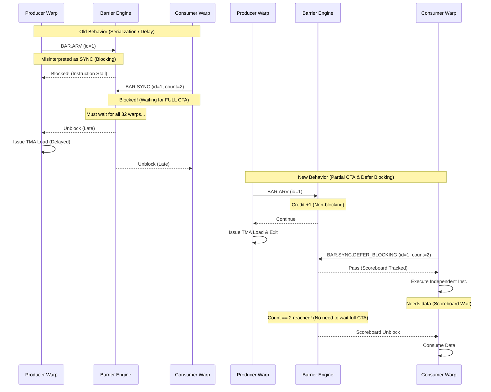

# FA3 Progress

This document tracks the current optimization status for FA3 using the existing notes in:

- `.result/FA3_kernel_5_fwd.md`
- `.result/FA3_kernel_10_bwd.md`
- `.plan/BAR_OP_H100.md`

To keep this file easy to extend, use the following update pattern whenever a new optimization is added:

- Add one new row to `Optimization Progress`.
- Add one new column per optimization version to each kernel table in `Simulator Cycle Breakdown`.
- Add the corresponding run file paths to `Run Paths`.
- Add one new subsection under `Optimization Details` with the same three sub-sub-sections:
  - `Why this optimization`
  - `How to implement`
  - `Result`
- If a run is still pending or a metric is not yet summarized, keep the cell as `—` and explain the reason in the note column instead of guessing.

## 1. Status Summary

### Optimization Progress

| Version | Opt item | Value / change | FA3 fwd (kernel 5) | FA3 bwd (kernel 10) | Status |
|---|---|---|---|---|---|
| Init | Baseline simulator | Original simulator state before the targeted fixes below | Not available as a standalone cycle in the current notes | 376,735 cycles (2.83x vs HW) | Fwd missing, bwd available |
| Opt 1 | ROP latency tuning | `-gpgpu_l2_rop_latency 211 -> 100` | 220,024 cycles (3.25x vs HW). This run already used `rop=100`, so there is no separate init cycle to compare against. | 361,760 cycles (2.72x vs HW, -4.0% vs init) | Done |
| Opt 2 | BAR implementation | `OP_BAR` handling + barrier engine fix + warp-exit drain fix | 162,582 cycles (2.40x vs HW, -26% vs Opt 1). Run exits cleanly. | BAR-enabled cycle not available yet. Run is still in progress. | Fwd done, bwd running |

### Simulator Cycle Breakdown

#### FA3 fwd - top-level simulator breakdown

| Class | Init | Opt 1 (`rop=100`) | Opt 2 (BAR impl) | Note |
|---|---|---|---|---|
| `sim_cycle` | — | 220,024 | 162,582 | No standalone init cycle is available in the current notes. The Opt 2 run also exits cleanly. |
| `no_warps_ready` | — | 64.02% | 23.83% | This drops sharply after the BAR fix. |
| `issuing` | — | 14.56% | 21.17% | Issuing share improves after the BAR fix. |
| `next_stage_not_available` | — | 11.40% | 15.25% | Present in the Opt 2 run output (`.o12`). |
| `no_valid_instruction` | — | 9.52% | 39.12% | This becomes the new dominant bucket after the BAR fix. |
| `issue_port_busy` | — | 0.50% | 0.63% | Present in the run outputs (`.o3`, `.o12`). |
| `sum` | — | 100.00% | 100.00% | Top-level classes sum to 100% in both runs. |

#### FA3 fwd - inner stall / wait breakdown

| Wait reason | Init | Opt 1 (`rop=100`) | Opt 2 (BAR impl) | Note |
|---|---|---|---|---|
| `inst_barrier` | — | 56.09% | 9.09% | Barrier inflation drops sharply after the BAR fix. |
| `wait_barrier` | — | 6.64% | 8.07% | mbarrier wait remains present. |
| `tma_axis` | — | 62.73% | 17.16% | Grouped TMA-side stall share falls substantially. |
| `non_tma_axis` | — | 17.80% | 17.34% | Grouped non-TMA stall share stays similar. |
| `fu_occupied` | — | 11.83% | 9.91% | Present in the run outputs (`.o3`, `.o12`). |
| `stall_count` | — | 5.00% | 5.97% | Present in the run outputs (`.o3`, `.o12`). |
| `tma_flush` | — | 0.00% | 0.00% | Present in the run outputs (`.o3`, `.o12`). |
| `yield` | — | 0.92% | 1.21% | Present in the run outputs (`.o3`, `.o12`). |
| `result_queue_full` | — | 0.05% | 0.25% | Present in the run outputs (`.o3`, `.o12`). |
| `l1c` | — | 0.00% | 0.00% | Present in the run outputs (`.o3`, `.o12`). |
| `scoreboard (memory)` | — | 0.00% | 0.00% | Present in the run outputs (`.o3`, `.o12`). |

#### FA3 bwd - top-level simulator breakdown

| Class | Init | Opt 1 (`rop=100`) | Opt 2 (BAR impl) | Note |
|---|---|---|---|---|
| `sim_cycle` | 376,735 | 361,760 | — | BAR-enabled cycle is not available yet because the run is still in progress. |
| `no_warps_ready` | — | 66.64% | — | This is the dominant top-level class in Opt 1. |
| `issuing` | — | 12.71% | — | |
| `next_stage_not_available` | — | 10.69% | — | downstream pipe back-pressure |
| `no_valid_instruction` | — | 8.96% | — | frontend / L0I miss |
| `issue_port_busy` | — | 1.01% | — | |
| `sum` | — | 100.00% | — | Verified exclusive in the source doc. |

#### FA3 bwd - inner stall / wait breakdown

| Wait reason | Init | Opt 1 (`rop=100`) | Opt 2 (BAR impl) | Note |
|---|---|---|---|---|
| `inst_barrier` | — | 58.47% / 87.70% of `no_warps_ready` | — | `BAR.SYNC` only (`__syncthreads`) |
| `fu_occupied` | — | 11.55% / 17.30% of `no_warps_ready` | — | function-unit busy |
| `wait_barrier` | — | 7.98% / 12.00% of `no_warps_ready` | — | `DEPBAR` (SB phase wait = TMA mbarrier) |
| `stall_count` | — | 4.11% / 6.20% of `no_warps_ready` | — | explicit stall cycles |
| `tma_flush` | — | 0.83% / 1.20% of `no_warps_ready` | — | `UTMACMDFLUSH` |
| `yield` | — | 0.68% / 1.00% of `no_warps_ready` | — | `YIELD` |
| `result_queue_full` | — | 0.03% / — | — | fixed-latency result queue |
| `l1c` | — | 0.03% / — | — | L1 constant |
| `scoreboard (memory)` | — | 0.00% / 0.00% of `no_warps_ready` | — | traditional scoreboard (unused here) |

### Run Paths

Base directory:
`simulator-remodeled/sim_run_12.8/flashattn-fa3-bf16-bwd-causal-b1-s2048-hd64-nh24/flashattn_fa3_bf16_bwd_causal_b1_s2048_hd64_nh24___warmup_0___iters_1`

FA3 fwd

- Opt 1 (`rop=100`)
  - Stats run: `H100_80GB-OnlyKernel5/flashattn-fa3-bf16-bwd-causal-b1-s2048-hd64-nh24-flashattn_fa3_bf16_bwd_causal_b1_s2048_hd64_nh24___warmup_-63a73d452237.o3`
  - Event / debug run: `H100_80GB-OnlyKernel5/flashattn-fa3-bf16-bwd-causal-b1-s2048-hd64-nh24-flashattn_fa3_bf16_bwd_causal_b1_s2048_hd64_nh24___warmup_-63a73d452237.e3`
  - Note: verified as `FlashAttnFwdSm90`, `trace_kernel_id=5`, `rop=100`

- Opt 2 (BAR impl)
  - Stats run: `H100_80GB-OnlyKernel5/flashattn-fa3-bf16-bwd-causal-b1-s2048-hd64-nh24-flashattn_fa3_bf16_bwd_causal_b1_s2048_hd64_nh24___warmup_-63a73d452237.o12`
  - Event / debug run: `H100_80GB-OnlyKernel5/flashattn-fa3-bf16-bwd-causal-b1-s2048-hd64-nh24-flashattn_fa3_bf16_bwd_causal_b1_s2048_hd64_nh24___warmup_-63a73d452237.e12`
  - Note: clean exit, BAR debug summary shows `leaked_ids=0`

FA3 bwd

- Init
  - Stats run: `H100_80GB-OnlyKernel10/flashattn-fa3-bf16-bwd-causal-b1-s2048-hd64-nh24-flashattn_fa3_bf16_bwd_causal_b1_s2048_hd64_nh24___warmup_-82f2f3a37882.o304`
  - Event / debug run: `H100_80GB-OnlyKernel10/flashattn-fa3-bf16-bwd-causal-b1-s2048-hd64-nh24-flashattn_fa3_bf16_bwd_causal_b1_s2048_hd64_nh24___warmup_-82f2f3a37882.e304`
  - Note: baseline kernel-10 run

- Opt 1 (`rop=100`)
  - Stats run: `H100_80GB-OnlyKernel10/flashattn-fa3-bf16-bwd-causal-b1-s2048-hd64-nh24-flashattn_fa3_bf16_bwd_causal_b1_s2048_hd64_nh24___warmup_-fe2c19726f6a.o307`
  - Event / debug run: `H100_80GB-OnlyKernel10/flashattn-fa3-bf16-bwd-causal-b1-s2048-hd64-nh24-flashattn_fa3_bf16_bwd_causal_b1_s2048_hd64_nh24___warmup_-fe2c19726f6a.e307`
  - Note: `rop=100`, full trace run

- Opt 2 (BAR impl)
  - Stats run: `—`
  - Event / debug run: `—`
  - Note: run is still in progress

## 2. Optimization Details

### Opt 1 - ROP latency tuning

#### Why this optimization

- The first hypothesis was that FA3 was paying too much modeled L2/global-memory latency in the simulator.
- In the bwd analysis, `rop_latency` was ranked as the first knob to test because it is paid by all global/TMA accesses, including L2 hits.
- This also made it a low-cost experiment: the change is in runtime config only, so it can be tested without rebuilding the simulator.

#### How to implement

- Update `gpu-simulator/gpgpu-sim/configs/tested-cfgs/SM90_H100_L2_50MB_80GB/gpgpusim.config`.
- Change `-gpgpu_l2_rop_latency` from `211` to `100`.
- Re-run the FA3 kernels with the reduced ROP latency.
- No source rebuild is required because this is a configuration-only change.

#### Result

- FA3 bwd improved from 376,735 cycles to 361,760 cycles, which is only a 4.0% reduction.
- The bwd cycle breakdown shows `scoreboard (memory) = 0.00%`, so memory latency is not the dominant stall for this workload.
- FA3 fwd already has an Opt 1 run at 220,024 cycles, but there is no standalone init cycle preserved in the current notes.
- Overall conclusion: Opt 1 was worth testing, but it is not the main lever for FA3.

### Opt 2 - BAR implementation

#### Why this optimization

- FA3 uses a warp-specialized pipeline that depends heavily on named/counted barriers and correct warp-exit behavior to enable asynchronous cooperation between Producer and Consumer warpgroups.
- We initiated this optimization because the simulator was failing to support this asynchronous behavior, causing artificial blocking (`inst_barrier` ~58%), which led to severe performance bottlenecks and serialization.
- The evidence is strongest in the cycle breakdowns:
  - FA3 fwd Opt 1 had `inst_barrier = 56.09%`.
  - FA3 bwd Opt 1 had `inst_barrier = 58.47%`.
  - FA3 bwd Opt 1 also showed `scoreboard (memory) = 0.00%`, which further points away from the ROP path and toward the barrier path.
- Because the dominant stall was barrier-related, BAR implementation became the highest-value optimization after Opt 1.

#### How to implement

**Original Implementation & The Problem**
- **Original Implementation**: The simulator's `OP_BAR` decoder hardcoded all barrier instructions to `bar_id=0`, `bar_count=-1` (meaning full CTA), and `bar_type=SYNC` (blocking).
- **The Problem**: Arrive-only barriers (`BAR.ARV`) and named barriers for sub-groups were forced to act exactly like a full-CTA `__syncthreads`. Because `bar_count` was ignored, independent Producer and Consumer warps were artificially forced to wait for every other warp in the CTA, completely destroying the warp-specialized concurrency. This caused severe serialization and massive delays. While the program eventually progressed once the sync conditions were met, it suffered from immense performance degradation.

**The Fix (New Implementation)**
- **Accurate Decoding**: In `gpu-simulator/trace-driven/trace_driven.cc`, preserve the real `OP_BAR` semantics by decoding the actual operands:
  - `bar_id`: The identifier (name) of the barrier, allowing multiple independent barriers to exist concurrently.
  - `bar_count`: The specific number of threads/warps required to satisfy the barrier.
  - `bar_type`: The behavior mode (e.g., `SYNC` for blocking wait, `ARV` for non-blocking arrive).
- **Partial CTA (Sub-group) Barriers**: The most critical performance gain comes from respecting `bar_count`. Instead of forcing a full CTA sync, barriers now only wait for the specified subset of warps. This allows Producer and Consumer warps to synchronize only with their relevant peers, enabling true concurrent execution.
  - **Release Condition**: A barrier is released when the number of arrived threads satisfies the requested count: `  (arrived_warps * 32) >= bar_count`
- **Non-blocking ARRIVE**: In `gpu-simulator/gpgpu-sim/src/abstract_hardware_model.h` and `shader.cc`, support non-blocking `ARRIVE` operations. This adds credits to the barrier without stalling the issuing warp.
- **Differentiate SYNC types (DEFER_BLOCKING)**: `BAR.SYNC.DEFER_BLOCKING` is now correctly handled. A traditional `__syncthreads()` (regular `SYNC`) causes an instruction stall, completely stopping the warp's scheduling at the issue stage. In contrast, `DEFER_BLOCKING` does not block the warp at the issue stage. Instead, it allows the warp to proceed and only blocks later via the Scoreboard (dependency tracker) if the warp attempts to access a register or memory dependent on the barrier's result. This allows the warp to continue executing other independent, useful instructions immediately after encountering the barrier.
- **Warp-exit Drain**: Added the warp-exit cleanup path in `barrier_set_t::warp_exit`. Previously, if a warp finished execution and exited before reaching a barrier, the barrier engine would wait forever for that "dead" warp to arrive, leading to a teardown leak or deadlock at the end of the program. Now, when a warp exits, it is immediately removed from the active warp list (`m_warp_active`), and `release_satisfiable_barriers()` is called to re-evaluate if the remaining active warps satisfy the barrier condition, correctly unblocking the waiting warps.

**How BAR operates now**

- Add `release_satisfiable_barriers()` so barriers can release when the remaining active participants have all arrived.
- In `gpu-simulator/gpgpu-sim/src/gpgpu-sim/remodeling/sm.cc`, make sure non-blocking ARRIVE-style barriers are not treated like blocking sync barriers in the issue path.

#### Result

- FA3 fwd improved from 220,024 cycles to 162,582 cycles after the BAR implementation work.
- The fwd run now exits cleanly instead of aborting during deadlock/teardown.
- The barrier-related distortion dropped sharply in fwd:
  - `inst_barrier` went from 56.09% to 9.09%.
  - `tma_axis` went from 62.73% to 17.16%.
- The next major fwd bottleneck is now `no_valid_instruction = 39.12%`, so the dominant problem moved away from barriers after this fix.
- For FA3 bwd, the same BAR work is the right next step based on the Opt 1 breakdown, but the BAR-enabled cycle result is not available yet because that run is still in progress.
