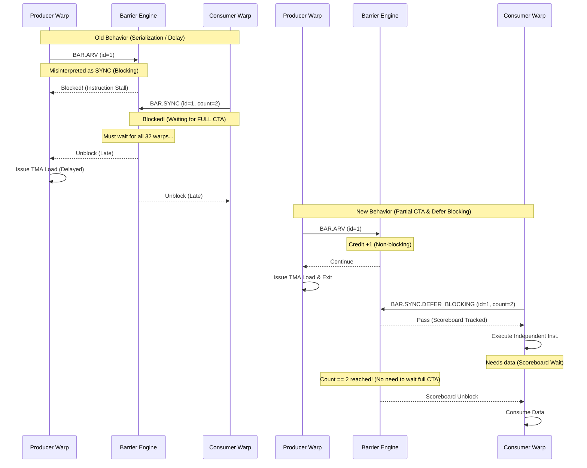

# FA3 Progress

This document tracks the current optimization status for FA3 using the existing notes in:

- `.result/FA3_kernel_5_fwd.md`
- `.result/FA3_kernel_10_bwd.md`
- `.plan/BAR_OP_H100.md`
- `.plan/MEMBAR_SCOPE_AWARE_H100.md`
- `.plan/L1I_prefetch_redesign.md`

To keep this file easy to extend, use the following update pattern whenever a new optimization is added:

- Add one new row to `Optimization Progress`.
- Add one new column per optimization version to each kernel table in `Simulator Cycle Breakdown`.
- Add the corresponding run file paths to `Run Paths`.
- Add one new subsection under `Optimization Details` with the same three sub-sub-sections:
  - `Why this optimization`
  - `How to implement`
  - `Result`
- If a run is still pending or a metric is not yet summarized, keep the cell as `—` and explain the reason in the note column instead of guessing.

## 1. Status Summary

### Optimization Progress

| Version | Opt item | Value / change | FA3 fwd (kernel 5) | FA3 bwd (kernel 10) | Status |
|---|---|---|---|---|---|
| Target HW | Real H100 (NCU) | Actual hardware measurements | 67,696 cycles | 132,901 cycles | Target |
| Init | Baseline simulator | Original simulator state before the targeted fixes below | Not available as a standalone cycle in the current notes | 376,735 cycles (2.83x vs HW) | Fwd missing, bwd available |
| Opt 1 | ROP latency tuning | `-gpgpu_l2_rop_latency 211 -> 100` | 220,024 cycles (3.25x vs HW). This run already used `rop=100`, so there is no separate init cycle to compare against. | 361,760 cycles (2.72x vs HW, -4.0% vs init) | Done |
| Opt 2 | BAR implementation | `OP_BAR` handling + barrier engine fix + warp-exit drain fix | 162,582 cycles (2.40x vs HW, -26% vs Opt 1). Run exits cleanly. | 328,643 cycles (2.47x vs HW, -9.1% vs Opt 1). Run exits cleanly. | Done |
| Opt 3 | MEMBAR Scope-Aware Fix | Scope-aware memory fence (CTA/GPU level) | 158,990 cycles (2.35x vs HW, -2.2% vs Opt 2). Run exits cleanly and `inst_barrier` nearly disappears. | 259,456 cycles (1.95x vs HW, -21.1% vs Opt 2). Run exits cleanly. | Done |
| Opt 4 | Prefetch (deeper stream buffer) | `-prefetch_per_stream_buffer_size 1 -> 4` (deeper stream buffer, config-only) | 155,765 cycles (2.30x vs HW, -2.0% vs Opt 3) | 241,528 cycles (1.82x vs HW, -6.9% vs Opt 3) | Done |
| Opt 5 | L1I eager-promote | Promote a ready prefetched line into L1I as soon as it is filled in the stream buffer, without waiting for a demand and without an L0I response (code change, on top of Opt 4 sb=4) | 149,727 cycles (2.21x vs HW, -3.4% vs Opt 4). From the clean-exit Step-0 instrumentation run (fwd `.o20`); Step-0 counters are timing-neutral. | 241,425 cycles (1.82x vs HW, -0.04% vs Opt 4). From the clean-exit Step-0 run (bwd `.o3`); supersedes the earlier 242,270 figure that hit a teardown SIGSEGV. | Done (cycles from clean-exit `.o20`/`.o3`) |
| Opt 6 | TMA real base + CTA-indexed tile spread (M2/M2.5) | Replace synthetic `(transfer_uid<<20)` address with the real per-site GMEM base + per-CTA tile offset, so L2 locality matches HW | 145,855 cycles (2.15x vs HW, **-2.6% vs Opt 5**). `L2_TMA_true_hit_rate` 0.9854 → **0.9461** (HW 0.6958). fwd `.o31`. This is an **accuracy baseline** (no-fake-wins tradeoff), not a targeted cycle opt — it is the trustworthy baseline that Opt 7 builds on | 290,572 cycles (2.19x vs HW, **+20.4% vs Opt 5** — accuracy tradeoff). `L2_TMA_true_hit_rate` 0.9785 → **0.8718** (HW 0.8226, on target). bwd `.o14` | Done (accuracy prerequisite; enabled Opt 7) |
| Opt 7 | TMA queue/interconnect calibration (inject + reply) | HW-calibrated per-SM 4 sector/clk drain on both inject and reply paths: `-icnt_grant_passes_per_cycle 4` + `-gpgpu_icnt_to_l2_pop_per_cycle 4` (inject) + `-gpgpu_l2_reply_drain_per_cycle 4` + `-gpgpu_cluster_reply_eject_per_cycle 4` (reply), paired so no 1/tick choke remains. Timing-only (work invariant). | 138,021 cycles (2.04x vs HW, **-5.4% vs Opt 6**). fwd `.o35`. `L2_TMA_true_hit_rate` 0.9456 (unchanged → work invariant). | 250,026 cycles (1.88x vs HW, **-13.9% vs Opt 6**). bwd `.o18`. `L2_TMA_true_hit_rate` 0.8688 (unchanged). `gpu_stall_icnt2sh` 1.82M→5.8K, `L2_TMA_output_full` 1.39M→441. | Done. TMA queue tuning now **exhausted** — every queue stage at noise floor; next wall is `ROP_DELAY` (fixed-latency), see Ongoing. |
| Opt 8 | L2 slice parallelism (admission-rate + balanced slice hash) | Part 1: `-gpgpu_l2_admit_sectors_per_cycle 2` (HW 64B/cycle/slice). Part 2: `-gpgpu_l2_slice_balanced_hash 1` (SplitMix64 hash removes the `ipoly%80` 2:1 spatial imbalance from the 40-channel non-2^n config). Timing-only (work invariant). | 137,053 cycles (2.02x vs HW, **-0.7% vs Opt 7**). fwd `.o37`. `L2_TMA_true_hit_rate` 0.9453 (unchanged). Correctly a near no-op — fwd's TMA path was already at floor (ROP_DELAY 126≈fixed 100); its bottleneck is frontend tail + hit-rate over-model, not the TMA queue. | 234,665 cycles (**1.77x** vs HW, **-6.1% vs Opt 7**). bwd `.o20`. `L2_TMA_true_hit_rate` 0.8688 (unchanged). **Part 2 did the heavy lifting**: slice imbalance removed (util p50≈max), ROP_DELAY 1,483→558 (-62%), `gpu_stall_dramfull` 137K→0. | Done. Placement bias fixed; residual bwd wall is per-transfer temporal-burst / fixed-overhead (see Ongoing). |
| Opt 9 | L2 sub-partition drain widening (ROP-drain + DRAM-reply-drain) | Two symmetric 1-sector/tick L2 gates, each its own knob: `-gpgpu_l2_rop_drain_per_cycle 2` (Gate A, REQUEST: ROP delay-queue→m_icnt_L2_queue) + `-gpgpu_l2_dram_reply_drain_per_cycle 2` (Gate B, REPLY: m_dram_L2_queue→L2 fill/L2_icnt; fill port modeled M-wide). Fixed latencies unchanged; timing-only (work invariant). | 135,999 cycles (2.01x vs HW, **-0.8% vs Opt 8**). fwd `.o38`. `L2_TMA_true_hit_rate` 0.9455 (unchanged). Small (fwd still frontend-tail bound). | 215,895 cycles (**1.62x** vs HW, **-8.0% vs Opt 8**). bwd `.o21`. `L2_TMA_true_hit_rate` 0.8682 (unchanged). **Unlocked Opt 8**: `L2_admit_per_active_cycle` 1.00→**1.93** (the 2-wide bank was starved by the 1/tick ROP feed); ROP_DELAY 558→**164** (-71%), `averagemflatency` 692→369. | Done. Opt 8+9 were a matched pair. Residual now spread across ROP(45%)+inject(37%)+reply(12.5%); no single 1/tick gate dominates. |

### Simulator Cycle Breakdown

#### FA3 fwd - top-level simulator breakdown

| Class | Init | Opt 1 (`rop=100`) | Opt 2 (BAR impl) | Opt 3 (MEMBAR) | Opt 4 (prefetch, sb=4) | Opt 5 (eager-promote) | Opt 6 (TMA real base) | Opt 7 (queue calib) | Opt 8 (slice parallelism) | Opt 9 (drain widening) | Note |
|---|---|---|---|---|---|---|---|---|---|---|---|
| `sim_cycle` | — | 220,024 | 162,582 | 158,990 | 155,765 | 149,727 | 145,855 | 138,021 | 137,053 | 135,999 | Opt 8 = `.o37`. Opt 9 = `.o38` (ROP+reply drain 1→2; -0.8% vs Opt 8, still frontend-tail bound). |
| `no_warps_ready` | — | 64.02% | 23.83% | 20.98% | 26.81% | 27.32% | 27.93% | 29.51% | 29.14% | 29.22% | Flat (fwd unaffected). |
| `issuing` | — | 14.56% | 21.17% | 24.05% | 31.18% | 31.19% | 32.30% | 34.75% | 34.77% | 34.96% | Flat. |
| `next_stage_not_available` | — | 11.40% | 15.25% | 17.26% | 22.45% | 22.46% | 23.23% | 24.90% | 24.96% | 25.07% | Flat. |
| `no_valid_instruction` | — | 9.52% | 39.12% | 37.01% | 18.63% | 18.11% | 15.59% | 9.81% | 10.10% | 9.72% | Frontend tail (`nv_ibuffer_empty` ~12%) is fwd's real residual. |
| `issue_port_busy` | — | 0.50% | 0.63% | 0.71% | 0.92% | 0.92% | 0.95% | 1.02% | 1.02% | 1.03% | |
| `sum` | — | 100.00% | 100.00% | 100.00% | 100.00% | 100.00% | 100.00% | 100.00% | 100.00% | 100.00% | |

#### FA3 fwd - inner stall / wait breakdown

| Wait reason | Init | Opt 1 (`rop=100`) | Opt 2 (BAR impl) | Opt 3 (MEMBAR) | Opt 4 (prefetch, sb=4) | Opt 5 (eager-promote) | Opt 6 (TMA real base) | Opt 7 (queue calib) | Opt 8 (slice parallelism) | Opt 9 (drain widening) | Note |
|---|---|---|---|---|---|---|---|---|---|---|---|
| `inst_barrier` | — | 56.09% | 9.09% | 0.05% | 0.07% | 0.07% | 0.07% | 0.08% | 0.08% | 0.08% | Negligible. |
| `wait_barrier` | — | 6.64% | 8.07% | 9.01% | 11.98% | 12.58% | 12.66% | 13.18% | 12.69% | 12.74% | mbarrier-style wait. |
| `tma_axis` | — | 62.73% | 17.16% | 9.06% | 12.05% | 12.65% | 12.73% | 13.25% | 12.77% | 12.82% | Grouped TMA-side stall share. See note [1] below. |
| `non_tma_axis` | — | 17.80% | 17.34% | 19.07% | 24.10% | 24.07% | 24.90% | 26.59% | 26.93% | 26.84% | Execution/resource-side waits (fwd's residual). |
| `fu_occupied` | — | 11.83% | 9.91% | 10.91% | 13.53% | 13.50% | 13.99% | 14.98% | 15.13% | 15.10% | Present in `.o38`. |
| `stall_count` | — | 5.00% | 5.97% | 6.56% | 8.47% | 8.48% | 8.75% | 9.31% | 9.45% | 9.42% | Present in `.o38`. |
| `tma_flush` | — | 0.00% | 0.00% | 0.00% | 0.00% | 0.00% | 0.00% | 0.00% | 0.00% | 0.00% | fwd is load-only. |
| `yield` | — | 0.92% | 1.21% | 1.30% | 1.69% | 1.69% | 1.74% | 1.83% | 1.89% | 1.85% | Present in `.o38`. |
| `result_queue_full` | — | 0.05% | 0.25% | 0.29% | 0.40% | 0.40% | 0.41% | 0.45% | 0.45% | 0.46% | Present in `.o38`. |
| `l1c` | — | 0.00% | 0.00% | 0.00% | 0.00% | 0.00% | 0.00% | 0.03% | 0.02% | 0.00% | Present in `.o38`. |
| `scoreboard (memory)` | — | 0.00% | 0.00% | 0.00% | 0.00% | 0.00% | 0.00% | 0.00% | 0.00% | 0.00% | Present in `.o38`. |

> **[1] On the Opt 1 `tma_axis = 62.73%`.** This is a correctly-recorded value, not an input error. `tma_axis` is the grouped sum `wait_barrier + inst_barrier + tma_flush`, and the **same formula is applied in every column** (e.g. Opt 1: 6.64+56.09+0.00=62.73; Opt 2: 8.07+9.09+0.00=17.16) — it is not split differently between columns. Opt 1 only looks large because the pre-BAR-fix `inst_barrier` (56.09%) is folded in; that is not a real TMA cost. It collapses to 17.16% in Opt 2 purely because `inst_barrier` itself drops (56.09% -> 9.09%) after the BAR implementation. The HW TMA axis is ~23.8%, so the Opt 1 value is an over-attribution driven by the unfixed barrier model.

#### FA3 bwd - top-level simulator breakdown

| Class | Init | Opt 1 (`rop=100`) | Opt 2 (BAR impl) | Opt 3 (MEMBAR) | Opt 4 (prefetch, sb=4) | Opt 5 (eager-promote) | Opt 6 (TMA real base) | Opt 7 (queue calib) | Opt 8 (slice parallelism) | Opt 9 (drain widening) | Note |
|---|---|---|---|---|---|---|---|---|---|---|---|
| `sim_cycle` | 376,735 | 361,760 | 328,643 | 259,456 | 241,528 | 241,425 | 290,572 | 250,026 | 234,665 | 215,895 | Opt 8 = `.o20`. Opt 9 = `.o21` (ROP+reply drain 1→2; **-8.0% vs Opt 8**; unlocked Opt 8's 2-wide admission, ROP_DELAY 558→164). |
| `no_warps_ready` | 66.40% | 66.64% | 58.27% | 29.80% | 36.56% | 36.45% | 41.51% | 34.00% | 34.35% | 36.49% | TMA-completion stall keeps draining. |
| `issuing` | 12.12% | 12.71% | 14.06% | 20.93% | 26.18% | 25.70% | 17.76% | 21.94% | 23.63% | 29.49% | Rises strongly: warps wait far less on TMA completion. |
| `next_stage_not_available` | 10.17% | 10.69% | 11.41% | 15.11% | 18.96% | 18.52% | 12.88% | 15.83% | 17.11% | 21.35% | per-subcore. |
| `no_valid_instruction` | 10.37% | 8.96% | 15.02% | 33.59% | 17.59% | 18.63% | 27.37% | 27.63% | 24.28% | 11.87% | Frontend tail; drops as TMA axis shrinks. |
| `issue_port_busy` | 0.95% | 1.01% | 1.24% | 0.57% | 0.71% | 0.70% | 0.48% | 0.59% | 0.64% | 0.80% | |
| `sum` | 100.00% | 100.00% | 100.00% | 100.00% | 100.00% | 100.00% | 100.00% | 100.00% | 100.00% | 100.00% | Init columns sum to ~100% after rounding. |

#### FA3 bwd - inner stall / wait breakdown

| Wait reason | Init | Opt 1 (`rop=100`) | Opt 2 (BAR impl) | Opt 3 (MEMBAR) | Opt 4 (prefetch, sb=4) | Opt 5 (eager-promote) | Opt 6 (TMA real base) | Opt 7 (queue calib) | Opt 8 (slice parallelism) | Opt 9 (drain widening) | Note |
|---|---|---|---|---|---|---|---|---|---|---|---|
| `inst_barrier` | — | 58.47% / 87.70% of `no_warps_ready` | 44.78% / 76.84% of `no_warps_ready` | 1.01% / 3.40% of `no_warps_ready` | 1.30% / 3.57% of `no_warps_ready` | 1.26% | 0.89% | 1.09% | 1.09% | 1.34% | Remains low after the MEMBAR fix. |
| `tma_axis` | — | 67.28% / 90.90% of `no_warps_ready` | 58.09% | 17.13% / 57.49% of `no_warps_ready` | 21.96% / 60.06% of `no_warps_ready` | 22.17% | 31.91% | 21.60% | 21.02% | 19.74% | Down again as ROP_DELAY collapses (558→164). |
| `non_tma_axis` | — | 16.40% / 24.50% of `no_warps_ready` | 18.08% | 21.99% / 73.79% of `no_warps_ready` | 27.15% / 74.25% of `no_warps_ready` | 26.66% | 18.94% | 22.79% | 24.37% | 30.17% | Execution-side now the larger share as TMA drains. |
| `fu_occupied` | — | 11.55% / 17.30% of `no_warps_ready` | 12.63% | 14.67% / 49.21% of `no_warps_ready` | 18.09% / 49.47% of `no_warps_ready` | 17.75% | 12.58% | 15.18% | 16.25% | 20.21% | function-unit busy |
| `wait_barrier` | — | 7.98% / 12.00% of `no_warps_ready` | 8.62% | 11.76% / 39.46% of `no_warps_ready` | 14.66% / 40.12% of `no_warps_ready` | 14.71% | 11.80% | 12.09% | 11.82% | 13.82% | `DEPBAR` (SB phase wait = TMA mbarrier) |
| `stall_count` | — | 4.11% / 6.20% of `no_warps_ready` | 4.63% | 6.18% / 20.73% of `no_warps_ready` | 7.55% / 20.65% of `no_warps_ready` | 7.40% | 5.30% | 6.33% | 6.74% | 8.31% | explicit stall cycles |
| `tma_flush` | — | 0.83% / 1.20% of `no_warps_ready` | 4.69% | 4.36% / 14.62% of `no_warps_ready` | 5.99% / 16.38% of `no_warps_ready` | 6.20% | 19.22% | 8.42% | 8.11% | 4.58% | `UTMACMDFLUSH` store-drain; keeps dropping. |
| `yield` | — | 0.68% / 1.00% of `no_warps_ready` | 0.76% | 1.02% / 3.41% of `no_warps_ready` | 1.26% / 3.45% of `no_warps_ready` | 1.23% | 0.87% | 1.06% | 1.13% | 1.39% | `YIELD` |
| `result_queue_full` | — | 0.03% / — | 0.03% | 0.09% / 0.30% of `no_warps_ready` | 0.12% / 0.33% of `no_warps_ready` | 0.12% | 0.08% | 0.10% | 0.11% | 0.14% | fixed-latency result queue |
| `l1c` | — | 0.03% / — | 0.03% | 0.04% / 0.14% of `no_warps_ready` | 0.13% / 0.36% of `no_warps_ready` | 0.16% | 0.11% | 0.13% | 0.14% | 0.12% | L1 constant |
| `scoreboard (memory)` | — | 0.00% / 0.00% of `no_warps_ready` | 0.00% | 0.00% / 0.00% of `no_warps_ready` | 0.00% / 0.00% of `no_warps_ready` | 0.00% | 0.00% | 0.00% | 0.00% | 0.00% | traditional scoreboard (unused here) |

> **[2] On the bwd Opt 1 `tma_axis` / `non_tma_axis`.** These were not emitted as single grouped counters in the Opt 1 run (`.o307`), so the cells are **computed** from the per-reason rows in the same column (the later runs emit them directly):
> - `tma_axis` = `wait_barrier + inst_barrier + tma_flush` = 7.98+58.47+0.83 = **67.28%** (of `no_warps_ready`: 12.00+87.70+1.20 = 90.90%).
> - `non_tma_axis` = `fu_occupied + stall_count + l1c + scoreboard + result_queue_full + yield` = 11.55+4.11+0.03+0.00+0.03+0.68 = **16.40%** (of `no_warps_ready`: 17.30+6.20+1.00 = 24.50%; the `result_queue_full`/`l1c` sub-shares are `—` in this run).
>
> **[3] On the bwd `Init` column.** `sim_cycle` and the top-level breakdown are from the baseline `.o304` run (rop=211). The inner stall/wait per-reason counters were not yet implemented at the `Init` stage, so those cells remain `—` (no source value to report).
>
> **[4] On the bwd Opt 5 column (`.o3`, clean-exit Step-0 run).** The run is sb=4 + eager-promote. It **exits cleanly** (`exit code 0`, no teardown SIGSEGV — the earlier `.o320` run's destructor heap-corruption crash is gone), so the cycle (241,425) and breakdown are fully trustworthy and this supersedes the preliminary 242,270. eager-promote counters: `eager_promote_to_cache=994,032`, `demand_hit_later=366,329`, `skipped_fill_port_busy=31,254`, `skipped_has_waiter=0`, `demand_miss_after_promote=0` (the prior `.o320` showed 2,224 here — the teardown fix also cleared the promote-then-miss artifact); L1I miss rate 0.1977. Step-0 instrumentation counters are timing-neutral, so this is a valid Opt-5 baseline.

### Ongoing (next cycle-reduction levers — after Opt 9)

Opt 6 (address realism), Opt 7 (queue calibration), Opt 8 (L2 slice parallelism) and Opt 9 (L2
sub-partition drain widening) are **Done**. After Opt 9 the whole TMA memory path — inject, ROP-drain,
L2 admission, slice placement, and DRAM-reply — is HW-calibrated, and no single 1/tick gate dominates
(bwd ROP_DELAY 80.65% → 44.67%; round-trip spread across ROP 44.7% + inject 36.7% + reply 12.5%).
Cumulative: **bwd 250,026 → 215,895 (-13.7% since Opt 7, 1.88x → 1.62x); fwd 138,021 → 135,999**. The
remaining sim-vs-HW gap (fwd 2.01x / bwd 1.62x) is owned by the items below. No cycle claim is made
until an item lands a verified improvement.

#### ⭐ Measured per-CTA breakdown run (2026-07-17, fwd `.o42` / bwd `.o25`) — decisive results

Timing-neutral (bwd 215,537 ≈ .o21 215,895; fwd 136,293 ≈ .o38 135,999). Per-CTA `[CTAFIN]` with the
new `-cta_stall_breakdown_instrument_enable` columns (sm_idle_cyc / sm_idle_ibuffer_empty_cyc). Full
tables in [CTA_FINISH_TENSOR_CORRELATION.md](file:///home/jihyun/modern-gpu-simulator-micro-2025/.plan/CTA_FINISH_TENSOR_CORRELATION.md) RESULTS.

1. **Warpgroup-4× REFUTED.** sim `Σ tensor_ops` = **835,584** vs HW gmma **835,506** = **1.0001×**
   (both per-warp). No tensor over-execution → Ongoing item 4 CLOSED; the gap is not tensor work.
2. **fwd (K5): drain-idle bound, NOT tensor, tight spread.** Per-CTA elapsed spread only **12.5%**
   (slow÷fast 1.10×, everything flat ~1.1×). Absolute breakdown: **drain-idle sm_idle_cyc = 46.9% of
   elapsed**, of which **ibuffer-empty (trace-drained) = 34.0%**; `sm_idle_tensor_cyc` only 2.0%,
   `fu_occupied_tensor` 13.4%. → fwd's residual is the **drain tail** (trace-exhausted warps), confirming
   the "drain-idle 1.39×" factor (Ongoing item 3) and the trace-drained *nature* (not fetch-starved,
   item 2). No per-CTA imbalance lever for fwd.
3. **bwd (K10): large REAL work imbalance, faithfully reproduced.** elapsed spread **92.2%**; slow-decile
   does **11.4×** the tensor_ops of the fast-decile and ALL stalls co-scale (r(elapsed,tensor_ops)=**+0.99**,
   r(sm_idle)=+0.99). This is causal-mask triangular load imbalance — a scheduler/tile-assignment
   property the sim reproduces correctly, not a modeling bug. The bwd r=0.99 "tensor coupling" is
   confirmed as density co-scaling, not an artifactual per-op over-cost (confound cleared).

**Consequence:** both tensor-side hypotheses (async-WGMMA lever, warpgroup-4×) are now closed by
measurement. The live recoverable gap is **fwd drain-idle** (item 2/3) and any bwd load-balance modeling;
neither is a tensor-pipe fix.

#### ⭐ Follow-up (2026-07-17): W2 quarter-tile + work-over-issue BOTH closed as non-levers

Two candidate levers surviving the per-CTA run were tested and **both refuted**:

1. **W2 (quarter-tile tensor occupancy) — REFUTED by HW `sm__pipe_tensor_cycles_active`.** The 4×-count
   refutation (above) proved instruction *count* is faithful but not per-op pipe *occupancy* (cycles).
   Measured directly: HW tensor-pipe active **fwd 46.13% / bwd 53.61%** (`ncu --page raw`, kernels 4/9)
   vs sim **fwd ≈48.5% (1.05×) / bwd ≤69.6% upper-bound (≤1.30×)** — **not 4×**. Root reason: the sim's 4×
   MAC over-count is **exactly cancelled by a 4×-too-large per-pipe rate** (`-tensor_rate_per_cycle 32768`
   is the *whole-SM* peak, so full-tile/whole-SM-rate = ¼-tile/per-SMSP-rate = **64 cyc/pipe** on both).
   Timing is already faithful; W2 (and W1) would *break* it. **CLOSED — no action.** Detail:
   [WARP_GROUP_H100.md](file:///home/jihyun/modern-gpu-simulator-micro-2025/.plan/WARP_GROUP_H100.md) "W2 VERDICT" box. (This also resolves the doc discrepancy: HW bwd
   tensor-pipe is **53.6%** `pct_of_peak_sustained_active`, not the mislabeled 15.33% in
   FA3_kernel_10_bwd.md.) Residual tensor fidelity gap is FLOP-*accounting*/power-% only, not cycles.
2. **Work over-issue (1.10× fwd / 1.13× bwd) — REFUTED as a counting artifact, no extra work.** Source
   audit: the sim's issue-slot counter == its warp-inst retire counter **bit-for-bit**
   (`total_num_cycles_issue_stage_issuing` = `gpgpu_n_tot_w_icount` = **16,064,281** fwd / **22,626,216**
   bwd), and issue is capped at 1/subcore/cycle (`is_issued_inst`+`tail_readonly` guard,
   [subcore.cc:672](file:///home/jihyun/modern-gpu-simulator-micro-2025/simulator-remodeled/gpu-simulator/gpgpu-sim/src/gpgpu-sim/remodeling/subcore.cc#L672)) — **zero replay/re-issue.** The apparent "1.10×"
   was comparing sim warp-insts against `gpu_sim_insn/32`, but `gpu_sim_insn` sums **active lanes**
   ([sm.cc:2424](file:///home/jihyun/modern-gpu-simulator-micro-2025/simulator-remodeled/gpu-simulator/gpgpu-sim/src/gpgpu-sim/remodeling/sm.cc#L2424)), so `/32` under-counts by exactly the predication factor
   `32/avg_active_lanes` = 32/28.36 = **1.128** (fwd) / 32/27.81 = **1.151** (bwd). The sim-vs-HW warp-inst
   ratio (16.06M/14.48M = 1.109) is a real trace-vs-HW `inst_executed` definitional difference (e.g.
   fully-predicated-off insts in the trace), **not** a timing model artifact. **CLOSED — no lever.**

**Net after all four closures (async-WGMMA, warpgroup-4×, W2/W1, work-over-issue): the entire tensor/work
axis is HW-faithful in *timing*.** The sole remaining recoverable gap is **fwd drain-idle** (46.9% of
elapsed, trace-drained warps — Ongoing item 2/3), which is not tensor, not work-count, and not
fetch-starvation.

#### Ongoing item (the ONLY live gap) — fwd drain-idle tail (subcore-idle 1.39×; bwd 1.29×)

> **All other candidates are CLOSED and moved to [Deferred Opts](#deferred-opts)** (async-WGMMA,
> warpgroup-4× / W1 / W2, work-over-issue, bwd memory-path residual, fwd L2-hit fidelity, frontend
> fetch-nature). The entire tensor/work axis is HW-faithful **in timing**. The single remaining
> recoverable gap is the fwd **subcore drain-idle**.

##### ⭐ UPDATE (2026-07-20) — root cause narrowed to the producer mbarrier spin-loop (NANOSLEEP), NOT a memory floor

Two decisive measurements this session **overturned the earlier "faithful floor" reading** of the
drain-idle and localized it to a concrete, config/code-fixable modeling gap.

**1. FWD_DRAIN_IDLE 4-axis run (fwd `OnlyKernel5/.o43` = 135,452 cyc; bwd `OnlyKernel10/.o26` = 216,527
cyc; both clean exit).** ⚠️ NOT bit-identical to the tracked baselines (fwd .o42 136,293 / bwd .o25
215,537) — the 4-axis instrument shifted timing ~0.4%, so these cycles are for shape only, not a new
tracked baseline. Findings:
- **mbarrier wait-duration histogram (축3):** both kernels are dominated by the **long (1024+ cyc)**
  bucket with ~zero short waits (fwd `b5_1024plus=1,769`, b1-b3≈0; bwd `b5=4,233`, b1-b3≈0).
- **per-CTA (축1/2/4):** fwd `sm_idle` = 46.9% of elapsed (wait_barrier_only 53% of idle, drained/floor
  17%, r(wait_barrier_only,elapsed)=+0.68). bwd `sm_idle` = 49.1%, everything r≈0.99 (faithful
  load-imbalance, confirmed not a lever).
- **role drain (축2):** consumer(WGMMA) drains at **59.5%** of elapsed; producer(TMA) lives to **100%**
  → a **40.5% producer-only tail** carries ~40pp of the 47% idle.

**2. HW trace cross-check (the decisive step).** Parsed the HW dynamic trace directly
(`hw_run/.../traces/threadblocks/.../kernel_5`, 132 CTAs = sim's 132):
- CTA has **16 warps**: warp 0 (producer) = **14,082 insts**; warps 4-15 (consumer) = ~8,600 each; warps
  1-3 ≈ 55 (setup). Producer having MORE insts than consumer is **trace-inherent** → "consumer drains
  first" is NOT a sim artifact.
- **warp 0's 14,082 insts are ~89% a spin-loop:** `PHASECHK.TRYWAIT` 3,117 + `NANOSLEEP.SYNCS` 3,075 +
  `PHASECHK` 3,075 + `BRA` 3,226. Consumer warp 4 is all real compute (`MUFU.EX2` 1,184, `FFMA/FADD`,
  `HGMMA`), no spin. So the producer-only tail is the producer **polling the mbarrier**, not doing work.
- Compared against the sim's own TMA timing: consumer mbarrier waits are **1024+ cyc** but a TMA tile
  actually **arrives in ~335 cyc** (`lat_total` p50; `lat_emit` fixed 127), and per-SM TMA inter-transfer
  gap is **2,596 cyc** with **max 3 concurrent in-flight** — i.e. the wait is long because the *producer
  under-pipelines / spins*, not because memory is slow.

**Root cause (source-confirmed).** `NANOSLEEP` decodes to `MISCELLANEOUS_NO_QUEUE_OP`; the H100 config
never set `-trace_opcode_latency_initiation_miscellaneous_no_queue`, so it fell back to the default
**`1,1` (1-cycle)**. HW's nanosleep backoff is tens–hundreds of cyc. And `PHASECHK/TRYWAIT` are modeled
**non-blocking** ([sm.cc:1895](file:///home/jihyun/modern-gpu-simulator-micro-2025/simulator-remodeled/gpu-simulator/gpgpu-sim/src/gpgpu-sim/remodeling/sm.cc#L1895)) — the warp is not parked; the traced spin
loop is replayed at full issue rate. So the producer's spin ops are issued every cycle
([subcore.cc:709-727](file:///home/jihyun/modern-gpu-simulator-micro-2025/simulator-remodeled/gpu-simulator/gpgpu-sim/src/gpgpu-sim/remodeling/subcore.cc#L709-L727)), consuming issue slots (single-issue/subcore, GTO) and
displacing the consumer → **eligible-warp 0.53 vs HW 0.83** (matched occupancy). This is the drain-idle
mechanism — a spin-loop latency modeling gap, **not** a memory-latency floor and **not** the (closed)
tensor axis.

**Hypothesis to test:** widening NANOSLEEP latency → producer spins less often → consumer reclaims issue
slots → eligible↑ / drain-idle↓ / cycle↓. ⚠️ Like TODO-2 (SFU), this is a **fidelity** change that may
move cycles up OR down; not assumed a win.

##### Experiment RESULT (2026-07-20) — NANOSLEEP spin lever REFUTED (non-lever, closed)

Ran A(`nanosleep 1,1`, baseline) vs **B(`nanosleep 64,1`)** on both kernels (dedicated NANOSLEEP knob;
`-miscellaneous_no_queue_latency` raised to 64 to size the MISC_NO_QUEUE FU pipeline depth, else the
fixed-latency FU asserts `start_stage < m_pipeline_depth` — same pipe-stage-index ceiling as async-WGMMA).
Both B runs exit cleanly (fwd `.o45`, bwd `.o28`).

| | baseline A (NANO=1) | experiment B (NANO=64) | Δ |
|---|---:|---:|---|
| fwd `gpu_sim_cycle` | 135,999 | **137,207** | **+0.9%** (worse) |
| bwd `gpu_sim_cycle` | 215,895 | **217,423** | **+0.7%** (worse) |
| fwd `ncu_eligible_warps_per_scheduler` | 0.53 | **0.5263** | ~flat |
| bwd `ncu_eligible_warps_per_scheduler` | 0.41 | **0.4072** | ~flat |
| fwd `issuing%` | 34.96 | 34.84 | ~flat |

**Verdict — the "spin steals issue slots" hypothesis (scenario A) is REFUTED; it is scenario B
(fidelity-only, no slot contention).** Widening the producer's mbarrier-spin backoff did **not** raise
eligible-warp and **slightly raised** cycles. Reason: at **1 CTA/SM, ~20% occupancy**, when the producer
stops spinning there is **no other warp to fill the freed slot** — the consumer warps are already parked
on the mbarrier (non-eligible) waiting for TMA data. So the producer spin was **filling slots that would
otherwise be idle anyway**, not displacing the consumer; removing it just turns spin-cycles into
idle-cycles (and the NANOSLEEP delay pushes the next producer TMA slightly later, hence the small cycle
rise). This means the drain-idle is **structural low-occupancy idle** (no eligible warp exists), not an
issue-slot-scheduling artifact.

**Consequence:** NANOSLEEP latency is **not a cycle lever** and not even a correct-direction fidelity
knob (raising it worsens the ratio). Config restored to baseline (`nanosleep 1,1`,
`miscellaneous_no_queue_latency 1`). The producer-spin axis is **closed**. The residual fwd drain-idle
(sim eligible 0.53 vs HW 0.83 at matched occupancy) is owned by the deeper question of *why HW keeps more
warps eligible under the same 1-CTA/SM ~20%-occupancy warp-specialized structure* — a producer/consumer
overlap property not reachable by per-op latency tuning. (Instrumentation note: the three
`total_num_cycles_spin_*` counters register but are not auto-printed in the stat dump — they need an
explicit read in `shader.cc` if a future run wants the exact spin-slot counts; the cycle/eligible verdict
above does not depend on them.)

##### Implementation reference (instrumentation + knob, retained for re-runs)

- **Code (2026-07-20, gated `-spin_instrument_enable`, default 0, timing-neutral):** three
  observe-only counters at the issue winner site
  ([subcore.cc:826-841](file:///home/jihyun/modern-gpu-simulator-micro-2025/simulator-remodeled/gpu-simulator/gpgpu-sim/src/gpgpu-sim/remodeling/subcore.cc#L826-L841)): `total_num_cycles_spin_ops_issued`
  (winner was PHASECHK/TRYWAIT spin), `total_num_cycles_spin_won_over_eligible` (of those, ≥1 other warp
  was eligible-but-not-selected = spin stole a slot), `total_num_spin_phasechk_issued`. Files:
  `shader.h`, `gpu-sim.cc` (option + stat register), `subcore.cc`. **Headers changed → `make clean`.**
- **Config (H100):** `-spin_instrument_enable` and a **dedicated NANOSLEEP-only** latency knob
  `-trace_opcode_latency_initiation_nanosleep` in `SM90_H100_L2_50MB_80GB/gpgpusim.config`. NANOSLEEP was
  **split out of the shared MISC_NO_QUEUE knob in code** (`trace_driven.{h,cc}`: opcode-aware
  `set_latency(category, opcode, ...)` overriding only `MISCELLANEOUS_NO_QUEUE_OP && OP_NANOSLEEP`), so
  raising it perturbs **only** NANOSLEEP. ⚠️ To re-run with latency L>1, also set
  `-miscellaneous_no_queue_latency >= L` (it sizes the FU pipeline depth). Both restored to baseline
  (`1,1` / `1`) after the experiment; default is bit-identical.

##### Investigation note (2026-07-20) — fwd eligible-warp gap → `wait`/`stall_count` under-model (SUSPECT, not confirmed)

Traced the fwd eligible-warp deficit (sim 0.53 vs HW 0.83 at matched occupancy ~3.2 warps/sched) via the
NCU warp-state taxonomy (HW from `...full_rpt.ncu-rep` kernel 5, sim from `.o45`, normalized to
per-issue-active). The paradox: **sim is MORE idle yet records FEWER stalls** because the stall *mix* is
displaced —
- sim OVER: `math_pipe_throttle` 1.38×, `no_instruction` 1.67×, `gmma` 1.66× (long/terminal stalls)
- sim UNDER (≪1): **`wait` 0.20×** (HW's #1 stall, ratio 1.363), `barrier` 0.00×, `dispatch_stall` 0.04×,
  `mio_throttle` 0.03×, `short_scoreboard` 0.00×, `sleeping`/`imc_miss`/`branch_resolving` ~0.

HW fills warp-latency with **many short stalls that keep the warp resident/eligible**; sim lacks them, so
its warps swing to the extremes (long `long_scoreboard` block or trace `drain`) and fall out of eligible.
The largest single gap is **`wait` (fixed-latency dependency)**: sim `ncu_stall_wait` = `stall_count`
counter, set from the SASS control-word stall field (raw 0-15, [control_bits.cc:35](file:///home/jihyun/modern-gpu-simulator-micro-2025/simulator-remodeled/util/traces_enhanced/src/control_bits.cc#L35);
[sm.cc:918-927](file:///home/jihyun/modern-gpu-simulator-micro-2025/simulator-remodeled/gpu-simulator/gpgpu-sim/src/gpgpu-sim/remodeling/sm.cc#L918-L927)) and decremented by
**`m_stall_counter >>= 1`** (exponential, [warp_dependency_state.cc:92](file:///home/jihyun/modern-gpu-simulator-micro-2025/simulator-remodeled/gpu-simulator/gpgpu-sim/src/gpgpu-sim/remodeling/warp_dependency_state.cc#L92)) — so a raw
stall of 5 lasts ~3 cyc, 13 lasts ~4 cyc (FA3 fwd: 24% of insts have stall≥3, so they under-stall).

**⚠️ NOT confirmed a bug — likely an intentional compressed-approximation.** Counter-evidence found on
re-check (do NOT re-chase as a plain bug): (1) `>>=1` is the codebase's shift-register convention (the FU
`occupied` bitset uses `.set(N)` + `>>=1` for an exact N-cycle model); (2) `m_yield` uses the same shift
but is set to `2`(=`1<<1`) → exactly 1 cyc, i.e. these counters are designed as bit-position-encoded +
shift; (3) `-num_stall_cycles_wait_after_bits_stall_0_and_yield 46` → after `>>=1` becomes ~6 cyc, which
looks like a **calibrated** magic number that presumes the log compression (so raw `stall_count` fed
straight in may be the intended "compress static stall to effective stall" model, avoiding double-count
with FU latency). Git history is a single "Uploaded" import — no origin intent recoverable. Only real
discrepancy: the option's doc says "Number of cycles" but the impl log-compresses it.

**Verdict:** a genuine SUSPECT for the eligible gap, but static analysis cannot decide bug-vs-intent. The
decisive test (`>>=1` → linear `--`, A/B) is **global** (all kernels/all stalls) and would require
re-calibrating dependent magic numbers (e.g. the `46`), so it is high-risk and deferred, not a quick win.
Recorded as an open modeling question, not a lever.

##### BWD cycle-lever scan (2026-07-20, `.o28`) — no large single lever; same CTA-internal shape as fwd

Scanned bwd (1.62×, 215,895 vs HW 132,901 ≈ 83K excess cyc) for a **cycle** lever (not a ratio), i.e.
where absolute cycles are actually burned. Findings (`.o28`, gpu_sim_cycle 217,423):
- **SM-all-idle = 16.83%** (~36K cyc). Decomposed by SM-level recoverable ceilings:
  `sm_idle_all_blocked_by_tensor` **1.75%**, `sm_idle_blocked_by_frontend_sbwait` **3.80%** — both small
  (per-subcore `tensor_reissue_lockout_only` is 11.77%, but SM-wide only 1.75% because another subcore
  is almost always issuing → tensor/frontend are NOT the cycle lever, consistent with the closed axes).
  The rest of SM-idle is `nv_ibuffer_empty`(drain) 10.24% + `wait_barrier`(mbarrier) 10.12% (OR-overlap).
- **Occupancy is structural, matches HW.** Boot log: `CTA/core = 1, limited by: shmem regs` (233 KB
  shmem/block → 1 CTA/SM). HW is the same (H100 ~227 KB SM shmem). Wave structure from `[CTAFIN]`: first
  wave = 132 CTAs @ cyc 1,501 (1/SM); remaining 252 launch **one-at-a-time** (88,620→tail) as each SM's
  CTA finishes. So bwd is 1-CTA/SM just like fwd — the low occupancy is NOT a sim artifact.
- **CTA elapsed spread 92.6%** (10,186–137,800; r(tensor_ops,elapsed)=+0.99) = causal-mask triangular
  imbalance, faithfully reproduced (HW has it too). 97/384 CTAs finish in the last 10% (long tail).

**bwd warp-state vs HW (NCU kernel-11 raw, per issue_active) — SAME displacement as fwd:** sim UNDER on
the short execution stalls — `barrier` 0.03×, `short_scoreboard` 0.01×, `mio_throttle` 0.01×,
`dispatch_stall` 0.08×, `wait` 0.36×, `sleeping` 0.14× — and OVER on `no_instruction` 3.61× and
`math_pipe_throttle` 3.58×. Same pattern as fwd but more pronounced: HW keeps warps resident with many
short stalls; sim lacks them so warps swing to `drain`/`math_pipe`.

**Verdict (cycle goal):** bwd has **no large single cycle lever left** — every big candidate is either
closed (tensor SM-wide 1.75%, memory path Opt6-9), structural (1-CTA/SM occupancy = HW-matched),
or faithful (causal tail). The residual 1.62× is the **CTA-internal warp-progress gap** (sim runs each
CTA longer than HW), which decomposes into the same short-stall-under / drain-over displacement as fwd
(the `>>=1` stall_count SUSPECT above is one contributor, but global-risk). ⚠️ The short-stall
under-modeling (`short_scoreboard`/`mio_throttle`/`barrier`) is a **symptom-or-cause ambiguity**: their
low % may partly be a denominator effect (sim burns cycles elsewhere), so they are not yet actionable as
levers until the CTA-internal progress model is understood. No cycle claim made.

##### ⭐ CONSUMER-COMPUTE-BOUND (2026-07-20, `.o45` TMA timeline) — the CTA-internal gap is the consumer's per-tile compute

Full analysis: [CONSUMER_COMPUTE_BOUND.md](file:///home/jihyun/modern-gpu-simulator-micro-2025/.plan/CONSUMER_COMPUTE_BOUND.md). A per-CTA TMA-timeline decomposition of the SM0
log finally localized where the fwd 2× cycles are burned — and it is **not** memory/producer/frontend/
occupancy, it is the **consumer warpgroup's per-tile WGMMA+softmax compute**.

- **Warp structure (HW trace kernel_5 CTA0, 16 warps):** 1 producer (warp 0, 14,082 insts, **~66% spin**
  PHASECHK/NANOSLEEP, only 44 real TMA) + 12 consumers (warps 4-15, ~8,600 insts each, 216 HGMMA + many
  MUFU.EX2, ~no spin) + 3 setup. Producer is NOT the bottleneck — it mostly spins waiting on consumers.
- **TMA timeline (SM0, 40 load tiles):** per-tile arrival latency mean **402 cyc** (memory is fast);
  tiles arrive in pairs then a **7-16K cyc void**; **large voids (>2000) sum to 99,687 cyc = 93% of the
  TMA span** = producer waiting on the consumer to compute+free the double-buffer. Avg void 6,645 cyc ≈
  consumer processing ~2 tiles ⇒ **~3,300 cyc/tile** in sim.
- **It is consumer *compute*, not idle:** SM-all-idle only 17.2% (issuing 34.8%, fu_occupied 15.2%) — the
  voids are consumers busy on WGMMA/math, showing up as **stall-depth** (`math_pipe` 11% vs HW 3.2% =3.4×,
  `mma` 5.65% vs HW 1.4% =4×), not SM-idle. Reconciles with "tensor SM-wide-blocked 1.75%".
- **Quantified target:** sim ~3,300 cyc/tile vs HW ~1,700 (67,696/40, double-buffered) ≈ **1.9×** — i.e.
  ~the whole 2× gap.

⚠️ **CORRECTED (2026-07-20b, pipe-level split) — it is NOT "compute 1.9× too slow"; it is compute-SPARSE
vs HW compute-DENSE.** HW NCU pipe-active vs sim per-pipe fu_occupied (kernel 5):
  - HW **tensor 46.1%** (~705 cyc/tile) + **MUFU/xu 47.75%** (~729 cyc/tile, HW's #1 pipe) → SM **90%
    active**, ~1,434 of ~1,700 cyc/tile is real tensor+MUFU work (compute-dense, tightly packed).
  - sim **tensor fu_occupied only 13.4%** (~426 cyc/tile, LESS than HW) + **SFU/MUFU = 0.00%** (SFU
    modeled at 4-cyc FP-add, TODO-2) → SM **64% active**; per-tile ~3,300 cyc is only ~426 cyc compute +
    ~87% stall/idle. **sim runs the compute faster but cannot overlap/pack it.**
  - So the fwd 2× is an **overlap/packing + missing-MUFU-cost** problem, NOT over-costed compute. This is
    why async-WGMMA ("II too big") and NANOSLEEP were correctly refuted. **Sharp implication:** TODO-2
    (realistic SFU/MUFU latency) is the only way to reproduce HW's #1 pipe (xu 47.75%); whether it
    *reduces* the cycle ratio depends on whether the added MUFU work **overlaps** WGMMA (like HW) or
    serializes — the new key open question. See [CONSUMER_COMPUTE_BOUND.md](file:///home/jihyun/modern-gpu-simulator-micro-2025/.plan/CONSUMER_COMPUTE_BOUND.md) "Pipe-level breakdown".

**Status: re-opens the tensor/math re-issue axis with a concrete quantified target.** ⚠️ Overlaps the
deferred async-WGMMA (closed on "II not too big") and TODO-2 (SFU under-modeled → fixing makes sim
*slower*). The open question is **which part of the ~3,300 cyc/tile is over-costed** (WGMMA issue
serialization vs MUFU/SFU latency vs the math pipe). Next: measure HW per-tile compute directly + split
the sim per-tile compute by pipe. No cycle claim until measured; SFU direction caveat applies.

##### ⭐⭐ ROOT CAUSE (2026-07-20c) — issue-pipeline head-of-line blocking (sim can't warp-switch under FU backpressure)

Decomposing WHY sim is compute-sparse (SM-active 64% vs HW 90%): sim per-SMSP cycle budget is issuing
34.8%, **`next_stage_not_available` 24.96%** (11.5M cyc, 2nd-largest), fu_occupied 15.2%, wait_barrier
12.9%, stall_count 9.4%. The `next_stage` term is the mechanical root:
- **Source (confirmed):** fixed-latency issue pipe = `issue → ISSUE_CONTROL(1-deep) → CONTROL_ALLOCATE
  (1-deep) → read_stage(6-deep WGMMA) → TENSOR FU(lat 32)`. `Subcore::issue()` runs the warp-scan loop
  **only if `m_ISSUE_CONTROL_latch.has_free()`** ([subcore.cc:458](file:///home/jihyun/modern-gpu-simulator-micro-2025/simulator-remodeled/gpu-simulator/gpgpu-sim/src/gpgpu-sim/remodeling/subcore.cc#L458)); else the
  whole subcore issues nothing and **does not even look at other warps** ([subcore.cc:822](file:///home/jihyun/modern-gpu-simulator-micro-2025/simulator-remodeled/gpu-simulator/gpgpu-sim/src/gpgpu-sim/remodeling/subcore.cc#L822)).
  = **per-subcore head-of-line blocking.** (Not tensor-II: `tensor_add_extra_cycle_II`=14,763 = 0.1%.)
- **HW warp-switches instead:** NCU `warps_active=3.28`, **`not_selected=0.82`** (0.82 spare eligible
  warps every issue-active cycle); `dispatch_stall=0.787` is **per-warp** (scheduler picks another warp),
  so SMSP stays busy → SM-active 90%. sim's stall is **per-subcore** → 64%.
- **So the fwd 2× "compute-sparse" is a scheduler/pipeline-structure gap, not compute cost:** sim's
  1-deep issue latches propagate WGMMA read/FU backpressure into a full-subcore stall and cannot switch
  to a ready warp the way HW does.
- **⚠️ unconfirmed (needs run):** whether a *different* warp was actually eligible during those 11.5M
  `next_stage` cycles (recoverable head-of-line) or none was ready (not recoverable) — the loop is
  skipped so the stat can't tell. Decisive test = gated read-only eligible-scan in the `else` branch;
  secondary = widen ISSUE_CONTROL/CONTROL_ALLOCATE to 2-deep. Full analysis in [CONSUMER_COMPUTE_BOUND.md](file:///home/jihyun/modern-gpu-simulator-micro-2025/.plan/CONSUMER_COMPUTE_BOUND.md).

**What it is (measured, fwd `.o39` / `.o42`).** The fwd 2.01× (135,999 vs HW 67,696) decomposes into
three per-SMSP factors; two are closed as non-levers, and the **largest** is the live one:

| axis (per-SMSP / subcore) | HW (fwd) | sim | ratio | status |
|---|---|---|---|---|
| subcore **active** fraction (≥1 resident warp) | **88.9%** (SMSP-Active 60,209 / Elapsed 67,696) | **64.0%** (evaluated 45.95M / 71.81M subcore-cyc) | **1.39× more idle** | ⭐ **LIVE** |
| Issue Slots Busy (per active cyc) | 45.03% | 34.96% | 1.29× stall-depth | closed → Deferred (tensor axis) |
| issued warp-inst (work) | 14.48M | 16.06M | 1.10× | closed → Deferred (counting artifact) |
| ⇒ total cycles | 67,696 | 135,999 | **2.01× = 1.10 × 1.29 × 1.39** | |

(bwd is the same shape: subcore-active 67.6% vs HW 86.8% = **1.29×**, `.o25`.)

**⭐ fwd vs bwd — SAME symptom (~45% drain-idle), DIFFERENT cause (measured 2026-07-17, fwd `.o42` / bwd `.o25`).**
Both kernels carry nearly-identical *total* drain-idle, but only fwd's is a recoverable lever; bwd's is a
faithfully-reproduced real load imbalance:

| axis | FWD (K5, `.o42`) | BWD (K10, `.o25`) | read |
|---|---|---|---|
| SM-all-idle fraction | **43.5%** | **45.1%** | ~same total idle — bwd is NOT exempt |
| subcore-active vs HW | 63.9% (HW 88.9%) = 1.39× | 67.6% (HW 86.8%) = 1.29× | both idle far more than HW |
| CTA elapsed spread | **12.5%** (uniform) | **92.2%** (11× slow÷fast) | ← the decisive difference |
| per-CTA `sm_idle`/elapsed | 44.1–49.1% (flat) | 37.3–57.5% (density-scaled) | fwd uniform / bwd density-driven |
| r(mbarrier `wait_pending`, elapsed) | **+0.69** | **+0.06** | mbarrier-overlap is a **fwd-only** driver |
| r(tensor_ops, elapsed) | weak | **+0.99** | bwd idle tracks tensor density |
| idle reasons (OR-overlap) | ibuffer-empty 72.6% + wait_barrier 57.2% | ibuffer-empty 60.6% + wait_barrier 59.6% + tma_flush 20.1% | bwd adds store-drain (it writes dQ/dK/dV) |

- **fwd: intra-CTA warp-specialization stall — RECOVERABLE.** All CTAs are uniformly ~47% idle (spread
  only 12.5%), so it is a *structural* per-CTA property, not an outlier tail. The mbarrier `wait_pending`
  coupling (r=0.69) points at the consumer under-overlapping the TMA-completion wait. HW hides this far
  better (1.57× more warps eligible at matched occupancy), so there is a real gap to close.
- **bwd: causal-mask triangular load imbalance — FAITHFUL, not a bug.** CTA elapsed spans 11× (10,626 →
  136,028); the slow CTAs are the tensor-dense ones and every stall co-scales with density (r=0.99). This
  is a scheduler/tile-assignment property of the causal mask that **HW has too**, so the sim reproducing
  it is correct. There is **no mbarrier-overlap lever** on bwd (r=0.06). bwd's only non-faithful pieces
  were the memory-path/tensor axes, and those are already closed → Deferred.
- **Conclusion: the single recoverable drain-idle lever is fwd's consumer mbarrier-overlap.** bwd shares
  the ~45% idle *number* but its cause is a real workload imbalance, not a modeling gap.

**What is established about it (do not re-chase):**
- **Nature = trace-DRAINED warps, NOT fetch-starvation.** `nv_ibuf_fetch_inflight ≈ 0` (fwd `.o42`:
  `nv_ibuf_fetch_inflight=2`, `fetch_not_issued=2,154` — both ~0); empty-ibuffer warps have exhausted
  their trace. A frontend-fetch fix cannot help (Deferred Opts → L1I). Per-CTA `.o42`: fwd `sm_idle_cyc`
  = **46.9%** of elapsed, of which ibuffer-empty (trace-drained) = **34%**; `sm_idle_tensor_cyc` only
  2.0%. So the idle is **not** tensor-pipe blocked either.
- **It is INTRA-CTA idle, not a post-finish straggler gap.** All 132 CTAs launch at cyc 1,501 and *exit*
  at 87.6–100% of the kernel (fwd `.o42`: 1 CTA/SM, 1 wave → every CTA stays resident to the end; the
  per-CTA `finish_cyc` distribution is tight, p0=87.6% p50=93.1% p100=100%). The idle therefore accrues
  *while the CTA is resident*: within a warp-specialized CTA, the producer (TMA) warps drain their short
  trace early and sit idle, while the surviving consumer warps periodically stall the whole SM. The two
  dominant SM-fully-idle reasons (raw, overlapping OR across the 4 subcores, `.o42`) are
  **nv_ibuffer_empty (trace-drained) 5.68M cyc (72.6%)** and **wait_barrier (mbarrier/TMA-completion)
  4.48M cyc (57.2%)** — they co-occur, i.e. "producers done + consumers waiting on the next tile's data"
  leaves no warp to issue.
  - ⚠️ **`wait_barrier` (mbarrier) ≠ NCU `barrier` — DO NOT confuse the two.** `wait_barrier` here is the
    Hopper **async barrier** (mbarrier: consumer waiting for TMA data to arrive); in the NCU taxonomy it
    maps to **`long_scoreboard`** (`wait_barrier`+`tma_flush`) = **12.81%** (fwd `.o42`
    `ncu_stall_long_scoreboard`), and its SM-idle form is `sm_idle_reason_wait_barrier` = 9.73%. The NCU
    **`barrier`** row (`ncu_stall_barrier` = **0.08%**, sim `inst_barrier`) is a *different* mechanism —
    classic `BAR.SYNC`/`__syncthreads` CTA rendezvous, which FA3 barely uses (correctly ~0%). When this
    doc says "the barrier/mbarrier is fwd's drain driver" it always means the async mbarrier
    (`wait_barrier`/`long_scoreboard` 12.8%), NEVER the NCU `barrier` 0.08%.
- **Consumer mbarrier-wait correlates with fwd slowness (NEW, 2026-07-17 `[SYNCDBG]` from fwd `.e42` / bwd `.e25`).**
  Per-SM `wait_pending` (a consumer PHASECHK/TRYWAIT that found the mbarrier NOT ready) is **48.9%** of all
  fwd wait-checks, and **r(wait_pending, elapsed_cyc) = +0.69** — the SMs that wait on data-arrival
  mbarriers more are the slower/more-idle SMs. **bwd shows no such coupling** (`wait_pending` 50.8% but
  r=+0.06) — bwd idle tracks tensor density (r=0.99), not mbarrier waits. So mechanism-2 (consumer
  under-overlap of the mbarrier/TMA-completion wait) is a **fwd-specific** live contributor, coupled with
  the producer early-drain above.
- **Per-CTA spread is TIGHT (fwd).** elapsed spread only 12.5% (`.o42`); everything ~1.1× flat, so there
  is **no per-CTA imbalance lever** — the idle is an aggregate warp-specialization property, not a
  slow-CTA outlier.

**The open question (what "ongoing" means here).** At **matched occupancy** (active warps/sched sim ~3.2
== HW 3.28) HW keeps **1.57× more warps eligible** (0.83 vs 0.53) and idles only ~9.7% vs the sim's
~36–43%. So the sim hides the mbarrier/dependency latency far worse under the same 1-CTA/SM, ~20%-occupancy
warp-specialized structure. Is that 1.39× **recoverable**, or a faithful reproduction of HW's own tail
(HW NCU: `Waves Per SM=1.00`, HW itself 9.7% SM-idle)? The magnitudes do **not** match (sim ~36% vs HW
9.7%), so the sim drains a wider tail — but every *attributable* latency (tensor, TMA, memory, ROP) is now
calibrated/closed, so no single over-modeled latency explains the extra width. Resolving this is the sole
live investigation. See the FWD/BWD NCU taxonomy subsections below for the measured stall stack any fix
must move.

#### Measured result — NCU stall taxonomy: FWD K5 (Opt9+Metrics `.o39`, 2026-07-15)

> Implementation, counter definitions, and the two mapping-bug fixes live in
> [NCU_STALL_TAXONOMY_METRICS_IMPL.md](file:///Users/bytedance/Documents/github/modern-gpu-simulator-micro-2025/.plan/NCU_STALL_TAXONOMY_METRICS_IMPL.md). This section records **results only**.
> HW source = NCU report `/home/jihyun/modern-gpu-simulator-micro-2025/nv_reports/h100/flashattn-fa3-bf16-bwd-causal-b1-s2048-hd64-nh24_full_rpt.ncu-rep`, kernel 5 (`FlashAttnFwdSm90`, grid 132). Scheduler scalars come from the CSV export; per-reason HW shares come from the `.ncu-rep` Warp-State / ground-truth extraction.

**Bit-identity gate PASSED.** `.o38` (Opt9) and `.o39` (Opt9+Metrics) both = `gpu_sim_cycle 135,999`,
**identical** — the always-on metrics changed no timing.

**Scheduler scalars — sim vs HW (the head-to-head that matters).** These NCU metrics ARE in the HW
export, so this is a direct comparison:

| scheduler scalar | sim `.o39` (FWD) | HW NCU (FWD) | HW NCU metric (verbatim source) | read |
|---|---:|---:|---|---|
| Issue Slots Busy | 34.96% | **45.74%** | `smsp__issue_active.avg.pct_of_peak_sustained_active` | sim issues on fewer cycles → the 2× cycle gap. |
| Issued Warp / scheduler | 0.35 | **0.46** | `smsp__issue_active.avg.per_cycle_active` | same shape, sim lower. |
| Eligible Warps / scheduler | 0.53 | **0.83** | `smsp__warps_eligible.avg.per_cycle_active` | HW keeps more warps eligible. |
| No Eligible | 65.04% | **54.26%** | derived (`1 − issue_active pct`-class) | sim more often has nothing to issue. |
| Active Warps / scheduler | ~3.2 | **3.28** | `smsp__warps_active.avg.per_cycle_active` | occupancy matches (not a warp-count problem). |
| Warp Cyc / Issued Inst | ~9.1 | **7.16** | `smsp__average_warp_latency_per_inst_issued.ratio` | sim's per-issue stall depth ~1.28× HW. |
| Elapsed / SM-Active / SMSP-Active cyc | — | **67,838 / 61,147 / 60,209** | `sm__cycles_elapsed.avg` / `sm__cycles_active.avg` / `smsp__cycles_active.avg` | HW cycle anchors. |

**Sim stall taxonomy (full stack).** Denominator = `evaluated` 45,945,472; per-reason boolean-OR so
reasons overlap. HW per-reason shares below are from the same `.ncu-rep` (kernel 5 Warp-State
ground-truth extraction):

| NCU reason | sim `.o39` (FWD) | HW NCU (FWD) | HW cyc/inst (verbatim) | HW NCU metric (`smsp__average_warps_issue_stalled_*_per_issue_active.ratio`) | reads as |
|---|---:|---:|---:|---|---|
| `selected` | 34.96% | 45.03%¹ | 0.9995 | `..._selected_...` | issued winner (== `issuing`; ¹ = HW Issue Slots Busy). |
| **`not_selected`** | **17.90%** | **11.4%** | 0.8204 | `..._not_selected_...` | ⭐ eligible-but-not-picked — the suspect-#2 signature, large. |
| `long_scoreboard` (wait_barrier+tma_flush) | 12.74% | **9.8%** | 0.7003 | `..._long_scoreboard_...` | **async mbarrier** (TMA-completion / global-load dependency) — this IS fwd's drain-idle driver (≠ the `barrier` row below). |
| `math_pipe_throttle` (sfu+sp_int_dp) | 11.05% | **3.2%** | 0.2288 | `..._math_pipe_throttle_...` | math exec pipe busy (FMA/ALU; `sfu`=0 until TODO-2, cost sits in `sp_int_dp`). |
| `mio_throttle` | — | **6.4%** | 0.4565 | `..._mio_throttle_...` | MIO (SFU/shared/LSU) input-throttle; not folded into `math_pipe_throttle` on HW. |
| `no_instructions` | 9.72% | **2.4%** | 0.1691 | `..._no_instruction_...` | frontend/L0I tail (fwd is frontend-tail bound). |
| `wait` | 9.42% | **19.0%** | 1.3629 | `..._wait_...` | fixed-latency dependency. |
| `mma` (fu_occupied_tensor) | **5.65%** | **1.4%** | 0.0969 | `..._gmma_...` | ⭐ WGMMA tensor-pipe busy — suspect-#1 FU-busy signal. |
| `sleeping` (yield fold) | 1.85% | **3.1%** | 0.2232 | `..._sleeping_...` | — |
| `dispatch_stall` | (re-measure)² | **11.0%** | 0.7874 | `..._dispatch_stall_...` | ² sim `.o39` mapping was wrong; HW already shows this is large. |
| `warpgroup_arrive` | (re-measure)² | **1.7%**³ | 65 samples | `smsp__pcsamp_warps_issue_stalled_warpgroup_arrive` (³ PC-sampling family, not the `average_..._per_issue_active` one) | ² sim `.o39` mapping was wrong; ³ WGMMA `wgmma.wait_group` producer-arrive wait — small on fwd. |
| `barrier` | 0.08% | **10.9%** | 0.7817 | `..._barrier_...` | classic `BAR.SYNC`/`__syncthreads` CTA rendezvous — **NOT** the async mbarrier; FA3 barely uses it (sim ~0% correct). Do not confuse with `long_scoreboard` (mbarrier) above. |
| `imc_miss`/`short_scoreboard` (l1c) | 0.0017% | **2.2% / 4.6%** | 0.1563 / 0.3298 | `..._imc_miss_...` / `..._short_scoreboard_...` | HW exposes both `imc_miss` and `short_scoreboard`; sim's current `l1c` line is only the const-cache sliver. |
| `branch_resolving` | — | **0.9%** | 0.0612 | `..._branch_resolving_...` | branch-target resolve wait. |
| `misc` / `drain` | — | **0.0% / 0.0%** | 0.0018 / 0.0007 | `..._misc_...` / `..._drain_...` | negligible. |
| `membar` / `lg_throttle` / `tex_throttle` | — | **0.0%** | 0.0000 | `..._membar_/_lg_throttle_/_tex_throttle_...` | zero on this kernel. |

Self-consistent: `selected` 16.06M + `not_selected` 8.22M = eligible 24.29M.

**Finding (RE-normalized 2026-07-15b) — the 2× is `work 1.10× · stall-depth 1.29× · drain-idle 1.39×`;
drain-idle is the LARGEST factor and it is NOT HW-faithful.** All axes are per-subcore/SMSP (sim
`evaluated`/`issuing` counted per `Subcore::issue()`,
[subcore.cc:868](file:///Users/bytedance/Documents/github/modern-gpu-simulator-micro-2025/simulator-remodeled/gpu-simulator/gpgpu-sim/src/gpgpu-sim/remodeling/subcore.cc#L868); H100 = 4 subcores/SM).

- **Instruction count ~matches HW (slightly over).** sim `gpu_sim_insn` 455.6M / 32 lanes = 14.24M
  warp-inst vs HW `Executed Instructions` 14.48M by that measure; but the issue-slot count `issuing`
  16.06M is **1.10× HW's 14.48M** — the sim re-issues/replays somewhat more. Small factor, noted.
- **Stall-depth: 1.29×.** sim Issue-Slots-Busy (per *active* cycle) 34.96% vs HW 45.03%; equivalently
  warp-cyc/issued ~9.15 vs HW 7.16. This is the axis the stall stack above measures.
- **⚠️⚠️ RE-correction — the previous retraction OVER-corrected and was itself wrong.** An intermediate
  draft claimed the missing 36% of subcore-cycles is "≈ matched / HW-faithful tail-drain, not a lever."
  **That is false.** The apples-to-apples comparison is subcore-**active** fraction: **sim 64.0%
  (evaluated 45.95M / 71.81M subcore-cyc) vs HW SMSP-Active 88.9% (60,209 / 67,696)** = **1.39× more
  idle** — in raw idle-cycles, 48,972 vs 7,487 per subcore = a **6.5× wider drain tail**. The earlier
  "matched" claim mistakenly compared the `nv_ibuffer_empty` *reason-share* (12.2%, an evaluated-axis %)
  against HW's 9.67% SM-idle (a wall-clock %) — **different denominators**, so the "match" was an
  artifact. The idle IS real and IS the largest factor.
- **BUT the *nature* of the idle is still correctly diagnosed: it is trace-DRAINED warps (no inst to
  execute), not fetch-starvation.** `nv_ibuf_fetch_inflight ≈ 0`, so the prefetch/inst-fetch work
  (Opt 4/5) was correct and the residual is **not** a frontend-fetch lever. What was wrong was calling
  the resulting idle "HW-faithful" — HW drains a much tighter tail (11% vs 36%).
- **Is the tail CAUSED by synchronous-WGMMA? — HYPOTHESIS, being measured (do not assume coupled).**
  `stall-depth` and `drain-idle` live on **disjoint** cycle populations (warps-present vs. SM-empty), so
  they are **not** automatically coupled. A *uniform* WGMMA slowdown scales every CTA's finish time
  equally and leaves the idle **fraction** unchanged — it would fix stall-depth but **not** the tail.
  async-WGMMA fixes the tail **only if** the cost is **differential** (tensor-heavy CTAs slowed more,
  widening the finish spread). fwd's `DynamicPersistentTileScheduler` + causal-mask triangular work makes
  that plausible but **unproven**. An earlier draft here asserted the two are "mechanically coupled" —
  **that overstated it and is retracted.** The decisive test — per-CTA `finish_cyc` vs per-CTA
  `tensor_ops` correlation — is now instrumented and pending a run; see
  [CTA_FINISH_TENSOR_CORRELATION.md](file:///Users/bytedance/Documents/github/modern-gpu-simulator-micro-2025/.plan/CTA_FINISH_TENSOR_CORRELATION.md). Result decides whether this is one lever
  (async-WGMMA) or two (async-WGMMA + a separate CTA-imbalance/scheduler lever).
- **On dual-issue (answer to the standing question):** Hopper schedulers are **single-issue per SMSP**;
  SM-wide 4-issue = 4 subcores, which the sim already models. Not a lever — removed from the plan.

**Where the recoverable cycles sit** (sim over-model vs HW, from the table above): `math_pipe_throttle`
11% vs HW 3.2%, `mma` 5.65% vs HW 1.4% — the tensor/FU **re-issue interval is too coarse** (synchronous
WGMMA). This is confirmed to drive **stall-depth** (1.29×); whether it *also* drives the **drain tail**
(1.39×) is the pending correlation test ([CTA_FINISH_TENSOR_CORRELATION.md](file:///Users/bytedance/Documents/github/modern-gpu-simulator-micro-2025/.plan/CTA_FINISH_TENSOR_CORRELATION.md)). That is Ongoing item 3's
Suspect #1 and the single fwd lever; tracked in **Ongoing item 3** (async-WGMMA). Frontend and
dual-issue are **not** levers. **Open measurement TODO:** per-CTA finish-cycle histogram to size the
drain-tail component that survives after normalizing out stall-depth.

> **⛔ SUPERSEDED (2026-07-17) — the "async-WGMMA is the single fwd lever" conclusion in the paragraph
> above is WRONG and retained only as the historical `.o39` record.** The pending tests it referenced are
> now done: the `.o42` per-CTA run showed the drain-tail is NOT tensor-driven (`sm_idle_tensor_cyc` only
> 2.0% of elapsed, drain-idle 46.9%), and the tensor `mma`/`math_pipe` over-model is closed as
> non-recoverable (async already modeled + warpgroup-4×/W2 refuted — see [Deferred Opts](#deferred-opts)).
> The live fwd lever is the **drain-idle tail itself**, not the tensor re-issue interval. See the single
> Ongoing item above.

> ²`warpgroup_arrive`/`dispatch_stall` in `.o39` used the pre-fix mappings and are **not** trustworthy;
> the corrected values will appear in the next post-`make clean` run (which must also re-confirm the
> FWD bit-identity gate = 135,999).
>
> ³**On `warpgroup_arrive` (why it was earlier marked `—`).** It **does** exist in HW, but only in the
> **PC-sampling** metric family (`smsp__pcsamp_warps_issue_stalled_warpgroup_arrive`), NOT in the
> `smsp__average_warps_issue_stalled_*_per_issue_active.ratio` family the rest of this table's HW
> `cyc/inst` column is read from — that average family simply has no `warpgroup_arrive` member. So its
> HW share (1.7% fwd) is a **sample-count %** of the pcsamp total (65 / 3,925), on a slightly different
> normalization than the cyc/inst rows (the two agree to ~0.5pp: e.g. pcsamp `wait` 19.5% vs
> average-family 19.0%). It captures the WGMMA producer waiting at `wgmma.wait_group`.

#### Measured result — NCU stall taxonomy: BWD K10 (Opt9+Metrics `.o22`, 2026-07-15)

> HW source = NCU report `/home/jihyun/modern-gpu-simulator-micro-2025/nv_reports/h100/flashattn-fa3-bf16-bwd-causal-b1-s2048-hd64-nh24_full_rpt.ncu-rep`, kernel 10 (`FlashAttnBwdSm90`, grid 384). Sim column = bwd `.o22` (Opt8+Opt9 config, metrics build).

**⚠️ Bit-identity: bwd is NOT exact (unlike fwd), but the delta is negligible.** `.o22` (Opt9+Metrics)
= `gpu_sim_cycle 216,015` vs `.o21` (Opt9, no metrics) = `215,895` — **+120 cyc (+0.056%)**, same
config, same `gpu_sim_insn` (629,211,348). fwd was byte-exact (`.o38`==`.o39`); bwd is not. **Cause not
identified** — a source audit confirmed the three known side-effecting tail predicates ARE gated on
`tail_readonly` (`c_warp->waiting()`, `warp_waiting_at_tma_flush()`, `are_l1c_operands_ready()` at
[subcore.cc:598-609](file:///Users/bytedance/Documents/github/modern-gpu-simulator-micro-2025/simulator-remodeled/gpu-simulator/gpgpu-sim/src/gpgpu-sim/remodeling/subcore.cc#L598-L609)), and the remaining tail calls (`can_issue`, wait-barrier/ldgdepbar
checks, `next_inst`) are read-only, so the earlier "store-drain leak" guess is **not** supported. At
+0.056% it is treated as negligible and not chased; the tracked **Opt9 bwd cycle stays 215,895**
(`.o21`), and `.o22` is used only for the (timing-neutral-in-shape) stall taxonomy below.

**Scheduler scalars — sim vs HW:**

| scheduler scalar | sim `.o22` (BWD) | HW NCU (BWD) | HW NCU metric (verbatim source) |
|---|---:|---:|---|
| Issue Slots Busy | 29.38% | **32.83%** | `smsp__issue_active.avg.pct_of_peak_sustained_active` |
| Issued Warp / scheduler | 0.29 | **0.33** | `smsp__issue_active.avg.per_cycle_active` |
| Eligible Warps / scheduler | 0.41 | **0.46** | `smsp__warps_eligible.avg.per_cycle_active` |
| No Eligible | 70.62% | **67.17%** | derived (`1 − issue_active pct`-class) |
| Active Warps / scheduler | ~2.4 (occ-matched, est.) | **2.47** | `smsp__warps_active.avg.per_cycle_active` |
| Warp Cyc / Issued Inst | ~8.2 (= 2.4 ÷ 0.294) | **7.53** | `smsp__average_warp_latency_per_inst_issued.ratio` |
| Elapsed / SM-Active / SMSP-Active cyc | — | **132,901 / 118,089 / 115,328** | `sm__cycles_elapsed.avg` / `sm__cycles_active.avg` / `smsp__cycles_active.avg` |

**Sim stall taxonomy (full stack).** Denominator = `evaluated` 77,008,681; per-reason boolean-OR so
reasons overlap. HW per-reason shares are from the same kernel-10 `.ncu-rep`:

| NCU reason | sim `.o22` (BWD) | HW NCU (BWD) | HW cyc/inst (verbatim) | HW NCU metric (`smsp__average_warps_issue_stalled_*_per_issue_active.ratio`) | reads as |
|---|---:|---:|---:|---|---|
| `selected` | 29.38% | 32.07%¹ | 1.0000 | `..._selected_...` | issued winner (== `issuing`; ¹ = HW Issue Slots Busy). |
| **`not_selected`** | **11.47%** | **5.4%** | 0.4051 | `..._not_selected_...` | eligible-but-not-picked — sim ~2× HW (same over-count as fwd). |
| `long_scoreboard` (wait_barrier+tma_flush) | 18.39% | **19.8%** | 1.4915 | `..._long_scoreboard_...` | TMA / global-memory data-arrival latency — **on target**. |
| **`mma`** (fu_occupied_tensor) | **12.51%** | **5.3%** | 0.3981 | `..._gmma_...` | ⭐ WGMMA tensor-pipe busy — sim **2.4× HW** (suspect-#1 signature). |
| `no_instructions` | 12.14% | **1.6%** | 0.1150 | `..._no_instruction_...` | frontend/ibuffer tail — sim **7.6× HW**. |
| **`math_pipe_throttle`** (sfu+sp_int_dp) | **9.64%** | **1.2%** | 0.0917 | `..._math_pipe_throttle_...` | ⭐ math exec pipe busy — sim **8× HW** (suspect-#1 signature). |
| `wait` | 8.27% | **10.4%** | 0.7839 | `..._wait_...` | fixed-latency dependency — on target. |
| `sleeping` (yield fold) | 1.39% | **4.4%** | 0.3284 | `..._sleeping_...` | warp-specialization producer idle — sim under-counts. |
| `barrier` | 1.33% | **17.4%** | 1.3131 | `..._barrier_...` | ⚠ mbarrier/named-barrier — sim **13× UNDER** HW (folded elsewhere; see note). |
| `mio_throttle` | 0.14%⁴ | **6.3%** | 0.4744 | `..._mio_throttle_...` | ⁴ result_queue_full only; sim under-models MIO input-throttle. |
| `dispatch_stall` | (re-measure)² | **4.5%** | 0.3376 | `..._dispatch_stall_...` | ² `.o22` mapping was wrong (== `mio_throttle` 0.14%); fix pending. |
| `warpgroup_arrive` | (re-measure)² | **5.7%**³ | 436 samples | `smsp__pcsamp_warps_issue_stalled_warpgroup_arrive` (³ PC-sampling family) | ² `.o22` = 0 (string-match bug); HW is **6th-largest bwd stall**, notable. |
| `imc_miss`/`short_scoreboard` (l1c) | 0.12% / 0.12% | **1.3% / 8.5%** | 0.0944 / 0.6429 | `..._imc_miss_...` / `..._short_scoreboard_...` | sim's `l1c` line is only the const-cache sliver; HW's `short_scoreboard` 8.5% is unmapped. |
| `branch_resolving` | 0.00% | **0.8%** | 0.0602 | `..._branch_resolving_...` | no branch unit in trace-driven sim. |
| `misc` / `drain` | 0.00% / 0.00% | **0.0% / 0.0%** | 0.0019 / 0.0014 | `..._misc_...` / `..._drain_...` | negligible. |
| `membar` / `lg_throttle` / `tex_throttle` | 0.00% | **0.0%** | 0.0000 | `..._membar_/_lg_throttle_/_tex_throttle_...` | zero on this kernel. |

Self-consistent: `selected` 22.63M + `not_selected` 8.83M = eligible 31.46M (= `ncu_eligible_warps_per_scheduler` 0.4085 × evaluated).

**bwd finding — SAME structural problem as fwd, and MORE pronounced on the compute pipes.** The two
signatures that identify synchronous-WGMMA over-modeling are **larger on bwd than fwd**:
`math_pipe_throttle` sim 9.64% vs HW 1.2% = **8×** (fwd was 3.4×), and `mma` sim 12.51% vs HW 5.3% =
**2.4×** (fwd was 4×). bwd is the more tensor-dense kernel (grid 384, `mma` is the sim's **single
largest** non-scoreboard stall at 12.51%), so it suffers the synchronous-WGMMA serialization harder —
exactly as predicted. The 3-factor decomposition confirms the same shape as fwd:

| axis (per-SMSP / subcore) | HW (bwd) | sim `.o22` | ratio (sim ÷ HW) |
|---|---:|---:|---:|
| subcore **active** fraction | **86.8%** (SMSP-Active 115,328 / Elapsed 132,901) | **67.5%** (evaluated 77.01M / 114.10M subcore-cyc) | **1.29×** more idle |
| Issue Slots Busy (per active cyc) | **32.07%** | 29.38% | **1.09×** stall-depth |
| issued warp-inst (work) | 19.95M | 22.63M | **1.13×** (sim over-issues) |
| ⇒ total cycles | 132,901 | 215,895 (`.o21`) | **1.62× = 1.13 × 1.09 × 1.29** |

So bwd's 1.62× is the **same three coupled factors** as fwd's 2.01× — work over-issue (1.13×),
stall-depth (1.09×), and subcore drain-idle (1.29×, again the largest). The stall-depth factor is
*smaller* on bwd (1.09× vs fwd 1.29×) because bwd's `long_scoreboard`/`wait`/`barrier` (real
data-latency) already match HW well; the recoverable gap is concentrated in the **tensor/math re-issue
lockout** (`mma` 2.4×, `math_pipe` 8×) and the drain tail it inflates. **Confirmed: async-WGMMA is the
shared fwd+bwd lever**, and bwd is arguably the *better* kernel to validate it on (the `mma` signal is
its top stall). Two bwd-specific caveats vs fwd: (a) `barrier` is 13× UNDER HW (17.4% HW vs 1.33% sim)
— a fold/mapping gap to resolve, not a timing lever; (b) `warpgroup_arrive` is genuinely large on HW
(5.7%, 6th) so the pending bug-fix re-measure matters more here than on fwd.

> ³**On `warpgroup_arrive`.** Same caveat as fwd: it lives **only** in the PC-sampling family
> (`smsp__pcsamp_warps_issue_stalled_warpgroup_arrive`), not the `average_..._per_issue_active.ratio`
> family the other rows use, so its 5.7% is a **sample-count %** of the pcsamp total (436 / 7,613).
> Unlike fwd it is **large on bwd** (6th place, > `not_selected` / `dispatch_stall`) — the WGMMA
> producer often waits at `wgmma.wait_group`, consistent with bwd's heavier tensor pipeline.

### Deferred Opts

Optimizations that were investigated and consciously **parked** because, although they fix a real
modeling inaccuracy, the measured cycle leverage is too small to matter for the 1.8–2.2x sim-vs-HW
gap. Kept here so they are not re-attempted blindly.

**Shared-mem bank-conflict model.** This was a swizzle / vector-width-aware shared bank-conflict model plus a counter-semantics fix, motivated by the sim over-counting `gpgpu_n_shmem_bkconflict` (fwd 38,016 vs HW 281, bwd 1,327,104 vs HW 35,493). See [SHMEM_BANK_CONFLICT_H100.md](file:///home/jihyun/modern-gpu-simulator-micro-2025/.plan/SHMEM_BANK_CONFLICT_H100.md). It was deferred because the NCU raw data shows the per-instruction over-charge is only ~3 cyc and HW shared stores are 98.5–99.5% conflict-free; HW's real store serialization is width-based, which the sim under-states. Fixing the counter therefore improves a metric, not the cycle gap.

**WGMMA / tensor-pipe issue-serialization (`fu_occupied`).** The idea was to stop serializing back-to-back WGMMA issue at the per-WGMMA `initiation_interval` (~32 cyc) so consecutive HGMMAs pipeline like real async WGMMA, with Step-0 instrumentation behind `-wgmma_step0_instrument_enable` (default off). See [WGMMA_FU_OCCUPIED_H100.md](file:///home/jihyun/modern-gpu-simulator-micro-2025/.plan/WGMMA_FU_OCCUPIED_H100.md). It was deferred because the Step-0 run (fwd `.o19` / bwd `.o2`) showed the TRUE recoverable ceiling (`sm_idle_all_blocked_by_tensor`) is only **0.65% (fwd) / 1.59% (bwd)**; the per-subcore `fu_occupied` (13.4% / 18.1%) overcounted the SM-level loss ~7x because another subcore is almost always issuing. Too small for the gap.

**ISSUE_CONTROL latch depth (`next_stage_not_available`).** A non-TMA candidate: raise the depth-1 `m_ISSUE_CONTROL_latch` so WGMMA II lockout does not back-pressure issue. See [ISSUE_CONTROL_LATCH_DEPTH_H100.md](file:///home/jihyun/modern-gpu-simulator-micro-2025/.plan/ISSUE_CONTROL_LATCH_DEPTH_H100.md). Gate failed on the M2/M2.5 baseline (fwd `.o31` / bwd `.o14`): the per-subcore `next_stage_not_available` is 23.23% / 12.88% but the true `sm_idle_all_blocked_by_tensor` is only **0.67% / 1.13%** — the identical per-subcore over-count mirage as WGMMA `fu_occupied`. Raising the latch depth would move the per-subcore counter but not `gpu_sim_cycle`. Parked without implementing.

**L1I frontend `stream_buffer_wait` / prefetch send-bandwidth.** The original hypothesis was that the L0→L1 prefetch send port (`m_memport` = a single per-SM `L0_icnt` with `max_request_allowed_to_L1I 1`, shared by 4 subcores' demand+prefetch+const) was the #1 remaining frontend bottleneck, supported by `prefetch_blocked_memport_full 1.9M > prefetch_issued 1.1M` and `head_demand_arrived_after_ready = 0` despite a 521-cyc prefetch lead. (An earlier "lookahead=1" diagnosis was wrong — `do_prefetch` already fills ~4 lines.) See [L1I_PREFETCH_LOOKAHEAD_H100.md](file:///home/jihyun/modern-gpu-simulator-micro-2025/.plan/L1I_PREFETCH_LOOKAHEAD_H100.md). It is deferred because three independent lines of evidence show the apparent frontend bucket is actually **tail-drain (winding-down warp/SM imbalance)**, which is not recoverable by any frontend-fetch fix:

- **GATE + sub-bucket decomposition.** The SM-idle decomposition (fwd `.o20` / bwd `.o3`) shows `sm_idle_blocked_by_frontend_sbwait` is only **3.99% / 5.31%** of cycles. The follow-up split run (fwd `.o23`, `gpu_sim_cycle=151,350`, clean exit / bwd `.o5`, `gpu_sim_cycle=241,238`, clean exit) shows the largest coarse bucket `no_valid_other` is almost entirely `nv_ibuffer_empty` = **12.21% / 10.08%**, while `nv_ibuf_fetch_inflight = 0` and `nv_ibuf_fetch_not_issued ≈ 0.005%`. Since the fetch-related sub-buckets are ~0, the empty-ibuffer warps are **drained (trace exhausted)**, not fetch-starved — confirmed in source: `Subcore::cycle()` deliberately leaves a trace-done warp's empty ibuffer unclassified for the inflight/not-issued sub-buckets ([subcore.cc:461-487](file:///home/jihyun/modern-gpu-simulator-micro-2025/simulator-remodeled/gpu-simulator/gpgpu-sim/src/gpgpu-sim/remodeling/subcore.cc#L461-L487)), and the SM-idle counters only increment on cycles where **no** subcore issued ([sm.cc:564-602](file:///home/jihyun/modern-gpu-simulator-micro-2025/simulator-remodeled/gpu-simulator/gpgpu-sim/src/gpgpu-sim/remodeling/sm.cc#L564-L602)). The other major live bucket is `wait_barrier` (~10–11%).

- **Time distribution (per-SM drain).** The `[L1IPFDBG][eager-promote] sm=N ... cycle=C` logs in the split runs (fwd `.e23` / bwd `.e5`) give each SM's last frontend-fetch cycle. Binned into deciles of kernel duration, the idle is **concentrated at the kernel tail, not spread through the middle**: in fwd, **0 SMs** stop before 50% of the kernel, and **103 / 132 SMs (78%)** keep fetching into the final 10% (90–100%) window; the earliest finisher stops at cycle 79,378 (52%), giving a per-SM finish spread of 71,872 cyc (47% of the kernel). In bwd, again **0 SMs** stop before 50%, and **125 / 132 SMs (95%)** finish in the last 20%; earliest finisher at cycle 154,959 (64%), spread 83,741 cyc (35%). A scheduling/throughput bottleneck would spread idle across the whole timeline; this straggler-tail shape rules that out.
  - ⚠️ **These are OLD Opt-5-era runs, NOT the current Opt-9 baselines** — fwd `.e23` is cyc 151,350 (vs current fwd `.o42` 136,293) and bwd `.e5` is cyc 241,238 (vs current bwd `.o25` 215,537). They are the historical evidence that first established the *frontend-not-a-lever* conclusion, and are retained here only as that record. Do **not** cross-compare their numbers against the current `.o42`/`.o25` per-CTA data (different runs / different measurement — last-FETCH cycle here vs CTA-exit cycle there).

- **HW NCU cross-validation.** The H100 NCU report (`nv_reports/h100/...full_rpt.csv`) tracks the same imbalance directly. For fwd: `Waves Per SM = 1.00`, `Block Limit (Registers / Shared Mem) = 1` → exactly **1 CTA per SM, 1 wave**, so an early-finishing SM has no other CTA to switch to; `Elapsed Cycles 67,696` vs `SM Active Cycles 61,147` → **9.67% SM-idle**, and `SMSP Active 60,209` → **11.06% SMSP-idle**, matching the sim's `nv_ibuffer_empty = 12.21%`. For bwd: `Waves Per SM = 2.91` (non-integer = classic tail effect), `Elapsed 132,901` vs `SM Active 118,089` → **11.1% SM-idle**, `SMSP Active 115,328` → **13.2% SMSP-idle**, matching the sim's `nv_ibuffer_empty = 10.08%`. HW achieved occupancy is also below theoretical (fwd 20.14% / 25.0%, bwd 15.02% / 18.75%). In other words the sim's ~10–12% idle is a faithful reproduction of HW's own tail imbalance, not a simulator artifact, so this is unrecoverable and correctly parked.

**Warpgroup execution model (WGMMA 4× over-execution; fix options W1 leader-only / W2 quarter-tile).** The hypothesis (former Ongoing item 4) was that the sim has no warpgroup execution unit — it parses the trace per warp, so all 4 warps of a warpgroup each issue the full-tile HGMMA onto their own subcore tensor pipe, seemingly executing the warpgroup tile 4× redundantly and flooding the tensor pipes (suspected root of the excess `mma` stall). See [WARP_GROUP_H100.md](file:///home/jihyun/modern-gpu-simulator-micro-2025/.plan/WARP_GROUP_H100.md). **Deferred (refuted by measurement, 2026-07-17, fwd `.o42` / bwd `.o25`) — it is not an over-model in either count OR timing:** (1) **Count is faithful** — sim `Σ tensor_ops = 835,584` == HW NCU gmma `835,506` (1.0001×); both NCU and the sim count `gmma` per-warp, so all 4 warps *should* each be counted. (2) **Per-op pipe occupancy is faithful** — HW `sm__pipe_tensor_cycles_active` fwd **46.13%** / bwd **53.61%** (`ncu --page raw`) vs sim **fwd ≈48.5% (1.05×) / bwd ≤69.6% upper-bound (≤1.30×)**, not 4×. The sim's 4× MAC over-count is **exactly cancelled by a 4×-too-large per-pipe rate** (`-tensor_rate_per_cycle 32768` is the *whole-SM* peak → full-tile/whole-SM-rate = ¼-tile/per-SMSP-rate = **64 cyc/pipe** on both sim and HW). So W1 (leader-only) and W2 (quarter-tile) would each *break* a currently-correct timing (naive W2 → 16 cyc/op → tensor 4× too fast). The only residual is FLOP-*accounting*/power-% fidelity, not cycles. **No cycle lever.**

**async-WGMMA (model WGMMA re-issue as background/async).** The idea (former Ongoing item 3 "Suspect #1") was that WGMMA is modeled synchronously — `TENSOR_CORE_OP` on a fixed-latency FU at II=32 — so the producer over-serializes and the consumer cannot overlap softmax `exp`, inflating `mma` / `math_pipe_throttle` vs HW. Design A (config II-divisor) and Design B (true background completion) were both designed. See [ASYNC_WGMMA.md](file:///home/jihyun/modern-gpu-simulator-micro-2025/.plan/ASYNC_WGMMA.md). **Deferred (closed as already-modeled / config-only, 2026-07-16):** a source audit (§11) showed the sim is **already effectively async** — the producer re-issues after the small II and runs other work; the consumer blocks only on the real `gsb0`/DEPBAR data dependency (as HW does at `wgmma.wait_group`). The only non-faithful piece is the latency/II *magnitude*, and the HW back-calc (§9) **falsified the "II too big" premise** — sim II=32 is actually *smaller* than HW II≈72. Design A was implemented then **reverted** (structurally impossible: `latency` is a pipe-stage index capped at `tensor_latency=32`, §8); Design B gives the same timing as raising the config knob and adds no cycles. **No code lever; latency/II are config-tunable only.**

**Work over-issue (sim 1.10× fwd / 1.13× bwd "extra" warp-insts).** The apparent factor (from Ongoing item 3's 3-factor decomposition) was that the sim issues more warp-instructions than HW executed (fwd 16.06M vs HW 14.48M). **Deferred (refuted as a counting artifact, no extra work, 2026-07-17):** a source audit found the sim's issue-slot counter == its own warp-inst retire counter **bit-for-bit** (`total_num_cycles_issue_stage_issuing` == `gpgpu_n_tot_w_icount` = 16,064,281 fwd / 22,626,216 bwd), and issue is capped at 1/subcore/cycle (`is_issued_inst`+`tail_readonly` guard, [subcore.cc:672](file:///home/jihyun/modern-gpu-simulator-micro-2025/simulator-remodeled/gpu-simulator/gpgpu-sim/src/gpgpu-sim/remodeling/subcore.cc#L672)) — **zero replay/re-issue**. The "1.10×" arose only from comparing sim warp-insts against `gpu_sim_insn/32`, but `gpu_sim_insn` sums active *lanes* ([sm.cc:2424](file:///home/jihyun/modern-gpu-simulator-micro-2025/simulator-remodeled/gpu-simulator/gpgpu-sim/src/gpgpu-sim/remodeling/sm.cc#L2424)), so `/32` under-counts by exactly the predication factor `32/avg_active_lanes` (1.128 fwd / 1.151 bwd). The true sim-vs-HW warp-inst ratio (1.109) is a trace-vs-HW `inst_executed` definitional difference (e.g. fully-predicated-off insts retained in the trace), not a timing artifact. **No lever.**

**bwd memory-path residual (injection dest-conflict + execution-side).** (Former Ongoing item 1.) Upstream diagnosis: [TMA_LATENCY_INJECTION_H100.md](file:///home/jihyun/modern-gpu-simulator-micro-2025/.plan/TMA_LATENCY_INJECTION_H100.md) §4.11.8. After Opt 9, bwd is 1.62× HW (`.o21`) and the whole TMA memory path is HW-calibrated. **Deferred (no free memory-side lever — the residual is HW-faithful):** (1) injection is **not rate-bound** — sim injects 2.70 TB/s = 81% of the HBM3 ceiling with iSLIP grant at full width (`avg_passes=4.0`); the residual `Req_Network_in_buffer_full=11.8` is transient iSLIP **dest-conflict** (a few bursting SMs hitting the same sub-partition), which HW's memory-partition crossbar also has, so it is faithful — and raising injection further would exceed the HBM ceiling (a fake win). (2) After Opt 9 no single 1/tick gate dominates (ROP 44.7% + inject 36.7% + reply 12.5%). (3) The larger bwd share is now **execution-side** (`non_tma_axis` 30.2%, `fu_occupied` 20.2% + `no_warps_ready` 36.5%) — compute/dependency, and its tensor component is the same axis closed above (async / warpgroup-4× / W2). (4) DRAM is idle (`bw_util` 0.085 vs HW 14.85%) — the device is not the wall. **No memory lever remains; the residual is either HW-faithful or the (closed) tensor axis.**

**fwd L2-hit over-model + frontend-tail *fetch-nature* (accuracy / not-a-lever).** (Former Ongoing item 2, split from its drain-idle *magnitude*, which stays live in the Ongoing section.) **Deferred for two distinct reasons:** (a) **fwd L2-hit over-model is a fidelity item, not a timing lever** — fwd `L2_TMA_true_hit_rate` 0.9456 vs HW 0.6958 is caused by the **CTA-count cap** (132 CTAs < 384 tiles → ≤132 distinct tiles/tensor); closing it needs real tile `coords` (Opt-6 approach B), an **addressing** fix, and is parked because bwd hit rate is already on target (0.8688 vs HW 0.8226). (b) **the frontend-tail *fetch* interpretation is ruled out** — `nv_ibuffer_empty` warps are **trace-DRAINED** (`nv_ibuf_fetch_inflight ≈ 0`), not fetch-starved, so no frontend-fetch fix helps (Opt 4/5 were correctly scoped and are exhausted). ⚠️ **Note:** the drain-idle *magnitude* (sim 64.0% active vs HW 88.9% = 1.39× more idle) is NOT deferred — it is the sole live Ongoing item below; only the *fetch-nature* and the *L2-hit fidelity* pieces are parked here.

### Run Paths

Base directory:
`simulator-remodeled/sim_run_12.8/flashattn-fa3-bf16-bwd-causal-b1-s2048-hd64-nh24/flashattn_fa3_bf16_bwd_causal_b1_s2048_hd64_nh24___warmup_0___iters_1`

FA3 fwd

- Opt 1 (`rop=100`)
  - Stats run: `H100_80GB-OnlyKernel5/flashattn-fa3-bf16-bwd-causal-b1-s2048-hd64-nh24-flashattn_fa3_bf16_bwd_causal_b1_s2048_hd64_nh24___warmup_-63a73d452237.o3`
  - Event / debug run: `H100_80GB-OnlyKernel5/flashattn-fa3-bf16-bwd-causal-b1-s2048-hd64-nh24-flashattn_fa3_bf16_bwd_causal_b1_s2048_hd64_nh24___warmup_-63a73d452237.e3`
  - Note: verified as `FlashAttnFwdSm90`, `trace_kernel_id=5`, `rop=100`

- Opt 2 (BAR impl)
  - Stats run: `H100_80GB-OnlyKernel5/flashattn-fa3-bf16-bwd-causal-b1-s2048-hd64-nh24-flashattn_fa3_bf16_bwd_causal_b1_s2048_hd64_nh24___warmup_-63a73d452237.o12`
  - Event / debug run: `H100_80GB-OnlyKernel5/flashattn-fa3-bf16-bwd-causal-b1-s2048-hd64-nh24-flashattn_fa3_bf16_bwd_causal_b1_s2048_hd64_nh24___warmup_-63a73d452237.e12`
  - Note: clean exit, BAR debug summary shows `leaked_ids=0`

- Opt 3 (MEMBAR)
  - Stats run: `H100_80GB-OnlyKernel5/flashattn-fa3-bf16-bwd-causal-b1-s2048-hd64-nh24-flashattn_fa3_bf16_bwd_causal_b1_s2048_hd64_nh24___warmup_-63a73d452237.o15`
  - Event / debug run: `H100_80GB-OnlyKernel5/flashattn-fa3-bf16-bwd-causal-b1-s2048-hd64-nh24-flashattn_fa3_bf16_bwd_causal_b1_s2048_hd64_nh24___warmup_-63a73d452237.e15`
  - Note: clean exit, verified as `FlashAttnFwdSm90` / `trace_kernel_id=5`; `MEMBAR.ALL.CTA` takes the fence path and no `[MEMBARDBG][stuck]` is reported

- Opt 4 (prefetch, sb=4)
  - Stats run: `H100_80GB-OnlyKernel5/flashattn-fa3-bf16-bwd-causal-b1-s2048-hd64-nh24-flashattn_fa3_bf16_bwd_causal_b1_s2048_hd64_nh24___warmup_-63a73d452237.o16`
  - Event / debug run: `H100_80GB-OnlyKernel5/flashattn-fa3-bf16-bwd-causal-b1-s2048-hd64-nh24-flashattn_fa3_bf16_bwd_causal_b1_s2048_hd64_nh24___warmup_-63a73d452237.e16`
  - Note: `-prefetch_per_stream_buffer_size 4` only; clean exit. No eager-promote code in this run.

- Opt 5 (L1I eager-promote, on top of sb=4)
  - Stats run: `H100_80GB-OnlyKernel5/flashattn-fa3-bf16-bwd-causal-b1-s2048-hd64-nh24-flashattn_fa3_bf16_bwd_causal_b1_s2048_hd64_nh24___warmup_-63a73d452237.o20`
  - Event / debug run: `H100_80GB-OnlyKernel5/flashattn-fa3-bf16-bwd-causal-b1-s2048-hd64-nh24-flashattn_fa3_bf16_bwd_causal_b1_s2048_hd64_nh24___warmup_-63a73d452237.e20`
  - Note: `sb=4` + `-is_instruction_prefetch_eager_promote_enabled 1`; clean-exit Step-0 instrumentation run (Step-0 counters are timing-neutral). `eager_promote_to_cache=662,658`, `demand_hit_later=252,212`, `demand_miss_after_promote=0` (no Risk A). L1I miss rate 0.3574. Supersedes the earlier `.o18` (150,755).

- Opt 6 (TMA real base + CTA-indexed tile spread)
  - Stats run: `H100_80GB-OnlyKernel5/flashattn-fa3-bf16-bwd-causal-b1-s2048-hd64-nh24-flashattn_fa3_bf16_bwd_causal_b1_s2048_hd64_nh24___warmup_-63a73d452237.o31`
  - Event / debug run: `H100_80GB-OnlyKernel5/flashattn-fa3-bf16-bwd-causal-b1-s2048-hd64-nh24-flashattn_fa3_bf16_bwd_causal_b1_s2048_hd64_nh24___warmup_-63a73d452237.e31`
  - Note: real-base + CTA-indexed tile spread (M2/M2.5); clean exit. Final cycle = `145,855`. `L2_TMA_true_hit_rate=0.9461` (accuracy baseline, not a cycle win).

- Opt 7 (TMA queue/interconnect calibration)
  - Stats run: `H100_80GB-OnlyKernel5/flashattn-fa3-bf16-bwd-causal-b1-s2048-hd64-nh24-flashattn_fa3_bf16_bwd_causal_b1_s2048_hd64_nh24___warmup_-63a73d452237.o35`
  - Event / debug run: `H100_80GB-OnlyKernel5/flashattn-fa3-bf16-bwd-causal-b1-s2048-hd64-nh24-flashattn_fa3_bf16_bwd_causal_b1_s2048_hd64_nh24___warmup_-63a73d452237.e35`
  - Note: `grant_passes=4` + `icnt_to_l2_pop=4` + `reply_drain=4` + `cluster_reply_eject=4` (all boot logs confirmed live). Final cycle = `138,021` (-5.4% vs Opt 6). `L2_TMA_true_hit_rate=0.9456` (unchanged → work invariant). ROP_DELAY dominates residual round-trip (61% / avg 135; req_side 95.3%).

- Opt 8 (L2 slice parallelism: admission-rate + balanced slice hash)
  - Stats run: `H100_80GB-OnlyKernel5/flashattn-fa3-bf16-bwd-causal-b1-s2048-hd64-nh24-flashattn_fa3_bf16_bwd_causal_b1_s2048_hd64_nh24___warmup_-63a73d452237.o37`
  - Event / debug run: `H100_80GB-OnlyKernel5/flashattn-fa3-bf16-bwd-causal-b1-s2048-hd64-nh24-flashattn_fa3_bf16_bwd_causal_b1_s2048_hd64_nh24___warmup_-63a73d452237.e37`
  - Note: `admit_sectors_per_cycle=2` + `l2_slice_balanced_hash=1` (both `[L2-ADMIT]`/`[L2-SLICE-HASH]` boot logs confirmed live, on top of the 4 Opt-7 knobs). Final cycle = `137,053` (-0.7% vs Opt 7). `L2_TMA_true_hit_rate=0.9453` (unchanged). Near no-op: ROP_DELAY already at floor (avg 135→126 ≈ fixed 100); fwd's residual is frontend tail (`nv_ibuffer_empty` 12.5%), not the TMA queue. Slice util flat (p50 0.314 / max 0.366).

- Opt 9 (L2 sub-partition drain widening: ROP-drain + DRAM-reply-drain)
  - Stats run: `H100_80GB-OnlyKernel5/flashattn-fa3-bf16-bwd-causal-b1-s2048-hd64-nh24-flashattn_fa3_bf16_bwd_causal_b1_s2048_hd64_nh24___warmup_-63a73d452237.o38`
  - Event / debug run: `H100_80GB-OnlyKernel5/flashattn-fa3-bf16-bwd-causal-b1-s2048-hd64-nh24-flashattn_fa3_bf16_bwd_causal_b1_s2048_hd64_nh24___warmup_-63a73d452237.e38`
  - Note: `l2_rop_drain_per_cycle=2` + `l2_dram_reply_drain_per_cycle=2` (both `[L2-ROP-DRAIN]`/`[L2-DRAM-REPLY-DRAIN]` boot logs confirmed live, on top of the Opt-7/8 knobs). Final cycle = `135,999` (-0.8% vs Opt 8). `L2_TMA_true_hit_rate=0.9455` (unchanged). Small (fwd still frontend-tail bound). `L2_rop_multi_cycles_total=1.55M` (Gate A fired), `L2_admit_per_active_cycle` 1.00→1.82.

FA3 bwd

- Init
  - Stats run: `H100_80GB-OnlyKernel10/flashattn-fa3-bf16-bwd-causal-b1-s2048-hd64-nh24-flashattn_fa3_bf16_bwd_causal_b1_s2048_hd64_nh24___warmup_-82f2f3a37882.o304`
  - Event / debug run: `H100_80GB-OnlyKernel10/flashattn-fa3-bf16-bwd-causal-b1-s2048-hd64-nh24-flashattn_fa3_bf16_bwd_causal_b1_s2048_hd64_nh24___warmup_-82f2f3a37882.e304`
  - Note: baseline kernel-10 run

- Opt 1 (`rop=100`)
  - Stats run: `H100_80GB-OnlyKernel10/flashattn-fa3-bf16-bwd-causal-b1-s2048-hd64-nh24-flashattn_fa3_bf16_bwd_causal_b1_s2048_hd64_nh24___warmup_-fe2c19726f6a.o307`
  - Event / debug run: `H100_80GB-OnlyKernel10/flashattn-fa3-bf16-bwd-causal-b1-s2048-hd64-nh24-flashattn_fa3_bf16_bwd_causal_b1_s2048_hd64_nh24___warmup_-fe2c19726f6a.e307`
  - Note: `rop=100`, full trace run

- Opt 2 (BAR impl)
  - Stats run: `H100_80GB-OnlyKernel10/flashattn-fa3-bf16-bwd-causal-b1-s2048-hd64-nh24-flashattn_fa3_bf16_bwd_causal_b1_s2048_hd64_nh24___warmup_-63a73d452237.o13`
  - Event / debug run: `H100_80GB-OnlyKernel10/flashattn-fa3-bf16-bwd-causal-b1-s2048-hd64-nh24-flashattn_fa3_bf16_bwd_causal_b1_s2048_hd64_nh24___warmup_-63a73d452237.e13`
  - Note: clean exit, BAR debug summary shows `leaked_ids=0`

- Opt 3 (MEMBAR)
  - Stats run: `H100_80GB-OnlyKernel10/flashattn-fa3-bf16-bwd-causal-b1-s2048-hd64-nh24-flashattn_fa3_bf16_bwd_causal_b1_s2048_hd64_nh24___warmup_-8c670b063c3c.o319`
  - Event / debug run: `H100_80GB-OnlyKernel10/flashattn-fa3-bf16-bwd-causal-b1-s2048-hd64-nh24-flashattn_fa3_bf16_bwd_causal_b1_s2048_hd64_nh24___warmup_-8c670b063c3c.e319`
  - Note: clean exit. Final cycle = `259,456`. `MEMBAR.ALL.CTA` uses the new fence path (`[MEMBARDBG][fence-enter]`), no `[MEMBARDBG][stuck]` deadlocks are reported, and the run exits cleanly (`GPGPU-Sim: *** exit detected ***`).

- Opt 4 (prefetch, sb=4 only)
  - Stats run: `H100_80GB-OnlyKernel10/flashattn-fa3-bf16-bwd-causal-b1-s2048-hd64-nh24-flashattn_fa3_bf16_bwd_causal_b1_s2048_hd64_nh24___warmup_-63a73d452237.o1`
  - Event / debug run: `H100_80GB-OnlyKernel10/flashattn-fa3-bf16-bwd-causal-b1-s2048-hd64-nh24-flashattn_fa3_bf16_bwd_causal_b1_s2048_hd64_nh24___warmup_-63a73d452237.e1`
  - Note: `-prefetch_per_stream_buffer_size 4` only; clean exit. Final cycle = `241,528`. No eager-promote counters or `[L1IPFDBG]` logs are present, so this run does NOT include the eager-promote path. `head_demand_arrived_after_ready` remains `0`.

- Opt 5 (L1I eager-promote, on top of sb=4)
  - Stats run: `H100_80GB-OnlyKernel10/flashattn-fa3-bf16-bwd-causal-b1-s2048-hd64-nh24-flashattn_fa3_bf16_bwd_causal_b1_s2048_hd64_nh24___warmup_-63a73d452237.o3`
  - Event / debug run: `H100_80GB-OnlyKernel10/flashattn-fa3-bf16-bwd-causal-b1-s2048-hd64-nh24-flashattn_fa3_bf16_bwd_causal_b1_s2048_hd64_nh24___warmup_-63a73d452237.e3`
  - Note: `sb=4` + `-is_instruction_prefetch_eager_promote_enabled 1`; **clean-exit** Step-0 instrumentation run (`exit 0`, the teardown SIGSEGV is fixed; Step-0 counters are timing-neutral). Final cycle = `241,425` (-0.04% vs Opt 4 `.o1`). `eager_promote_to_cache=994,032`, `demand_hit_later=366,329`, `skipped_fill_port_busy=31,254`, `skipped_has_waiter=0`, `demand_miss_after_promote=0`; L1I miss rate 0.1977. Supersedes the earlier `.o320` (242,270, teardown SIGSEGV).

- Opt 6 (TMA real base + CTA-indexed tile spread)
  - Stats run: `H100_80GB-OnlyKernel10/flashattn-fa3-bf16-bwd-causal-b1-s2048-hd64-nh24-flashattn_fa3_bf16_bwd_causal_b1_s2048_hd64_nh24___warmup_-63a73d452237.o14`
  - Event / debug run: `H100_80GB-OnlyKernel10/flashattn-fa3-bf16-bwd-causal-b1-s2048-hd64-nh24-flashattn_fa3_bf16_bwd_causal_b1_s2048_hd64_nh24___warmup_-63a73d452237.e14`
  - Note: real-base + CTA-indexed tile spread (M2/M2.5); clean exit. Final cycle = `290,572`. `L2_TMA_true_hit_rate=0.8718` (≈ HW 0.8226, on target). Cycle rise vs Opt 5 is the "no fake wins" accuracy tradeoff, not a regression.

- Opt 7 (TMA queue/interconnect calibration)
  - Stats run: `H100_80GB-OnlyKernel10/flashattn-fa3-bf16-bwd-causal-b1-s2048-hd64-nh24-flashattn_fa3_bf16_bwd_causal_b1_s2048_hd64_nh24___warmup_-63a73d452237.o18`
  - Event / debug run: `H100_80GB-OnlyKernel10/flashattn-fa3-bf16-bwd-causal-b1-s2048-hd64-nh24-flashattn_fa3_bf16_bwd_causal_b1_s2048_hd64_nh24___warmup_-63a73d452237.e18`
  - Note: `grant_passes=4` + `icnt_to_l2_pop=4` + `reply_drain=4` + `cluster_reply_eject=4` (all boot logs confirmed live). Final cycle = `250,026` (-13.9% vs Opt 6). `L2_TMA_true_hit_rate=0.8688` (unchanged → work invariant). `gpu_stall_icnt2sh` 1.82M→5,792, `L2_TMA_output_full_cycles` →441. Post-run: ROP_DELAY = 90% of TMA round-trip (avg 1,483), queue axis exhausted.

- Opt 8 (L2 slice parallelism: admission-rate + balanced slice hash)
  - Stats run: `H100_80GB-OnlyKernel10/flashattn-fa3-bf16-bwd-causal-b1-s2048-hd64-nh24-flashattn_fa3_bf16_bwd_causal_b1_s2048_hd64_nh24___warmup_-63a73d452237.o20`
  - Event / debug run: `H100_80GB-OnlyKernel10/flashattn-fa3-bf16-bwd-causal-b1-s2048-hd64-nh24-flashattn_fa3_bf16_bwd_causal_b1_s2048_hd64_nh24___warmup_-63a73d452237.e20`
  - Note: `admit_sectors_per_cycle=2` + `l2_slice_balanced_hash=1` (both boot logs confirmed live, on top of the 4 Opt-7 knobs). Final cycle = `234,665` (**-6.1% vs Opt 7**, 1.77x vs HW). `L2_TMA_true_hit_rate=0.8688` (unchanged → work invariant). **ROP_DELAY 1,483→558 (-62%)**, `gpu_stall_dramfull` 137K→**0**, `gpu_stall_icnt2sh`→0, `L2_TMA_output_full_cycles`→0. Slice imbalance removed: util p50 0.601 / p95 0.630 / max 0.651 (flat, matches HW ≤5%). Residual = ROP-drain 1/tick feed (`ROP_DELAY` still 80% — fixed by Opt 9).

- Opt 9 (L2 sub-partition drain widening: ROP-drain + DRAM-reply-drain)
  - Stats run: `H100_80GB-OnlyKernel10/flashattn-fa3-bf16-bwd-causal-b1-s2048-hd64-nh24-flashattn_fa3_bf16_bwd_causal_b1_s2048_hd64_nh24___warmup_-63a73d452237.o21`
  - Event / debug run: `H100_80GB-OnlyKernel10/flashattn-fa3-bf16-bwd-causal-b1-s2048-hd64-nh24-flashattn_fa3_bf16_bwd_causal_b1_s2048_hd64_nh24___warmup_-63a73d452237.e21`
  - Note: `l2_rop_drain_per_cycle=2` + `l2_dram_reply_drain_per_cycle=2` (both boot logs confirmed live, on top of the Opt-7/8 knobs). Final cycle = `215,895` (**-8.0% vs Opt 8**, **1.62x vs HW**). `L2_TMA_true_hit_rate=0.8682` (unchanged → work invariant). **Unlocked Opt 8**: `L2_admit_per_active_cycle` 1.00→**1.93**, `L2_admit_multi_cycles` 846→5.50M, `L2_rop_multi_cycles_total=5.50M` (Gate A fired). **ROP_DELAY 558→164 (-71%)**, `averagemflatency` 692→369. Relocation (expected, net-positive): `gpu_stall_dramfull` 0→46,758, `Req_Network_in_buffer_full` 5.67→11.8; ROP now 44.7% (was 80.65%), round-trip spread ROP+inject+reply.

## 2. Optimization Details

### Opt 1 - ROP latency tuning

#### Why this optimization

- The first hypothesis was that FA3 was paying too much modeled L2/global-memory latency in the simulator.
- In the bwd analysis, `rop_latency` was ranked as the first knob to test because it is paid by all global/TMA accesses, including L2 hits.
- This also made it a low-cost experiment: the change is in runtime config only, so it can be tested without rebuilding the simulator.

#### How to implement

- Update `gpu-simulator/gpgpu-sim/configs/tested-cfgs/SM90_H100_L2_50MB_80GB/gpgpusim.config`.
- Change `-gpgpu_l2_rop_latency` from `211` to `100`.
- Re-run the FA3 kernels with the reduced ROP latency.
- No source rebuild is required because this is a configuration-only change.

#### Result

- FA3 bwd improved from 376,735 cycles to 361,760 cycles, which is only a 4.0% reduction.
- The bwd cycle breakdown shows `scoreboard (memory) = 0.00%`, so memory latency is not the dominant stall for this workload.
- FA3 fwd already has an Opt 1 run at 220,024 cycles, but there is no standalone init cycle preserved in the current notes.
- Overall conclusion: Opt 1 was worth testing, but it is not the main lever for FA3.

### Opt 2 - BAR implementation

#### Why this optimization

- FA3 uses a warp-specialized pipeline that depends heavily on named/counted barriers and correct warp-exit behavior to enable asynchronous cooperation between Producer and Consumer warpgroups.
- We initiated this optimization because the simulator was failing to support this asynchronous behavior, causing artificial blocking (`inst_barrier` ~58%), which led to severe performance bottlenecks and serialization.
- The evidence is strongest in the cycle breakdowns:
  - FA3 fwd Opt 1 had `inst_barrier = 56.09%`.
  - FA3 bwd Opt 1 had `inst_barrier = 58.47%`.
  - FA3 bwd Opt 1 also showed `scoreboard (memory) = 0.00%`, which further points away from the ROP path and toward the barrier path.
- Because the dominant stall was barrier-related, BAR implementation became the highest-value optimization after Opt 1.

#### How to implement

**Original Implementation & The Problem**
- **Original Implementation**: The simulator's `OP_BAR` decoder hardcoded all barrier instructions to `bar_id=0`, `bar_count=-1` (meaning full CTA), and `bar_type=SYNC` (blocking).
- **The Problem**: Arrive-only barriers (`BAR.ARV`) and named barriers for sub-groups were forced to act exactly like a full-CTA `__syncthreads`. Because `bar_count` was ignored, independent Producer and Consumer warps were artificially forced to wait for every other warp in the CTA, completely destroying the warp-specialized concurrency. This caused severe serialization and massive delays. While the program eventually progressed once the sync conditions were met, it suffered from immense performance degradation.

**The Fix (New Implementation)**
- **Accurate Decoding**: In `gpu-simulator/trace-driven/trace_driven.cc`, preserve the real `OP_BAR` semantics by decoding the actual operands:
  - `bar_id`: The identifier (name) of the barrier, allowing multiple independent barriers to exist concurrently.
  - `bar_count`: The specific number of threads/warps required to satisfy the barrier.
  - `bar_type`: The behavior mode (e.g., `SYNC` for blocking wait, `ARV` for non-blocking arrive).
- **Partial CTA (Sub-group) Barriers**: The most critical performance gain comes from respecting `bar_count`. Instead of forcing a full CTA sync, barriers now only wait for the specified subset of warps. This allows Producer and Consumer warps to synchronize only with their relevant peers, enabling true concurrent execution.
  - **Release Condition**: A barrier is released when the number of arrived threads satisfies the requested count: `  (arrived_warps * 32) >= bar_count`
- **Non-blocking ARRIVE**: In `gpu-simulator/gpgpu-sim/src/abstract_hardware_model.h` and `shader.cc`, support non-blocking `ARRIVE` operations. This adds credits to the barrier without stalling the issuing warp.
- **Differentiate SYNC types (DEFER_BLOCKING)**: `BAR.SYNC.DEFER_BLOCKING` is now correctly handled. A traditional `__syncthreads()` (regular `SYNC`) causes an instruction stall, completely stopping the warp's scheduling at the issue stage. In contrast, `DEFER_BLOCKING` does not block the warp at the issue stage. Instead, it allows the warp to proceed and only blocks later via the Scoreboard (dependency tracker) if the warp attempts to access a register or memory dependent on the barrier's result. This allows the warp to continue executing other independent, useful instructions immediately after encountering the barrier.
- **Warp-exit Drain**: Added the warp-exit cleanup path in `barrier_set_t::warp_exit`. Previously, if a warp finished execution and exited before reaching a barrier, the barrier engine would wait forever for that "dead" warp to arrive, leading to a teardown leak or deadlock at the end of the program. Now, when a warp exits, it is immediately removed from the active warp list (`m_warp_active`), and `release_satisfiable_barriers()` is called to re-evaluate if the remaining active warps satisfy the barrier condition, correctly unblocking the waiting warps.

**How BAR operates now**

- Add `release_satisfiable_barriers()` so barriers can release when the remaining active participants have all arrived.
- In `gpu-simulator/gpgpu-sim/src/gpgpu-sim/remodeling/sm.cc`, make sure non-blocking ARRIVE-style barriers are not treated like blocking sync barriers in the issue path.

#### Result

- FA3 fwd improved from 220,024 cycles to 162,582 cycles after the BAR implementation work.
- The fwd run now exits cleanly instead of aborting during deadlock/teardown.
- The barrier-related distortion dropped sharply in fwd:
  - `inst_barrier` went from 56.09% to 9.09%.
  - `tma_axis` went from 62.73% to 17.16%.
- The next major fwd bottleneck is now `no_valid_instruction = 39.12%`, so the dominant problem moved away from barriers after this fix.
- For FA3 bwd, the cycle count dropped from 361,760 to 328,643 (-9.1%). While `inst_barrier` stalls decreased significantly (from 58.47% to 44.78%), they remain the largest bottleneck, indicating that further barrier optimizations or related pipeline fixes are needed for the backward kernel.

### Opt 3 - MEMBAR Scope-Aware Fix

> The full root-cause analysis, SASS control-word decoding, hardware semantics, and the verified inc/dec site table are documented in detail in [MEMBAR_SCOPE_AWARE_H100.md](file:///home/jihyun/project/modern-gpu-simulator-micro-2025/.plan/MEMBAR_SCOPE_AWARE_H100.md). This section is a condensed summary.

#### Why this optimization

- Even after the Opt 2 BAR fix, `inst_barrier` remained the #1 stall in FA3 bwd at **44.78%** of issue cycles / **76.84%** of `no_warps_ready`, leaving the kernel ~2.47x slower than HW (328,643 vs 132,901 cycles).
- Root cause: the dominant barrier event in bwd is `MEMBAR.ALL.CTA` (**55,296 dynamic issues**, #1 by far), and the simulator decoded it as a **full-CTA blocking SYNC barrier** (`bar_type=SYNC, bar_count=-1`) routed through the CTA barrier engine (`warp_reaches_barrier()`).
- That decode is semantically wrong. A `MEMBAR` is an **ordering / visibility fence**, not a thread rendezvous: only the **issuing warp** waits, and only until **its own outstanding writes** become visible at the requested scope. Forcing a full-CTA rendezvous serialized the warp-specialized pipeline exactly like the original BAR bug did. (fwd was barely affected only because it issues `MEMBAR.ALL.CTA` 17x less often — 3,168 vs 55,296.)
- A fence's cost is **not** a fixed cycle count; it is the time to drain the warp's pending writes to the target scope. With no outstanding writes it passes almost immediately — which is exactly why HW NCU shows membar stalls at ~0% for this kernel.
- SASS control-word decoding (`HGMMA`: `id_w=7, wait=0`) further confirmed that **WGMMA ordering is enforced by the separate `WARPGROUP`/`DEPBAR` mechanism**, not by MEMBAR. So the fence must model store visibility only, and must **not** wait on WGMMA completion.

#### How to implement

The fix turns the memory barrier into a **per-warp, scope-aware fence** that waits only until the issuing warp's stores reach the scope the instruction requested:

- `MEMBAR.ALL.CTA` -> CTA-visible stores drained (shared stores + L1-level global stores; observers = other threads of the same CTA via shared memory + L1 on the same SM).
- `MEMBAR.ALL.GPU` -> GPU-visible stores drained (L2-level global + TMA stores), which **subsumes** the CTA condition (observers = other CTAs on other SMs via L2).

**1. Two new per-warp, two-level store counters (`shader.h`).** `m_stores_outstanding` is deliberately left untouched because it backs `stores_done()` for warp/kernel exit; repurposing it would corrupt teardown. Instead two parallel per-warp counters are added to `shd_warp_t`:
  - `m_pending_stores_cta_visible` — shared stores (STS/STSM) + L1-level global stores.
  - `m_pending_stores_gpu_visible` — L2-level (L1-bypass, `.cg`) global stores. (TMA stores reuse the existing `tma_unit_sm` counter and are folded into the GPU condition.)

**2. Visibility-level tagging on `mem_fetch` (`mem_fetch.h`).** A `fence_visibility_level_t` tag (CTA vs GPU) is set once at store **issue** time, using the `is_l1d_bypass()` flag already present on `mem_access_t` (the bypass decision, hence the visibility level, is known at issue). Each sector mem_fetch then carries its own tag, so the correct counter is decremented at whichever ack site fires (L1-hit ack, L2 `WRITE_ACK`), and inc/dec stay balanced at **sector granularity** — the counters return to exactly 0.

**3. Precise inc/dec hooks in the LDST path (`ldst_unit_sm.cc`).**
  - **Global stores**: at issue, `inc_fence_store` increments `cta_visible` when `!is_l1d_bypass()` (L1 path) or `gpu_visible` when `is_l1d_bypass()` (L2-bypass path). On ack, `dec_fence_store` decrements the counter matching the mem_fetch tag.
  - **Shared stores**: shared memory generates **no** `mem_fetch`; it flows through the fixed-latency Pending Request Table (PRT). A new **per-warp, store-only** counter (the existing `m_current_num_shared_mem_inst` is SM-wide and counts loads+stores, so it cannot be reused) is incremented at PRT `assign_entry` and decremented at the PRT store-retire branch (`pop_entry`, gated on `is_shared() && is_store()`), feeding `cta_visible`.

**4. Carry the fence scope on the warp (`sm.cc` / `shader.h`).** Issue used to set only a boolean (`set_membar()`). A `membar_scope_t` (`MEMBAR_SCOPE_CTA` / `MEMBAR_SCOPE_GPU`, with SYS reserved/asserted-out) is now derived from the trace opcode at MEMORY_BARRIER_OP issue and stored on the warp, so the wait logic knows which scope to evaluate.

**5. Scope-aware wait + rendezvous removal (`sm.cc`).** `warp_waiting_at_mem_barrier(warp_id)` was rewritten to bypass the barrier engine entirely for memory fences (`is_non_rendezvous_memory_barrier`, extended to `FENCE.*` + `MEMBAR.ALL.CTA/GPU`) and to drop the old fixed SM-wide stall latency. It now releases based purely on the scope's pending counters:
  - CTA scope: release when `cta_visible == 0`.
  - GPU scope: release when `cta_visible == 0 && gpu_visible == 0 && !tma_unit.warp_has_outstanding_stores()` (GPU subsumes CTA).
  - The existing L1-invalidate-on-flush hook is preserved on release.

**Why this is safe:** the generic SASS wait-barrier check (`wait_barrier_bits`, used by `FENCE.VIEW.ASYNC.S`) lives at the **issue stage** and runs for every op independently of the MEMORY_BARRIER_OP barrier-engine path, and the read/write SB-barrier bookkeeping runs in the common tail of `func_exec_inst`. Bypassing `warp_reaches_barrier()` for MEMBAR therefore leaves async-proxy / WGMMA ordering fully intact — only the (incorrect) store-fence rendezvous is removed.

A deadlock-detection watchdog (`[MEMBARDBG][stuck]`) was also added so any warp that stays parked at a fence beyond a threshold is reported with its live counter values, making counter-leak / drain bugs immediately visible during bring-up.

#### Result

- FA3 fwd improved from 162,582 cycles to 158,990 cycles after the MEMBAR scope-aware fence work, a further **-2.2%** reduction vs Opt 2. This places fwd at **2.35x** the HW target (158,990 vs 67,696 cycles).
- The run exits cleanly. In the debug log, `MEMBAR.ALL.CTA` is confirmed to use the new fence path (`[MEMBARDBG][fence-enter]`) and the watchdog stays silent (`[MEMBARDBG][stuck]` not observed).
- The main MEMBAR-specific symptom is essentially removed in fwd: `inst_barrier` drops from **9.09%** to **0.05%**. The grouped TMA-side stall share also falls again, from **17.16%** to **9.06%**.
- Top-level issue-stage balance improves in the same direction: `no_warps_ready` falls from **23.83%** to **20.98%**, while `issuing` rises from **21.17%** to **24.05%**.
- The dominant remaining fwd bottlenecks are now frontend / availability related rather than barrier related: `no_valid_instruction = 37.01%` and `next_stage_not_available = 17.26%`.
- FA3 bwd improved from 328,643 cycles to 259,456 cycles after the MEMBAR scope-aware fence work, a further **-21.1%** reduction vs Opt 2. This places bwd at **1.95x** the HW target (259,456 vs 132,901 cycles).
- The run exits cleanly. In the debug log, `MEMBAR.ALL.CTA` is confirmed to use the new fence path (`[MEMBARDBG][fence-enter]`), the watchdog stays silent (`[MEMBARDBG][stuck]` not observed), and teardown summaries continue to report `leaked_ids=0`.
- The old barrier-engine artifact is almost eliminated in bwd: `inst_barrier` drops from **44.78%** to **1.01%**. The top-level `no_warps_ready` class also falls from **58.27%** to **29.80%**, while `issuing` rises from **14.06%** to **20.93%**.
- After the MEMBAR fix, the dominant remaining bwd bottlenecks shift away from `inst_barrier` and toward frontend / wait-path pressure: `no_valid_instruction = 33.59%`, `non_tma_axis = 21.99%`, `tma_axis = 17.13%`, and `next_stage_not_available = 15.11%`.

### Opt 4 - Prefetch (deeper stream buffer)

#### Why this optimization

- After Opt 3, the #1 fwd stall became the instruction frontend: `no_valid_instruction = 37.01%`, almost entirely `head_invalid_waiting_frontend` -> `stream_buffer_wait` -> `prefetch_issued_not_ready = 11,710,629 cycles`.
- Root-cause analysis (see [L1I_prefetch_redesign.md](file:///home/jihyun/modern-gpu-simulator-micro-2025/.plan/L1I_prefetch_redesign.md)) found a single shallow stream buffer causing head-of-line blocking: `prefetch_blocked_sb_full = 59,742,797` and `new_stream_rejected_head_waiting_for_cache = 246,187` (~77% of candidates rejected).

#### How to implement

- Config-only: `-prefetch_per_stream_buffer_size 1 -> 4`. A deeper FIFO relieves the head-of-line blocking directly, no code changes.

#### Result

- FA3 fwd (`.o16`): 158,990 -> **155,765 cycles** (**-2.0%** vs Opt 3, **2.30x** vs HW). Clean exit.
  - Frontend pressure dropped sharply: `no_valid_instruction` **37.01% -> 18.63%**, `stream_buffer_wait` **17.67% -> 14.03%**, `prefetch_issued_not_ready` **11,710,629 -> 7,141,887 (-39%)**, `prefetch_blocked_sb_full` **59.7M -> 30.5M (-49%)**, `new_stream_rejected_head_waiting_for_cache` **246,187 -> 166,487 (-32%)**.
  - The cycle reduction is smaller than the stall reduction because relieved frontend pressure shifts into `no_warps_ready` (**20.98% -> 26.81%**) and execution-side waits (`non_tma_axis` 19.07% -> 24.10%, `fu_occupied` 10.91% -> 13.53%). `issuing` rises **24.05% -> 31.18%**.
  - Notably `head_demand_arrived_after_ready` is **still 0**: deeper buffering does not fix the structural "prefetch can never beat demand" problem. That is what Opt 5 targets.
- FA3 bwd (`.o1`): 259,456 -> **241,528 cycles** (**-6.9%** vs Opt 3, **1.82x** vs HW). Clean exit.
  - Top-level balance shifts as expected: `no_valid_instruction` **33.59% -> 17.59%**, `issuing` **20.93% -> 26.18%**, while `no_warps_ready` rises **29.80% -> 36.56%**.
  - `head_demand_arrived_after_ready` is **still 0** here too.

### Opt 5 - L1I eager-promote

> Full root-cause analysis and design are documented in [L1I_prefetch_redesign.md](file:///home/jihyun/modern-gpu-simulator-micro-2025/.plan/L1I_prefetch_redesign.md). Opt 5 is a code change applied on top of Opt 4 (sb=4).

#### Why this optimization

- Even with the deeper buffer (Opt 4), `head_demand_arrived_after_ready` stayed at 0: a prefetch could never be cached before its demand. The cause is structural - a prefetched line sits in the stream buffer and is only copied into the L1I tag array when a demand arrives (promote and L0I response were fused, and the promote was gated on the single L0I response slot).

#### How to implement

*Core idea.* Split the promote from the L0I response. As soon as a prefetched
line is filled in the stream buffer (becomes `is_ready`), promote it straight into
the L1I tag array with **no L0I response generated**. A later demand then simply
HITs in L1I.

*Trigger / scheduling.*
- Runs once per cache cycle, after the demand path has had its turn at the fill
  port that cycle.
- Port gating: the promote consumes the L1I fill port via `use_fill_port()`. If
  the port is already busy this cycle, the promote is **deferred to a later cycle,
  never dropped** (the line stays safely in the stream buffer). This keeps the L1I
  `fill_port_util` metric honest and gives demand fills priority.

*Safety guards (each maps to a failure mode in the plan):*
- **Risk A (silent miss):** fill with the exact key the demand probes -
  `mshr_addr(base_addr)`, asserting `prefetch_addr == base_addr`.
- **Risk B (stranded waiter / deadlock):** promote only when the head is ready,
  not yet demanded, and has **no waiting warp** attached.
- **Risk C (duplicate fill):** probe first; skip if the line is already HIT or has
  an in-flight MSHR entry.

*Observability.*
- Config flags: `-is_instruction_prefetch_eager_promote_enabled` (default off, for
  clean A/B), `-l1i_prefetch_debug_enable`, `-l1i_prefetch_debug_budget`.
- Counters: `total_num_l0i_sb_eager_promote_{to_cache, demand_hit_later,
  demand_miss_after_promote, skipped_already_cached, skipped_fill_port_busy,
  skipped_has_waiter}`.
- `[L1IPFDBG]` logs: success signal `demand-hit-promoted`, critical signal
  `demand-MISS-after-promote`, and a `[stuck]` deadlock watchdog (critical signals
  print regardless of budget).

*Files touched:* `shader.h`, `gpu-sim.cc`, `shader.cc`, `stream_buffer.{h,cc}`,
`first_level_instruction_cache.{h,cc}`.

#### Result

- FA3 fwd (`.o20`, sb=4 + eager-promote, clean-exit Step-0 run): 155,765 -> **149,727 cycles** (**-3.4%** vs Opt 4, **2.21x** vs HW). Clean exit, no deadlock. (Supersedes the earlier `.o18` 150,755; Step-0 instrumentation counters are timing-neutral.)
- The mechanism works as designed: `eager_promote_to_cache = 662,658`, `demand_hit_later = 252,212` (the success path that was impossible before), `demand_miss_after_promote = 0`. **L1I miss rate 0.3574.**
- Frontend stall fell only modestly further: `no_valid_instruction` **18.63% -> 18.11%**. The remaining bottleneck is no longer the frontend but `no_warps_ready = 27.32%` and execution-side waits (`non_tma_axis = 24.07%`, `fu_occupied = 13.50%`).
- `demand_miss_after_promote = 0` in the clean-exit `.o20` run (the earlier `.o18` showed 498, all capacity evictions with gap>1k cycles — no real Risk A; the teardown fix also cleared that artifact). Note: the metric previously conflated "evicted before demand" with true immediate miss; see the metric-accuracy follow-up below.
- The gain is smaller than expected. A dedicated re-analysis of why eager-promote yields only -3.4% (despite the L1I miss-rate drop) is tracked separately — and the subsequent Step-0 SM-idle decomposition showed the frontend is only ~4–5% of true SM-idle (see Deferred Opts), so further frontend work is not the lever.
- FA3 bwd (`.o3`, sb=4 + eager-promote, clean-exit Step-0 run): 241,528 -> **241,425 cycles** (**-0.04%** vs Opt 4, **1.82x** vs HW). Unlike fwd, eager-promote gives essentially no bwd cycle benefit even though L1I miss rate drops. `eager_promote_to_cache = 994,032`, `demand_hit_later = 366,329`, `skipped_has_waiter = 0`, `demand_miss_after_promote = 0`; L1I miss rate 0.1977.
- The bwd run now **exits cleanly** (`exit 0`). The earlier `.o320` run `SIGSEGV`ed in the teardown destructor chain (`gpgpu_sim::~gpgpu_sim()` -> `simt_core_cluster::~simt_core_cluster()` -> `SM::~SM()` -> `free()`) **after** all statistics were printed; root cause was the eager-promote stream-buffer ownership path: when `try_eager_promote_head()` removed a tracking entry while a prefetch response was still in flight, the later fill fell into the generic orphan path / `assert`, corrupting the heap (only triggered by the bwd configuration's higher concurrent-prefetch pressure).
- Fix applied (code, on top of Opt 5): `try_eager_promote_head()` now records dropped addresses in `m_eager_promoted_dropped_addrs`; `fill()` treats a later fill for such an address as a benign `[L1IPFDBG][sb-promoted-orphan-fill]` (new counter `total_num_l0i_stream_buffer_fill_eager_promoted_orphaned`) instead of re-driving the cache; and `send_to_cache()` / `has_ready_requested_head()` no longer `assert` on a missing head entry (new counter `total_num_l0i_stream_buffer_send_to_cache_head_missing_entry`, plus `[L1IPFDBG][sb-eager-drop]` logging). The clean-exit `.o3` run confirms the fix.

##### Metric accuracy follow-up (planned)

- `m_eager_promoted_base_addr_cycle` records a promoted base addr but is only
  cleared when a demand observes it. If the line is evicted before any demand, the
  entry lingers; a much later demand then MISSes and is counted as
  `demand_miss_after_promote`, even though the promote was correct.
- Fix direction: classify by promote->miss gap (or check eviction explicitly), so
  a small-gap immediate miss is the only true Risk-A signal and large-gap evictions
  go to a separate `eager_promote_evicted_before_demand` bucket.

### Opt 6 - TMA real base address + CTA-indexed tile spread (M2/M2.5)

> Detailed design & spike history: [TMA_exact_base_mapping_integration.md](file:///home/jihyun/modern-gpu-simulator-micro-2025/.plan/TMA_exact_base_mapping_integration.md) (milestones M0-M4, per-opcode handling), [TMA_BASE_ADDR.md](file:///home/jihyun/modern-gpu-simulator-micro-2025/.plan/TMA_BASE_ADDR.md) (base-recovery spikes SPIKE 1-10, §4.1 result), [TMA_ISA.md](file:///home/jihyun/modern-gpu-simulator-micro-2025/.plan/TMA_ISA.md) (per-opcode base/size).

#### Why this optimization

- The TMA unit fabricated a synthetic GMEM base per transfer (`agu_base = (transfer_uid << 20) + agu_index*128`). Because `transfer_uid` is unique per transfer, repeated reads of the *same* tensor never reused an L2 line → the model could not observe real address behavior (this was the former Arch **TODO-2**).
- Consequence: `L2_TMA_true_hit_rate` was fake-inflated (fwd 0.9854 / bwd 0.9785 in the M1 base-only run) vs HW (fwd 0.6958 / bwd 0.8226). Every prior TMA-latency / reply-path experiment ran on this fake ~0.98 locality, so its "no cycle lever" conclusion was **un-judgeable** — the reply traffic was artificially dense. Realistic addresses are therefore a *prerequisite* for interpreting the TMA bottleneck at all (i.e. the prerequisite for Opt 7), not just a fidelity nicety.

#### How to implement

- **Real base (M1):** recover each descriptor op's exact GMEM base offline into `tma_pc_base_map.json` (23/23 descriptor sites, `pool=0`, via direct SMEM-window offset + UTMACCTL.PF prefetch chain). Load it in `gpu-sim.cc`, look it up in `build_tma_command` by `(uid,pc)`, carry `global_base` + box/element_size on `TMACommand`, and drive the mover from the real base. Gated by `-tma_real_base_addr_enable`.
- **CTA-indexed tile spread (M2):** base-only collapses all of a tensor's tiles to one address (over-hit). The first fix (per-SM visit counter) **failed** — FA3 runs 1 CTA/SM with only ~24 transfers/tensor/SM, so every SM restarted at tile 0 (fwd stayed 0.9854). Fixed by seeding `tile_idx = (global_blockIdx + visit) % num_tiles` from `SM::get_global_cta_id()` (getter exposing the existing local→global CTA map), so distinct CTAs hit distinct tiles grid-wide while same-CTA revisits still hit.
- **M2.5 (UBLKRED/UBLKCP):** raw-pointer ops (not tensormaps); their real base is read offline from the by-value param struct (`launch_param_blobs/*.bin`) and given the same CTA-indexed tiling with `tile_bytes=covered_bytes`. Gated by `-tma_operand_addr_tiling_enable`.
- Files: `sm.h`/`sm.cc` (getter), `tma_unit_sm.{h,cc}` (lookup + mover + tile spread), `tma_types.h`, `gpu-sim.cc` (loader + flags). Commits `6893954` (code) + `0ddaec9` (docs).

#### Result

- `L2_TMA_true_hit_rate`: fwd **0.9854 → 0.9461**, bwd **0.9785 → 0.8718** (HW 0.6958 / 0.8226). **bwd is essentially on target**; fwd is still high due to the **CTA-count cap** (132 CTAs < 384 tiles → ≤132 distinct tiles/tensor). Closing the fwd gap needs real coords (approach B) and is parked (Ongoing item 2) since bwd is on target.
- UBLKRED real-base coverage: **6/6 sites, 6528/6528 commands** (was synthetic in M1).
- Cycles vs Opt 5: fwd 149,727 → **145,855 (-2.6%)**, bwd 241,425 → **290,572 (+20.4%)**. This is an **accuracy** change, not a targeted cycle opt — the bwd rise is the expected "no fake wins" tradeoff (fake ~0.98 locality → real DRAM traffic). This is now the trustworthy baseline Opt 7 builds on.
  - (For reference the M1 base-only run was fwd 142,764 / bwd 276,109; the Opt-progression baseline is Opt 5.)

### Opt 7 - TMA queue/interconnect calibration (inject + reply paths)

> Full derivation & experiment history: [TMA_LATENCY_INJECTION_H100.md](file:///home/jihyun/modern-gpu-simulator-micro-2025/.plan/TMA_LATENCY_INJECTION_H100.md) §4 (this Opt consolidates every measured experiment there: §4.5 reply-depth/drain, §4.8/§4.9 injection grant-passes + icnt→L2 pop, §4.11 port-width A/B, §4.11.6 paired reply-eject/drain, §4.11.7 post-run diagnosis, §6 summary).

#### Why this optimization

- On the realistic-address Opt-6 baseline, the #1 recoverable SM-idle was the TMA-completion axis (`wait_barrier` ≈ 9.5%, bwd `tma_flush` ≈ 14.66%). Static + measured analysis traced this to a chain of **1-item-per-cycle chokes** around a physically-idle DRAM (`bw_util` ≈ 8%): the SM's single shared REQ icnt injection node, the icnt→L2 pop, the L2→icnt reply drain, and the per-SM reply eject each moved only 1 sector-mf/tick, while one 24KB TMA transfer emits 768×32B sectors. That count ÷ the 1/tick chokes was the serialization.
- HW anchor (arXiv:2501.12084): the per-SM SM→L2 load bandwidth is **124 byte/clk ≈ 4 sector/clk = one 128B line/clk**, and TMA **shares** that path (no dedicated port). So the calibration target for every injection/reply stage is ~4 sector/clk — not "free memory".

#### How to implement

All knobs are config-gated and default to 1 (bit-identical). The H100 config sets them to 4:
- **Injection:** `-icnt_grant_passes_per_cycle 4` (xbar iSLIP runs up to N grant passes/tick) paired with `-gpgpu_icnt_to_l2_pop_per_cycle 4` (downstream icnt→L2 pop) — must be paired or the stall relocates to the out_buffer.
- **Reply:** `-gpgpu_l2_reply_drain_per_cycle 4` (L2→icnt reply FIFO drain) paired with the new `-gpgpu_cluster_reply_eject_per_cycle 4` (per-SM `simt_core_cluster::icnt_cycle` eject). §4.5 proved reply_drain alone is null (the stall relocated to the still-1/tick eject); pairing both ends removes the last reply choke.
- Every drained packet still passes `Has_Buffer_Out`/`icnt_push`/`full()`, so bandwidth accounting stays honest. Plus two timing-neutral correctness fixes: ceil-division fill/writeback port occupancy (prevents a fake 0-cycle fill when sweeping port width) and the `IN_PARTITION_L2_TO_DRAM_QUEUE` status-timestamp bug (§4.11.5a).
- L2 data-port width 32→64 was tested and **rejected** (null for both kernels); config left at 32B.
- Files: `local_interconnect.{h,cc}`, `icnt_wrapper.cc`, `gpu-sim.{cc,h}`, `shader.{h,cc}`, `gpu-cache.cc`, `l2cache.{h,cc}`, `gpgpusim.config`.

#### Result

- Cycles vs Opt 6: fwd 145,855 → **138,021 (-5.4%)** (`.o35`, 2.04x vs HW), bwd 290,572 → **250,026 (-13.9%)** (`.o18`, 1.88x vs HW). BWD gains more because its reply FIFO was a genuine relief valve; FWD's residual is reply-side fixed-latency across small transfers, which a throughput knob cannot touch.
- **Work invariant (the win is timing-only, not fake locality):** `L2_TMA_true_hit_rate` fwd 0.9456 / bwd 0.8688 (unchanged vs Opt 6); L2 accesses/read/write bytes within ~1%.
- Bottleneck relieved: bwd `Req_Network_in_buffer_full` 355→7, `L2_TMA_output_full_cycles` 1.39M→441, `gpu_stall_icnt2sh` 1.82M→5,792, `Reply_Network_in_buffer_full` 6.3→0.02. `tma_flush` SM-idle 14.66%→6.84%.
- **The levers actually fired:** bwd `reply_eject_multi_ticks=2.89M` (avg 2.17/tick, max_burst 4); `Req_Network_extra_pass_grants_total` large; ~67% of icnt→L2 pops came from the added downstream pops.
- **Conclusion — TMA queue/interconnect tuning is exhausted.** Post-run stage residency (bwd `.o18`) shows **90% of a TMA request's round-trip is now `ROP_DELAY`** (avg 1,483 cyc), a fixed-latency per-sector serialization, not any queue. Every queue stage is at the noise floor. The next cycle lever is the TMA fixed-overhead model (Ongoing item 1), not more queue widening.

### Opt 8 - L2 slice parallelism (admission-rate + balanced sub-partition hashing)

> Dedicated plan: [L2_SLICE_PARALLELISM_H100.md](file:///home/jihyun/modern-gpu-simulator-micro-2025/.plan/L2_SLICE_PARALLELISM_H100.md) (HW anchor, safety trace, per-slice histogram, §14 measured result). Upstream diagnosis: [TMA_LATENCY_INJECTION_H100.md](file:///home/jihyun/modern-gpu-simulator-micro-2025/.plan/TMA_LATENCY_INJECTION_H100.md) §4.11.7.

#### Why this optimization

- After Opt 7, the residual wall was `ROP_DELAY` = 90% of the TMA round-trip (bwd avg 1,483 cyc) with DRAM idle — a per-sector serialization at L2, not a queue. Two orthogonal root causes were found on the L2 sub-partition (=slice) axis:
  - **Part 1 (throughput):** the sim admits only **1 sector (32B)/slice/L2-tick** in `cache_cycle`, while a real H100 L2 slice returns **64B/cycle = 2×32B** (100-class HBM doubled per-slice width from V100's 32B — Cornell CVW GPU-memory + NVIDIA dev-forum L2-throughput thread). 2x under-modeled.
  - **Part 2 (placement):** the 40-channel (non-2^n) config makes the IPoly path hash into 128 then fold `% 80`, double-counting slices 0..47 (pigeonhole) → **up to 2:1 spatial load imbalance**. Pure sim artifact — NCU shows HW L2 slices even to ≤5% (`lts__cycles_active` avg≈max). Part 1 alone cannot fix this (widening every slice keeps the 2:1 ratio); it needed a placement fix.

#### How to implement

- **Part 1** (`-gpgpu_l2_admit_sectors_per_cycle N`, H100=2, default 1): wrap the `cache_cycle` admission in a bounded N-probe loop; gate the data port **only on the first probe** and add `(N-1)` extra data-port replenishes after the loop (models an N*32B-wide port without saturating the 1/tick base replenish). Each probe still runs the real `access()`+MSHR, so work is invariant. Safety traced before build (`access()` re-entrant, MSHR/miss-queue capacity- not rate-bounded).
- **Part 2** (`-gpgpu_l2_slice_balanced_hash`, H100=1, default 0): on the `gap && IPOLY` path, replace `ipoly(...)%80` with `balanced_subpartition_hash()` — a SplitMix64 avalanche of `high_bits ^ (index<<40)` then `% n_slices`. The avalanche decorrelates any 2^k stride from the modulus so the fold is uniform (verified: cv≤0.015 for stride 128/1024/4096 vs the `%80` 2:1). Deterministic + address-stable (same line→same slice; `partition_address()`/L2 tagging untouched) → work-invariant.
- Instrumentation: per-sub-partition `L2_admit_*` / `L2_slice_util_*` histogram + `[L2-ADMIT]`/`[L2-SLICE-HASH]` boot logs.
- Files: `l2cache.{h,cc}`, `gpu-cache.h`, `gpu-sim.{cc,h}` (Part 1 + instrumentation), `hashing.{h,cc}`, `addrdec.{h,cc}` (Part 2), `gpgpusim.config`.

#### Result

- Cycles vs Opt 7: fwd 138,021 → **137,053 (-0.7%)** (`.o37`, 2.02x vs HW), bwd 250,026 → **234,665 (-6.1%)** (`.o20`, **1.77x** vs HW).
- **Work invariant:** `L2_TMA_true_hit_rate` fwd 0.9453 / bwd 0.8688 (unchanged); L2 accesses/bytes ±1%. hit rate did NOT move → the balanced hash only re-picks slices, it does not perturb L2 set selection.
- **Part 2 did the heavy lifting on bwd:** slice imbalance removed — `L2_slice_util` p50≈p95≈max (bwd 0.601/0.630/0.651; fwd 0.314/0.348/0.366), matching HW's ≤5% spread. bwd **ROP_DELAY 1,483→558 (-62%)**, `averagemflatency` 1,649→692, `gpu_stall_dramfull` 137K→**0**, `gpu_stall_icnt2sh`→0, `L2_TMA_output_full`→0. `admit_per_active_cycle≈1.00` (with the bias gone there is no per-slice backlog, so Part 1's 2nd probe rarely fires — the win is placement, not raw throughput).
- **fwd is correctly a near no-op:** its TMA path was already at the floor (ROP_DELAY 135→126 ≈ fixed 100). fwd's real residual is the frontend tail (`nv_ibuffer_empty` 12.5%, HW's own straggler imbalance) + hit-rate over-model (0.945 vs HW 0.696, CTA-cap) — neither is a TMA-queue problem, so no memory-side lever can help fwd (see Ongoing item 2).
- **bwd residual (found + fixed by Opt 9):** after Opt 8, ROP_DELAY was still 558 (80.65%) with `dramfull=0`. Re-diagnosis showed the L2 bank admission was 2-wide but **starved by the 1/tick ROP-drain feed** (`admit_per_active`=1.00). That 1/tick gate (and its reply-side mirror) is Opt 9.

### Opt 9 - L2 sub-partition drain widening (ROP-drain + DRAM-reply-drain)

> Dedicated diagnosis + plan: [TMA_LATENCY_INJECTION_H100.md](file:///home/jihyun/modern-gpu-simulator-micro-2025/.plan/TMA_LATENCY_INJECTION_H100.md) §4.11.8 (two 1-sector/tick gates, injection-not-the-wall proof, measured result).

#### Why this optimization

- After Opt 8, bwd ROP_DELAY was still 558 (80% of the TMA round-trip) with DRAM idle, injection already at 81% of the HBM ceiling, and iSLIP grant at full width — so injection was ruled out as the wall (measured, not assumed). Tracing `memory_sub_partition::cache_cycle` found **two symmetric 1-sector/tick gates** inside the L2 sub-partition that Opt 8 did not touch:
  - **Gate A (REQUEST):** ROP delay-queue → `m_icnt_L2_queue` was a single `if` (1 sector/tick). This is what starved Opt 8's 2-wide bank admission (`admit_per_active` pinned at 1.00).
  - **Gate B (REPLY):** `m_dram_L2_queue` → {L2 fill | L2_icnt} was a single `if` (1 return/tick), the reply-side mirror. Everything on the path is 32B-sector-granular; HW returns 64B/cycle (2 sectors) per slice.

#### How to implement

- **Gate A** (`-gpgpu_l2_rop_drain_per_cycle N`, H100=2, default 1): the single `if` → bounded loop (up to N), each iteration re-checking `!m_rop.empty()`, `cycle >= front.ready_cycle` (FIFO age-order → break when head not ready), `!m_icnt_L2_queue->full()`. No port. Fixed `rop_latency` unchanged.
- **Gate B** (`-gpgpu_l2_dram_reply_drain_per_cycle M`, H100=2, default 1, **separate knob** — different site/direction): loop up to M. The fill path consumes the FILL port, so like Opt 8's data port, `fill_port_free()` is gated only on the first fill of the tick and `replenish_fill_port_extra(fills-1)` is called after the loop (fill port modeled M*32B-wide). The reply-push path touches no port.
- Both timing-only (fixed latencies unchanged, only throughput widens), work-invariant, default-off (bit-identical). Lever-fired counters `L2_rop_*` / `L2_dram_reply_*` + `[L2-ROP-DRAIN]`/`[L2-DRAM-REPLY-DRAIN]` boot logs.
- Files: `l2cache.{cc,h}` (both loops + counters), `gpu-cache.h` (`replenish_fill_port_extra`), `gpu-sim.{cc,h}` (2 knobs + boot logs + stat prints), `gpgpusim.config`.

#### Result

- Cycles vs Opt 8: fwd 137,053 → **135,999 (-0.8%)** (`.o38`, 2.01x vs HW), bwd 234,665 → **215,895 (-8.0%)** (`.o21`, **1.62x** vs HW).
- **Work invariant:** `L2_TMA_true_hit_rate` fwd 0.9455 / bwd 0.8682 (unchanged); L2 accesses ±1%.
- **Opt 8 + Opt 9 were a matched pair (the key finding):** Opt 9 opened the ROP feed to 2/tick, and Opt 8's previously-starved 2-wide bank finally fired — bwd `L2_admit_per_active_cycle` **1.00 → 1.93**, `L2_admit_multi_cycles` 846 → **5.50M**, `L2_rop_multi_cycles_total` = 5.50M (Gate A directly proven). bwd **ROP_DELAY 558 → 164 (-71%)**, `averagemflatency` 692 → 369. Gate B fired small (`L2_dram_reply_multi_cycles` 18K, only the ~13% DRAM-miss returns).
- **Relocation (expected, net-positive):** draining ROP faster lets injection push harder → bwd `gpu_stall_dramfull` 0 → 46,758, `Req_Network_in_buffer_full` 5.67 → 11.8. But cycles fell 8% and `partiton_level_parallism` rose 47→51, so the gain dwarfs the relocation. ROP_DELAY is no longer dominant (80.65% → 44.67%); the round-trip is now spread across ROP (44.7%) + inject (36.7%) + reply (12.5%) — no single 1/tick gate remains.
- **fwd unchanged story:** still frontend-tail bound; the memory levers are exhausted for fwd until the hit-rate over-model (Ongoing item 2) is fixed.

## 3. Arch TODO

Known modeling gaps that are **out of scope** for the current optimization pass but should be
implemented later for higher fidelity. These are architectural model limitations, not tuning
knobs.

### TODO-1: TMA shared-memory swizzle is not modeled

- **Status**: not implemented. The `swizzle` field exists in the TMA descriptor model only
  ([tma_types.h:60](file:///home/jihyun/modern-gpu-simulator-micro-2025/simulator-remodeled/gpu-simulator/gpgpu-sim/src/gpgpu-sim/remodeling/tma_types.h#L60), `:257`;
  carried at [tma_unit_sm.cc:380](file:///home/jihyun/modern-gpu-simulator-micro-2025/simulator-remodeled/gpu-simulator/gpgpu-sim/src/gpgpu-sim/remodeling/tma_unit_sm.cc#L380);
  parsed at [gpu-sim.cc:375-377](file:///home/jihyun/modern-gpu-simulator-micro-2025/simulator-remodeled/gpu-simulator/gpgpu-sim/src/gpgpu-sim/gpu-sim.cc#L375-L377))
  but the value is **carried, not used**: the TMA unit does not apply any swizzle when it writes
  a tile into shared memory, and there is no shared-memory bank model on the TMA store path.
- **Why it matters**: On Hopper, TMA writes (GMEM->SMEM) and the subsequent `LDSM`/`LDS`
  consumers rely on the descriptor swizzle to be bank-conflict-free in shared memory. Because the
  sim does not model the swizzle, the SMEM-side write/read bank behavior of TMA tiles is not
  represented at all.
- **TODO**: implement TMA-side shared-memory swizzle (apply the descriptor `swizzle` mode when
  computing the SMEM destination layout) so the TMA store path and the downstream LDSM/LDS
  consumers see the correct (swizzled) shared addresses.
- **Clarification — swizzle is an SMEM-bank concern, NOT the "spread across L2 slices" mechanism.**
  A common conflation: "swizzle spreads the transfer across all L2 sub-partitions to reach peak
  bandwidth." That peak-bandwidth spreading is done by the **L2 partition indexing / address hashing**
  (GMEM line → L2 slice), which the sim **already implements** (`addrdec.cc` + `hashing.cc`, IPoly,
  `-gpgpu_memory_partition_indexing 2`). TMA descriptor swizzle instead rearranges bytes **within one
  CTA's shared memory** to avoid the 32-bank SMEM conflict on the GMEM→SMEM write and the LDSM/LDS
  reads — it does not change which L2 slice a line lands on. The two are orthogonal (different memory
  layers). Whether TMA bursts actually exploit the L2 slice spread is a separate, measurable question —
  see [L2_SLICE_PARALLELISM_H100.md](file:///home/jihyun/modern-gpu-simulator-micro-2025/.plan/L2_SLICE_PARALLELISM_H100.md) §8 (per-slice admission histogram) / §9.

> Note: the *original* TODO-2 (real TMA base address) has been implemented — real per-site GMEM
> base + CTA-indexed tile spread (M2/M2.5). It is no longer a TODO; see the Ongoing section above
> and [TMA_exact_base_mapping_integration.md](file:///home/jihyun/modern-gpu-simulator-micro-2025/.plan/TMA_exact_base_mapping_integration.md).
> The TODO-2 slot below is a **new, unrelated** item (SFU/MUFU latency).

### TODO-2: SFU/MUFU (transcendental) latency is under-modeled in trace-driven mode

- **Status**: not fixed. The softmax `exp` (SASS `MUFU.EX2`) decodes correctly to `OP_MUFU` /
  `SFU_OP` ([hopper_opcode.h:30](file:///home/jihyun/modern-gpu-simulator-micro-2025/simulator-remodeled/gpu-simulator/ISA_Def/hopper_opcode.h#L30)) and routes to a **real, dedicated per-subcore SFU
  functional unit** ([functional_unit.h:190](file:///home/jihyun/modern-gpu-simulator-micro-2025/simulator-remodeled/gpu-simulator/gpgpu-sim/src/gpgpu-sim/remodeling/functional_unit.h#L190); routed at
  [subcore.cc:1092-1093](file:///home/jihyun/modern-gpu-simulator-micro-2025/simulator-remodeled/gpu-simulator/gpgpu-sim/src/gpgpu-sim/remodeling/subcore.cc#L1092-L1093)) — so the pipe **is** modeled. The gap is the **latency/throughput**
  it is given.
- **The bug (config gap, not code).** In trace-driven mode the per-op timing comes from
  `-trace_opcode_latency_initiation_sfu` ([trace_driven.cc:711-715](file:///home/jihyun/modern-gpu-simulator-micro-2025/simulator-remodeled/gpu-simulator/trace-driven/trace_driven.cc#L711-L715), consumed for
  `SFU_OP` at [trace_driven.cc:812-814](file:///home/jihyun/modern-gpu-simulator-micro-2025/simulator-remodeled/gpu-simulator/trace-driven/trace_driven.cc#L812-L814)). The H100 config
  (`SM90_H100_L2_50MB_80GB/gpgpusim.config`) sets only `-ptx_opcode_latency_sfu 21` /
  `-ptx_opcode_initiation_sfu 8` (lines 89-90), which feed the **PTX functional-sim path**
  (`cuda-sim.cc`), NOT the trace-driven timing. It never sets `-trace_opcode_latency_initiation_sfu`,
  so trace mode falls back to the default **`"4,1"`** → **latency = 4 cyc, initiation interval = 1**,
  *identical to an FP add* (`-trace_opcode_latency_initiation_sp` also defaults to `"4,1"`,
  [trace_driven.cc:701-705](file:///home/jihyun/modern-gpu-simulator-micro-2025/simulator-remodeled/gpu-simulator/trace-driven/trace_driven.cc#L701-L705); config does not override it either). This is why the Opt-8 fwd run
  reports `fu_occupied_sfu = 0.00%` — with 4 SFU units (one per subcore) each accepting one MUFU/cycle
  at 4-cyc latency, the transcendental pipe **never bottlenecks**.
- **Why it matters (fidelity).** On real H100, MUFU/transcendental runs at roughly **¼ the FMA rate**,
  and for FA3 **fwd** the xu/MUFU pipe is the **single busiest pipe on HW** — `SM Busy = 47.75%`
  (NCU, kernel 5), driven by the softmax `exp`. See [FA3_kernel_5_fwd.md](file:///home/jihyun/modern-gpu-simulator-micro-2025/.result/FA3_kernel_5_fwd.md) HW pipe table
  (`sm__inst_executed_pipe_xu = 47.75%`). Modeling `exp` at FP-add cost under-represents fwd's
  dominant compute cost.
- **⚠ Direction warning — this is a FIDELITY fix, NOT a cycle-reduction lever (it makes the sim
  SLOWER).** fwd currently over-estimates at **2.02×** HW (137,053 vs 67,696). Because the sim already
  under-costs its busiest pipe yet is still 2× too slow, giving SFU a realistic (higher) latency/II
  will push fwd cycles **UP**, widening the raw ratio. It must therefore be landed as an accuracy
  item, and only alongside re-checking the residual axes — the under-costed SFU is currently a
  **compensating error** that partially masks an over-estimation elsewhere (exposed
  warp-not-ready / mbarrier-wait under the 1-CTA/SM occupancy). Do **not** treat closing it as a win
  on the sim-vs-HW cycle ratio.
- **TODO (fix, when accuracy work is prioritized)**:
  1. Add `-trace_opcode_latency_initiation_sfu <lat>,<ii>` to the H100 config. Start from the PTX-path
     values already present (`21,8`) as the HW-plausible anchor (MUFU ~¼ FMA throughput ⇒ II≈4-8),
     then calibrate `lat`/`ii` against the NCU xu-pipe utilization (target: sim SFU-pipe occupancy
     approaches HW `pipe_xu` 47.75% for fwd) rather than guessing.
  2. Re-verify the pipe actually saturates: `fu_occupied_sfu` should become **> 0** once the II is
     realistic (that counter is the built-in proof the SFU pipe now bottlenecks —
     [subcore.cc:647](file:///home/jihyun/modern-gpu-simulator-micro-2025/simulator-remodeled/gpu-simulator/gpgpu-sim/src/gpgpu-sim/remodeling/subcore.cc#L647), gated on `-wgmma_step0_instrument_enable`).
  3. Because it raises cycles, land it together with a re-measurement of the compensated axis
     (`wait_barrier` / warp-not-ready), and keep the work axis (instruction counts, hit rate)
     invariant — this is a pure per-op *timing* change.
  4. **Bit-identity safety**: gate via config only (no code change needed for the minimal fix); with
     the option absent the default `"4,1"` reproduces today's behavior exactly, so existing 12h runs
     stay bit-identical until the config is deliberately changed.
